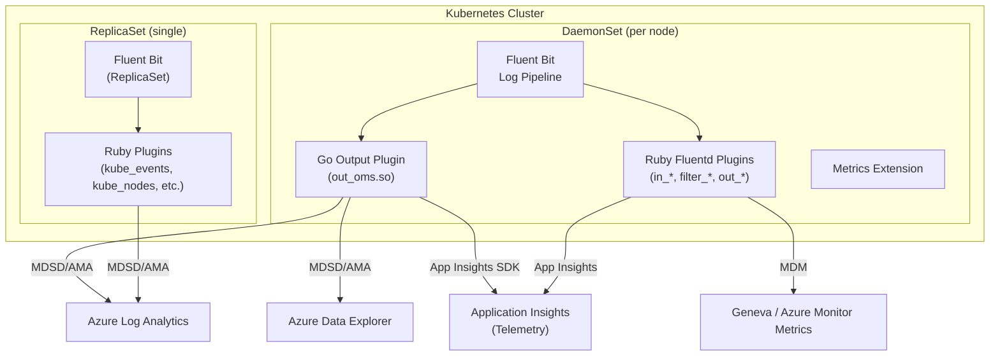

# AGENTS.md

## Setup Commands

```bash
# Clone the repository
git clone https://github.com/microsoft/Docker-Provider.git
cd Docker-Provider

# Install Go (version 1.25.7+ required)
# See scripts/build/linux/install-build-pre-requisites.sh for reference

# Install Ruby 3.3.x and Fluentd
gem install fluentd -v "1.14.2" --no-document
gem install ipaddress --no-document

# Build Go output plugin
cd source/plugins/go/src && make && cd -

# Build Go input plugins
cd source/plugins/go/input/containerinventory && make && cd -
cd source/plugins/go/input/perf && make && cd -

# Build Linux container image (requires Docker)
cd build/linux && make && cd -
```

## Code Style

### Go
- Package name: `main` for plugins (C-shared library constraint)
- Constants: `PascalCase` (e.g., `ContainerLogDataType`, `ResourceIdEnv`)
- Variables: `camelCase` for local, `PascalCase` for exported
- Error handling: check `err != nil` immediately after call, log via `Log(message)` or `fmt.Sprintf`
- Imports: standard library first, then third-party, then internal (`Docker-Provider/source/plugins/go/src/extension`)
- No unused imports — build will fail

### Ruby
- `frozen_string_literal: true` comment at top of every file
- Class naming: `PascalCase` (e.g., `ApplicationInsightsUtility`, `KubernetesApiClient`)
- Method naming: `camelCase` (e.g., `getContainerLogs`, `sendTelemetry`)
- Class-level variables: `@@VariableName`
- All Fluentd plugins extend `Fluent::Input`, `Fluent::Filter`, or `Fluent::Output`
- Error handling: `begin/rescue/end` blocks with telemetry via `ApplicationInsightsUtility.sendExceptionTelemetry`
- Logging: `$log.warn`, `$log.info`, `$log.error` (Fluentd logger)

### Shell (Bash)
- Use `#!/bin/bash` shebang
- Use `set -e` for error handling in build/setup scripts
- Variables: `UPPER_SNAKE_CASE` for env vars, `lower_snake_case` for locals
- Must work on Azure Linux (CBL-Mariner) — no apt-get, use `tdnf`

### PowerShell
- Functions: `Verb-Noun` convention (e.g., `Get-ClusterCloudEnvironment`, `Is-CanaryRegion`)
- Testing: Pester 5.3.3 framework
- `Set-StrictMode -Version Latest` preferred

## Testing Instructions

The CI runs four test suites on every PR to `ci_dev` and `ci_prod`:

| Suite | Command | Framework | Location |
|-------|---------|-----------|----------|
| Bash unit tests | `./test/unit-tests/test_main.sh` | Custom shell framework | `test/unit-tests/test_cases/` |
| Go unit tests | `./test/unit-tests/run_go_tests.sh` | `go test` | `source/plugins/go/src/*_test.go` |
| Ruby unit tests | `./test/unit-tests/run_ruby_tests.sh` | Ruby test driver | `source/plugins/ruby/*_test.rb`, `test/unit-tests/test_driver.rb` |
| PowerShell tests | `./test/unit-tests/test_main.ps1` | Pester 5.3.3 | `test/unit-tests/Test-*.ps1` |

**E2E tests (not in PR CI — run manually or via Azure Pipelines):**

| Suite | Framework | Location |
|-------|-----------|----------|
| Ginkgo E2E | Ginkgo/Gomega | `test/ginkgo-e2e/` (querylogs, containerstatus, livenessprobe) |
| Python E2E | pytest | `test/e2e/src/tests/` |

**Test naming conventions:**
- Go: `*_test.go` in same package
- Ruby: `*_test.rb` alongside source or in `test/unit-tests/`
- Bash: `test/unit-tests/test_cases/*.sh`
- PowerShell: `test/unit-tests/Test-*.ps1`

## Dev Environment Tips

- Use VS Code with Go and Ruby extensions
- Set `GOPATH` and ensure Go 1.25.7+ is on PATH
- For Ruby plugin development, install fluentd gem locally: `gem install fluentd -v "1.14.2"`
- The agent reads configuration from environment variables and Kubernetes ConfigMaps
- Key env vars: `APPLICATIONINSIGHTS_AUTH`, `AKS_RESOURCE_ID`, `ACS_RESOURCE_NAME`, `CONTROLLER_TYPE`, `CONTAINER_RUNTIME`, `OS_TYPE`

## PR Instructions

- **Commit messages:** Freeform with PR number suffix (e.g., `Fix CVEs and handle intermittent errors in Ginkgo tests (#1556)`)
- **Branch naming:** Feature branches, no strict convention
- **Target branches:** `ci_dev` for development, `ci_prod` for production
- **Required CI checks:** PR checker (build + Trivy scan), unit tests (Bash, Go, Ruby, PowerShell), CodeQL, DevSkim
- **Merge strategy:** Squash merge with PR title as commit message

## Architecture Diagram


