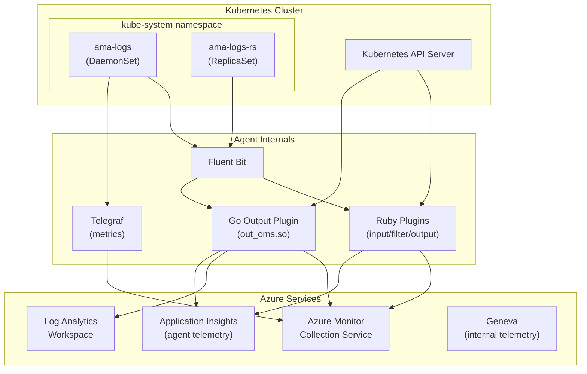

# AGENTS.md

## Setup Commands

```bash
# 1. Clone the repository
git clone https://github.com/microsoft/Docker-Provider.git
cd Docker-Provider

# 2. Install Go (1.23.8+)
# See https://golang.org/doc/install

# 3. Install Ruby (3.3+)
# Linux: tdnf install ruby or use ruby-build (see kubernetes/linux/setup.sh)

# 4. Build Go Fluent Bit output plugin
cd source/plugins/go/src
go get
make fbplugin
cd -

# 5. Run unit tests to verify setup
./test/unit-tests/test_main.sh

# 6. (Optional) Build Docker image for local testing
cd kubernetes/linux/dockerbuild
./build-and-publish-docker-image.sh --image local-test
```

## Code Style

### Ruby
- Use `frozen_string_literal: true` pragma at the top of every file.
- Use `snake_case` for methods, variables, and file names.
- Use `require_relative` for local imports.
- Indent with 2 spaces.
- Fluent Bit plugins follow the `Fluent::Plugin` module pattern with `register_input`/`register_filter`/`register_output`.
- Telemetry: Use `ApplicationInsightsUtility` class methods — never instantiate `TelemetryClient` directly.

### Go
- Follow standard `gofmt` formatting.
- Use `camelCase` for local vars, `PascalCase` for exports.
- Error handling: Always check `err != nil` and log or return errors.
- Telemetry: Use the global `TelemetryClient` from `telemetry.go` — emit via `appinsights.TrackMetric` / `TrackEvent`.
- Fluent Bit plugins use CGo with `//export` directives.
- Environment variables accessed via `os.Getenv()`.

### Shell/Bash
- Start scripts with `#!/bin/bash` and use `set -e` / `set -o pipefail` for error safety.
- Use `snake_case` for variables, `camelCase` for function names.
- Quote all variable expansions to prevent word splitting.

### PowerShell
- Use `PascalCase` for function names, `camelCase` for local variables.
- Scripts in `build/windows/installer/scripts/` and `kubernetes/windows/`.

## Testing Instructions

### Unit Tests
```bash
# Run all unit tests (Bash + Go + Ruby)
./test/unit-tests/test_main.sh

# Run only Go tests
cd source/plugins/go/src && go test -cover -race -coverprofile=coverage.txt -covermode=atomic

# Run only Ruby tests
ruby test/unit-tests/test_driver.rb

# Run only Bash tests
./test/unit-tests/test_framework.sh
```

### E2E Tests (Ginkgo)
```bash
# Requires a running AKS cluster with the agent deployed
cd test/ginkgo-e2e/<suite>
go test -v ./...
```

### E2E Tests (pytest)
```bash
cd test/e2e/src
pytest
```

### CI Test Pipeline
- GitHub Actions: `.github/workflows/run_unit_tests.yml` runs Bash and Go unit tests on every PR.
- GitHub Actions: `.github/workflows/pr-checker.yml` builds the Docker image and runs Trivy scan.
- Security: CodeQL (`.github/workflows/codeql-analysis.yml`) and DevSkim (`.github/workflows/devskim.yml`).

## Dev Environment Tips

- Use WSL2 on Windows — clone the repo inside Ubuntu, not on the Windows filesystem.
- Go version must match what CI uses (1.23.8 as of latest workflow config).
- Ruby version should be 3.3.x (see `kubernetes/linux/setup.sh` for exact version).
- The `.trivyignore` file suppresses known unfixable CVEs — update it when adding new suppressions.
- Build version is controlled by `build/version` file.

## PR Instructions

- **Branch naming**: Feature branches typically use `<alias>/<description>` format (e.g., `longw/networkflow-rename`).
- **Commit messages**: Freeform style with descriptive summary. Reference PR numbers with `(#NNNN)`.
- **PR targets**: PRs target `ci_dev` or `ci_prod` branches.
- **Required checks**: Unit tests (Bash + Go), Docker image build, Trivy vulnerability scan, CodeQL, DevSkim.
- **Merge strategy**: Squash merge with PR title as commit message.

## Architecture Diagram


