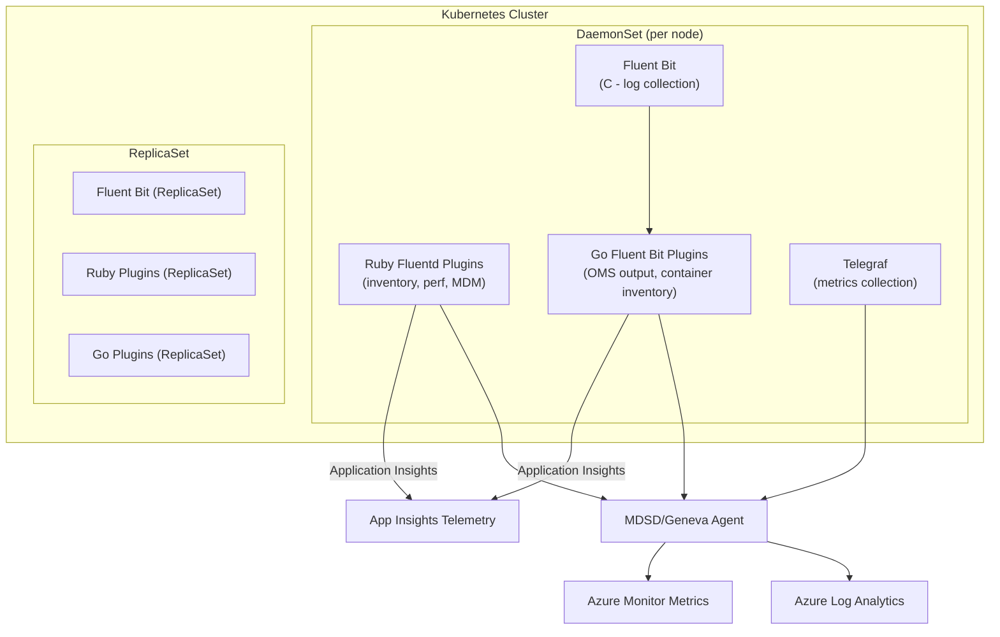

# AGENTS.md

## Setup Commands

```bash
# Clone the repository
git clone git@github.com:microsoft/Docker-Provider.git
cd Docker-Provider

# Install Go (1.25+)
# See https://go.dev/doc/install

# Install Ruby and fluentd for Ruby plugin development
sudo gem install fluentd -v "1.14.2" --no-document
sudo gem install ipaddress --no-document

# Install build dependencies (Linux)
sudo apt-get install build-essential -y

# Build the source code
cd build/linux && make

# Build Docker image
cd ../../kubernetes/linux
docker build . --file Dockerfile.multiarch -t containerinsights:local
```

## Code Style

### Ruby (`source/plugins/ruby/`)
- `frozen_string_literal: true` pragma at top of every file
- `snake_case` for methods and variables, `PascalCase` for class names
- `@@ClassVariable` for class-level state (e.g., `@@hostName`, `@@CustomProperties`)
- `require_relative` for local imports, `require` for gems
- Error handling: `begin/rescue => e` with telemetry logging via `ApplicationInsightsUtility.sendExceptionTelemetry(e)`
- Logging via custom `@log` (OMS logger)

### Go (`source/plugins/go/`)
- Standard `gofmt` formatting
- `camelCase` locals, `PascalCase` exports
- Error handling: `if err != nil` with telemetry via `SendException(err)`
- Application Insights via `github.com/microsoft/ApplicationInsights-Go`
- Fluent Bit plugin API via `github.com/fluent/fluent-bit-go`

### Shell (`scripts/`, `build/`)
- `#!/bin/bash` shebang
- `set -e` for error exit
- `snake_case` for variables and functions
- Configuration via environment variables

### PowerShell (`scripts/`, `kubernetes/windows/`)
- `PascalCase` for cmdlet-style function names
- `$CamelCase` for variables

## Testing Instructions

**Unit tests (CI runs these on every PR to `ci_dev`/`ci_prod`):**

```bash
# Bash unit tests
chmod +x test/unit-tests/test_main.sh
./test/unit-tests/test_main.sh

# Go unit tests
./test/unit-tests/run_go_tests.sh

# Ruby unit tests (requires fluentd gem installed)
./test/unit-tests/run_ruby_tests.sh
```

**Windows PowerShell tests** run on `windows-latest` in CI.

**Ginkgo E2E tests** under `test/ginkgo-e2e/` — separate Go modules per test suite (`containerstatus`, `livenessprobe`, `querylogs`).

**Test file conventions:**
- Ruby: `*_test.rb` in `source/plugins/ruby/`
- Go: `*_test.go` alongside source in `source/plugins/go/`
- Shell: `test/unit-tests/test_cases/*.sh`
- E2E: `test/ginkgo-e2e/<suite>/` with Go test files

## Dev Environment Tips

- Build primarily targets Linux — use WSL2 or a Linux VM for local development.
- The project produces a multi-arch Docker image (amd64/arm64) — see `Dockerfile.multiarch`.
- Key env vars at runtime: `APPLICATIONINSIGHTS_AUTH`, `CONTROLLER_TYPE` (DaemonSet/ReplicaSet), `OS_TYPE`, `CONTAINER_RUNTIME`, `AKS_RESOURCE_ID`, `AKS_REGION`.
- Helm chart for deployment: `charts/azuremonitor-containers/`.

## Recommended AI Workflow

### Explore → Plan → Code → Commit
For complex, multi-file changes:
1. **Explore** — Ask AI to read and explain relevant plugin code first.
2. **Plan** — Get a structured implementation plan listing all files to change.
3. **Code** — Implement step by step, verifying each change.
4. **Test** — Run `./test/unit-tests/test_main.sh` and Go/Ruby tests.
5. **Commit** — Use descriptive PR title format: `<Brief description> (#PR_NUMBER)`.

### Choosing the Right Tool
- **Inline suggestions** — Best for Ruby/Go plugin code completion.
- **Copilot Chat** — Best for understanding data flows, using @agents.
- **Copilot CLI** — Best for build/test workflows, multi-file changes.

### Validating AI-Generated Code
1. Run `cd build/linux && make` to verify build.
2. Run unit tests for affected languages.
3. Run `trivy fs --severity CRITICAL,HIGH --scanners vuln .` for security.
4. Verify telemetry follows existing patterns (ApplicationInsightsUtility / TelemetryClient).

## PR Instructions

- **Commit messages:** Descriptive title format, e.g., `Fix CVEs in go modules (#1234)`, `Add support for network flow logs (#1234)`.
- **Branch naming:** `<author>/<feature-description>` (e.g., `longw/networkflow-rename`).
- **Default branch:** `ci_prod` (not `main`).
- **CI checks:** PR build + Trivy scan, CodeQL, DevSkim, unit tests (Bash, Go, Ruby, PowerShell).
- **Merge strategy:** Squash merge with PR title as commit message.

## Architecture Diagram


