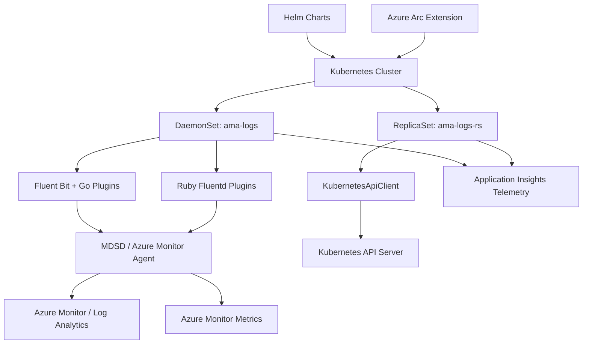

# AGENTS.md

## Setup Commands

```bash
# Prerequisites: Go 1.23.8+, Ruby, fluentd 1.14.2, Docker, Helm 3, build-essential, Python 3

# Install Ruby dependencies (for unit tests)
sudo gem install fluentd -v "1.14.2" --no-document
sudo gem install ipaddress --no-document

# Build Linux agent (Go plugins + installer)
cd build/linux && make

# Build Windows agent (requires Windows)
cd build/windows && .\Makefile.ps1
```

## Code Style

### Go (source/plugins/go/)
- Standard Go formatting (`gofmt`)
- PascalCase for exported identifiers, camelCase for local variables
- Constants use PascalCase with descriptive names (e.g., `ContainerLogDataType`)
- Imports grouped: stdlib, external packages, internal packages
- Error handling: check every error return, log with `Log(message)` or `FLBPluginLogMessage`
- Use `sync.Mutex` for shared state; avoid global mutable state where possible
- Test files use `_test.go` suffix; run with `GOUNITTEST=true ISTEST=true`

### Ruby (source/plugins/ruby/)
- `frozen_string_literal: true` on every file
- Class variables (`@@`) for singleton state (following fluentd plugin pattern)
- `require_relative` for local imports
- PascalCase for class names, snake_case for methods and variables
- `begin/rescue/end` blocks for error handling with telemetry in rescue
- Fluentd plugin pattern: inherit from `Fluent::Plugin::Input` / `Output` / `Filter`

### Shell (scripts/, build/, kubernetes/)
- Bash with `#!/bin/bash` shebang
- Use `set -e` for error-on-failure in critical scripts
- Quote all variables: `"$VAR"` not `$VAR`
- Uppercase for environment variables, lowercase for local variables

### PowerShell (build/windows/, kubernetes/windows/)
- `.ps1` extension, PascalCase function names
- Uses Pester 5.3.3 for testing
- PSScriptAnalyzer for linting

## Testing Instructions

### Unit Tests (CI runs on every PR)
```bash
# Bash unit tests
chmod +x test/unit-tests/test_main.sh
./test/unit-tests/test_main.sh

# Go unit tests
cd source/plugins/go/src && GOUNITTEST=true ISTEST=true go test .

# Ruby unit tests
./test/unit-tests/run_ruby_tests.sh

# PowerShell unit tests (Windows only)
./test/unit-tests/test_main.ps1
```

### E2E Tests
- Ginkgo-based tests in `test/ginkgo-e2e/` (querylogs, containerstatus, livenessprobe)
- TestKube-based tests in `test/testkube/`
- Conformance tests in `test/e2e/`

### Test file locations
- Bash: `test/unit-tests/test_cases/test_*.sh`
- Go: `source/plugins/go/src/*_test.go`
- Ruby: `source/plugins/ruby/*_test.rb`, `test/unit-tests/test_driver.rb`
- PowerShell: `test/unit-tests/test_cases/*.Tests.ps1`

## Dev Environment Tips

- Default branch is `ci_prod` — PRs target `ci_dev` or `ci_prod`
- Go plugins need `CGO_ENABLED=1` and cmetrics library installed
- For arm64 cross-compilation: install `gcc-aarch64-linux-gnu`
- Container base image: `mcr.microsoft.com/azurelinux/base/core:3.0`
- Telemetry uses Application Insights — key via `APPLICATIONINSIGHTS_AUTH` env var
- Log paths: Linux `/var/opt/microsoft/docker-cimprov/log/`, Windows `/etc/amalogswindows/`

## PR Instructions

- **Commit messages**: Freeform with PR number suffix (e.g., `Fix liveness probe issue (#1530)`)
- **Branch naming**: Feature branches use `<alias>/<description>` pattern
- **Required checks**: Linux build + Trivy scan, Windows build, unit tests (Bash, Go, Ruby, PowerShell)
- **Security**: CodeQL (Go, Python, Ruby) and DevSkim run on `ci_prod`
- **Merge**: Squash merge is standard; PR titles become commit messages

## Architecture Diagram


