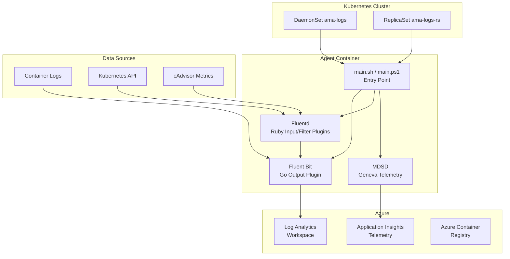

# AGENTS.md

## Setup Commands

```bash
# Prerequisites: Go 1.23.8+, Ruby with Fluentd 1.14.2, build-essential, Docker, Helm
# Install Go 1.23.8
# Install build dependencies
sudo apt-get install build-essential -y

# Build Linux agent
cd build/linux && make

# Install Ruby test dependencies
sudo gem install fluentd -v "1.14.2" --no-document
sudo gem install ipaddress --no-document

# Build Docker image (Linux multi-arch)
cd kubernetes/linux
docker build . --file Dockerfile.multiarch -t containerinsights:dev
```

## Code Style

### Go (`source/plugins/go/`)
- **Naming:** Exported functions `PascalCase`, internal `camelCase`, constants `UPPER_CASE`
- **Imports:** Grouped (stdlib, external, internal). Use `require_relative` sparingly.
- **Error handling:** Always check `if err != nil`; send to telemetry via `SendException(err.Error())`
- **Logging:** Use `Log()` wrapper (fmt.Sprintf style), not raw `fmt.Println`
- **Telemetry:** Use `SendException`, `SendEvent` from `telemetry.go`; never create new TelemetryClient instances

### Ruby (`source/plugins/ruby/`)
- **Naming:** Classes `PascalCase`, methods `snake_case`, constants `UPPER_CASE` or `@@camelCase`
- **Plugins:** Inherit from `Fluent::Plugin::Input/Filter/Output`; implement `initialize`, `configure`, `start`, `shutdown`
- **Error handling:** `begin/rescue/ensure` with `$log.warn`/`$log.error`
- **Telemetry:** Use `ApplicationInsightsUtility.sendCustomEvent` or `sendMetricTelemetry`
- **Config:** Use `config_param` DSL; read env vars via `ENV["VAR_NAME"]`

### Bash (`kubernetes/linux/`, `scripts/`, `build/`)
- **Naming:** Functions `camelCase`, env vars `UPPER_CASE`
- **Quoting:** Always quote variables in conditionals and arguments
- **Error handling:** Check exit codes; use `[ -e path ]` guards

### PowerShell (`kubernetes/windows/`, `build/windows/`)
- **Naming:** Functions `PascalCase-WithHyphens`, variables `$PascalCase`
- **Error handling:** `-ErrorAction SilentlyContinue` for optional checks; `try/catch` for critical
- **Testing:** Pester 5.3.3 framework

### Python (`test/e2e/`)
- **Naming:** Functions `snake_case`, classes `PascalCase`, constants `UPPER_CASE`
- **Testing:** pytest with session-scoped fixtures in `conftest.py`
- **Error handling:** `try/except` with `pytest.fail()` for test assertions

## Testing Instructions

Unit tests run in CI on every PR to `ci_dev` and `ci_prod`:

```bash
# Bash unit tests
./test/unit-tests/test_main.sh

# Go unit tests (requires Go 1.23.8)
./test/unit-tests/run_go_tests.sh

# Ruby unit tests (requires Fluentd 1.14.2 gem)
./test/unit-tests/run_ruby_tests.sh

# PowerShell unit tests (requires Pester 5.3.3 on Windows)
./test/unit-tests/test_main.ps1
```

Test files live in `test/unit-tests/test_cases/` (Bash), `source/plugins/go/src/*_test.go` (Go), and `test/e2e/` (Python E2E). Go tests use `*_test.go` convention; Ginkgo E2E suites are in `test/ginkgo-e2e/`.

## Dev Environment Tips

- Go 1.23.8 is required for building Go plugins
- `build/version` contains the version metadata — do not edit manually during releases
- Linux Dockerfile base is Mariner (CBL-Mariner/Azure Linux) — distroless variant
- Windows Dockerfile uses `ltsc2019`/`ltsc2022` Server Core
- Environment variables for telemetry: `APPLICATIONINSIGHTS_AUTH`, `TELEMETRY_APPLICATIONINSIGHTS_KEY`
- Agent config is in `container-azm-ms-agentconfig.yaml` ConfigMap

## Recommended AI Workflow

### Explore → Plan → Code → Commit

1. **Explore** — Ask the AI to read and explain relevant code before changes.
   Example: "Read `source/plugins/go/src/oms.go` and explain the data flow."
2. **Plan** — Ask for a structured implementation plan.
   Example: "Plan how to add a new Fluent input plugin for network flow logs."
3. **Code** — Implement step by step, verifying each.
4. **Test** — Run `./test/unit-tests/run_go_tests.sh` (or appropriate test suite).
5. **Commit** — Use descriptive messages with PR number references.

### Validating AI-Generated Code
1. Review for correctness and understand the code.
2. Run `cd build/linux && make` to build.
3. Run the appropriate unit test suite.
4. Check for hardcoded secrets and proper error handling.
5. Verify telemetry patterns match existing code.

## PR Instructions

- **Commit messages:** Freeform descriptive style with PR number, e.g., `Fix CVEs in go.mod (#1234)`. Some commits use Conventional Commits (`fix:`, `feat:`).
- **Branch naming:** Feature branches typically use `<author>/<description>` pattern.
- **Target branches:** PRs target `ci_dev` or `ci_prod`.
- **CI checks:** CodeQL (Go/Python/Ruby), DevSkim, unit tests (Bash/Go/Ruby/PowerShell), PR build and scan.
- **Review:** All PRs require review before merge.

## Architecture Diagram


