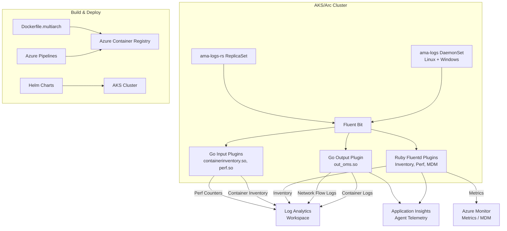

# AGENTS.md

## Setup Commands

```bash
# Clone the repository
git clone https://github.com/microsoft/Docker-Provider.git
cd Docker-Provider

# Install Go 1.23+ (if not already installed)
# See https://go.dev/doc/install

# Install Ruby 3.3+ and Fluentd gem for Ruby plugin development
gem install fluentd -v "1.14.2" --no-document
gem install ipaddress --no-document

# Build Go output plugin
cd source/plugins/go/src && make fbplugin && cd -

# Build Go input plugins
cd source/plugins/go/input/containerinventory && make containerinventory && cd -
cd source/plugins/go/input/perf && make perf && cd -

# Verify with tests
./test/unit-tests/test_main.sh
./test/unit-tests/run_go_tests.sh
```

## Code Style

### Ruby (Fluentd Plugins — `source/plugins/ruby/`)
- `frozen_string_literal: true` at top of every file
- Class variables (`@@`) for module-level state (e.g., `@@isWindows`, `@@os_type`)
- `require_relative` for local dependencies, `require` for gems
- Snake_case for methods and variables, PascalCase for classes
- Fluent plugin registration pattern: `Fluent::Plugin.register_*('name', self)`
- JSON-based data interchange between plugins
- Telemetry via `ApplicationInsightsUtility` singleton class

### Go (Fluent Bit Plugins — `source/plugins/go/`)
- Standard Go formatting (`gofmt`)
- Package-level variables for telemetry counters and shared state
- `appinsights` SDK for Application Insights telemetry
- CGO enabled for Fluent Bit plugin interface (C-shared build mode)
- Error handling: check `err != nil` and log via telemetry or `Log()` function

### Shell (Build & Operations — `scripts/`, `kubernetes/linux/`)
- `set -e` and `set -o pipefail` in build scripts
- Environment variable configuration (uppercase with underscores)
- `#!/bin/bash` shebang for all shell scripts

### PowerShell (Windows Agent — `kubernetes/windows/`, `build/windows/`)
- PascalCase for function names, scripts, and parameters
- Pester 5.x for testing with `Describe`/`Context`/`It` blocks

## Testing Instructions

### Unit Tests (CI runs all on PR to ci_dev/ci_prod)

| Framework | Language | Command | Location |
|-----------|----------|---------|----------|
| Custom bash framework | Shell | `./test/unit-tests/test_main.sh` | `test/unit-tests/test_cases/` |
| `go test` | Go | `./test/unit-tests/run_go_tests.sh` | `source/plugins/go/` |
| Minitest via `test_driver.rb` | Ruby | `ruby test/unit-tests/test_driver.rb` | `source/plugins/ruby/*_test.rb` |
| Pester 5.3.3 | PowerShell | `./test/unit-tests/test_main.ps1` | `test/unit-tests/test_cases/` |

### E2E Tests
| Framework | Command | Location |
|-----------|---------|----------|
| Ginkgo/Gomega (Go) | `cd test/ginkgo-e2e/<suite> && go test -v ./...` | `test/ginkgo-e2e/` |
| Python (legacy) | `python test/e2e/...` | `test/e2e/` |

### Adding Tests
- Ruby: Create `*_test.rb` alongside source in `source/plugins/ruby/`
- Go: Create `*_test.go` in the same package directory
- Shell: Add test case file in `test/unit-tests/test_cases/`
- PowerShell: Add `Test-*.ps1` in `test/unit-tests/test_cases/`

## Dev Environment Tips

- **Editor:** VS Code recommended. Install Go, Ruby, and PowerShell extensions.
- **Docker:** Required for building container images (`kubernetes/linux/Dockerfile.multiarch`).
- **Key env vars:** `OS_TYPE` (linux/windows), `CONTROLLER_TYPE` (DaemonSet/ReplicaSet), `AKS_RESOURCE_ID`, `APPLICATIONINSIGHTS_AUTH`.
- **Local debugging:** Ruby plugins can be tested with `fluentd -c <config>` using test config files.
- **Windows development:** Use `kubernetes/windows/` for Windows-specific agent code. PowerShell tests run on Windows only.

## PR Instructions

- **Commit messages:** Freeform style. Include PR number in parentheses, e.g., `fix liveness probe issue (#1530)`.
- **Branch naming:** Feature branches, no enforced convention. Target `ci_dev` or `ci_prod`.
- **Required checks:** CodeQL, DevSkim, Trivy scan, unit tests (Bash, Go, Ruby, PowerShell).
- **Merge strategy:** Squash merge via GitHub PR.
- **Release notes:** Update `ReleaseNotes.md` for version releases. Update Helm chart versions in `charts/*/Chart.yaml`.

## Architecture Diagram


