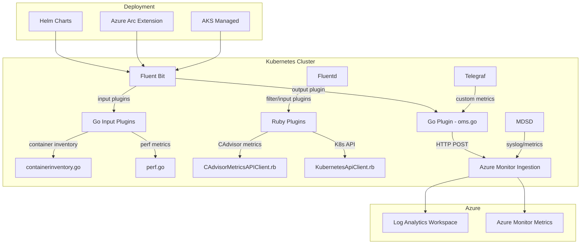

# AGENTS.md

## Setup Commands

```bash
# Clone the repository
git clone https://github.com/microsoft/Docker-Provider.git
cd Docker-Provider

# Linux build prerequisites
sudo apt-get install build-essential -y

# Build the Linux agent (Go shared object + installer)
cd build/linux && make
cd ../..

# Install Ruby test dependencies
sudo gem install fluentd -v "1.14.2" --no-document
sudo gem install ipaddress --no-document

# Verify Go setup (see source/plugins/go/src/go.mod for required version)
go version

# Run all unit tests to verify environment
./test/unit-tests/test_main.sh
cd source/plugins/go/src && go generate && GOUNITTEST=true ISTEST=true go test . && cd ../../../..
ruby test/unit-tests/test_driver.rb
```

## Code Style

### Go (`source/plugins/go/`)
- Exported symbols use `PascalCase`, unexported use `camelCase`
- Constants use `PascalCase` (e.g., `ContainerLogDataType`, `ResourceIdEnv`)
- Standard library imports first, then third-party, then internal packages
- Error handling: check `err != nil` immediately, log with `Log()` or `FLBPluginUnregister()`
- Use `ApplicationInsights-Go` SDK via `TelemetryClient` singleton for telemetry
- Test files use `_test.go` suffix in the same package directory
- Run `go generate` before running tests

### Ruby (`source/plugins/ruby/`)
- Classes use `PascalCase` (e.g., `ApplicationInsightsUtility`, `KubernetesApiClient`)
- Files use `PascalCase` matching class name (e.g., `KubernetesApiClient.rb`)
- Fluentd plugin pattern: inherit from `Fluent::Input`, `Fluent::Filter`, or `Fluent::Output`
- Use `require_relative` for local imports
- Handle exceptions with `begin/rescue/end`; log via `$log.warn`/`$log.error`

### Shell (`build/`, `kubernetes/`, `scripts/`)
- Use `#!/bin/bash` shebang
- Variables use `UPPER_SNAKE_CASE` for env vars, `lower_snake_case` for locals
- Source shared env: `source /opt/env_vars` where available
- Use `set -e` for error-sensitive scripts
- Quote all variable expansions: `"$VAR"` not `$VAR`

### PowerShell (`build/windows/`, `test/unit-tests/`)
- Use Pester 5.3.3 for unit tests
- Functions use `Verb-Noun` naming (PowerShell convention)

## Testing Instructions

### Test Suites
| Suite | Command | Framework | Directory |
|-------|---------|-----------|-----------|
| Bash unit tests | `./test/unit-tests/test_main.sh` | Custom bash framework | `test/unit-tests/test_cases/` |
| Go unit tests | `cd source/plugins/go/src && go generate && GOUNITTEST=true ISTEST=true go test .` | Go testing + testify | `source/plugins/go/src/` |
| Ruby unit tests | `ruby test/unit-tests/test_driver.rb` | Custom Ruby driver | `test/unit-tests/test_driver.rb` |
| PowerShell tests | `./test/unit-tests/test_main.ps1` | Pester 5.3.3 | `test/unit-tests/` |
| Ginkgo E2E | `cd test/ginkgo-e2e/<suite> && go test -v ./...` | Ginkgo + Gomega | `test/ginkgo-e2e/` |
| Python E2E | `pytest test/e2e/` | pytest | `test/e2e/` |

### Adding Tests
- **Bash tests**: Add `test_*.sh` files in `test/unit-tests/test_cases/`, use functions from `test/unit-tests/test_functions/`
- **Go tests**: Add `*_test.go` alongside source in `source/plugins/go/src/`; use `GOUNITTEST=true` env guard
- **Ruby tests**: Add test methods to `test/unit-tests/test_driver.rb`

## Dev Environment Tips

- Use WSL2 on Windows; clone into the Ubuntu filesystem (not Windows mount)
- Docker Desktop with WSL2 integration for building container images
- See `source/plugins/go/src/go.mod` for exact Go version; CI uses `actions/setup-go` with version from `run_unit_tests.yml`
- For Ginkgo E2E tests, a running Kubernetes cluster is required
- The `ISTEST` and `GOUNITTEST` env vars gate test-only code paths in Go
- Two Go modules exist (`source/plugins/go/src/` and `source/plugins/go/input/`) with separate `go.mod` files

## PR Instructions

- **Branch naming**: Feature branches typically use `<author>/<description>` format (e.g., `Longw/networkflow-rename`)
- **Commit messages**: Freeform style with PR number reference (e.g., `Fix FIC Auth support issues (#1547)`)
- **Target branches**: PRs target `ci_dev` or `ci_prod`
- **CI checks**: PRs trigger `pullrequest-build-and-scan` (Docker build + Trivy scan) and `Run Unit Tests` (Bash, Go, Ruby, PowerShell)
- **Required**: All unit tests must pass, Trivy scan must have no critical/high CVEs
- **Release process**: Update `ReleaseNotes.md`, bump chart versions in `charts/*/Chart.yaml`

## Architecture Diagram


