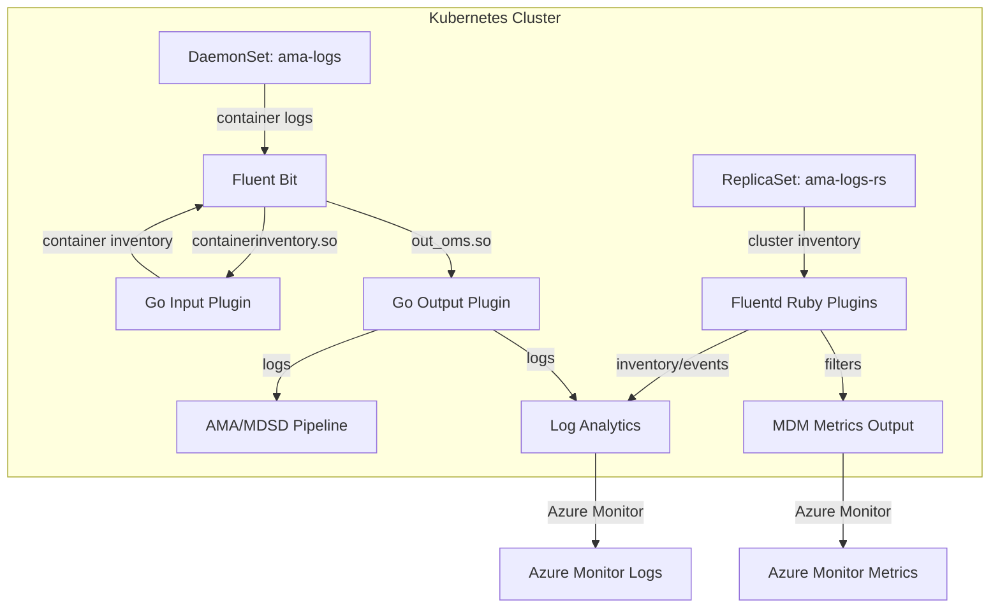

# AGENTS.md

## Setup Commands

```bash
# Clone the repository
git clone https://github.com/microsoft/Docker-Provider.git
cd Docker-Provider

# Install Go (1.23+)
# See https://go.dev/doc/install

# Install Ruby dependencies (for Ruby plugin tests)
sudo gem install fluentd -v "1.14.2" --no-document
sudo gem install ipaddress --no-document

# Install build dependencies (Linux)
sudo apt-get install build-essential -y

# Build Go plugins
cd build/linux && make
```

## Code Style

### Ruby
- Always use `frozen_string_literal: true` pragma at the top of every file.
- Fluent plugins inherit from `Fluent::Plugin::Input`, `Fluent::Plugin::Filter`, or `Fluent::Plugin::Output`.
- Use `require_relative` for project-internal dependencies, `require` for gems.
- Class variables (`@@`) are used extensively for shared state within plugins.
- Use double-quoted strings for string interpolation, single or double for literals (both are used).
- Naming: `snake_case` for methods/variables, `PascalCase` for classes, `SCREAMING_SNAKE` for constants.

### Go
- Standard `package main` for Fluent Bit output plugins; exported functions use `//export` CGo comments.
- Use `PascalCase` for exported functions, `camelCase` for unexported.
- Error handling: always check `err != nil` and log before returning.
- Logging via the custom `Log()` function (writes to lumberjack file logger).
- Telemetry via `appinsights` SDK — `appinsights.NewTelemetryClient()`.

### Shell (Bash)
- Use `#!/bin/bash` shebang.
- Source shared env: `source /opt/env_vars`.
- Use `set -e` in critical scripts.
- Quote all variable expansions.

### PowerShell
- Use `param()` block for script parameters.
- Follow Pester 5.x conventions for tests.

## Testing Instructions

Four test suites run in CI via `run_unit_tests.yml`:

| Suite | Command | Framework |
|-------|---------|-----------|
| Bash | `./test/unit-tests/test_main.sh` | Custom shell test framework |
| Go | `./test/unit-tests/run_go_tests.sh` | `go test` + `testify` |
| Ruby | `./test/unit-tests/run_ruby_tests.sh` | Fluentd test driver |
| PowerShell | `./test/unit-tests/test_main.ps1` | Pester 5.3.3 |

**E2E tests:** Ginkgo-based tests in `test/ginkgo-e2e/` and Python tests in `test/e2e/`.

**Test file naming:**
- Go: `*_test.go` alongside source files
- Ruby: `*_test.rb` alongside source files
- Bash: `test/unit-tests/test_cases/test_*.sh`
- PowerShell: `test/unit-tests/*.Tests.ps1`

## Dev Environment Tips

- The agent runs as a Kubernetes DaemonSet (per-node) and ReplicaSet (cluster-level).
- `CONTROLLER_TYPE` env var (`DaemonSet`/`ReplicaSet`) determines active code paths.
- `OS_TYPE` env var (`linux`/`windows`) determines platform-specific behavior.
- Container image is built from `kubernetes/linux/Dockerfile.multiarch` (Linux) or `kubernetes/windows/Dockerfile` (Windows).
- The main entrypoint is `/opt/main.sh` (Linux) or `C:\opt\amalogswindows\scripts\powershell\main.ps1` (Windows).
- Key env vars: `APPLICATIONINSIGHTS_AUTH`, `AKS_RESOURCE_ID`, `AKS_REGION`, `AGENT_VERSION`, `AZMON_CLUSTER_COLLECT_ENV_VAR`.

## PR Instructions

- Commit messages: freeform with descriptive summary, PR number in parentheses (e.g., `Fix CVEs through updating go packages (#1414)`).
- Target branches: `ci_dev` (development) or `ci_prod` (production).
- CI checks: PR builds Linux and Windows Docker images, runs Trivy scan, runs all unit test suites.
- PRs with critical/high CVEs from Trivy will be blocked.

## Architecture Diagram


