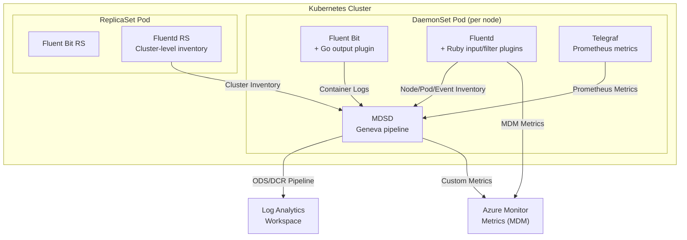

# AGENTS.md

## Setup Commands

```bash
# Clone and enter repo
git clone git@github.com:microsoft/Docker-Provider.git
cd Docker-Provider

# Go plugin development (requires Go 1.23.8+)
cd source/plugins/go/src
go mod download
cd -

# Ruby plugin development (requires Ruby with fluentd)
gem install fluentd -v "1.14.2" --no-document
gem install ipaddress --no-document
gem install minitest --no-document

# PowerShell test development (requires Pester 5.3.3)
Install-Module -Name Pester -RequiredVersion 5.3.3 -Force
Install-Module -Name PSScriptAnalyzer -Force
```

## Code Style

### Ruby (Fluentd Plugins — `source/plugins/ruby/`)
- `frozen_string_literal: true` pragma at top of every file
- Class names: `PascalCase` (e.g., `Kube_nodeInventory_Input`)
- Instance variables: `@camelCase` (e.g., `@kubernetesApiClient`)
- Class variables: `@@camelCase` (e.g., `@@configMapMountPath`)
- Constants: `UPPER_SNAKE_CASE` in `constants.rb`
- Use `require_relative` for local dependencies
- Telemetry via `ApplicationInsightsUtility` singleton
- Log via `$log.info/warn/error` (Fluentd logger) or `omslog`
- Environment variables accessed via `ENV["VAR_NAME"]`

### Go (Fluent Bit Plugins — `source/plugins/go/`)
- Standard Go formatting (`gofmt`)
- Constants: `PascalCase` with descriptive names (e.g., `ContainerLogV2DataType`)
- Test files: `*_test.go` alongside source files
- Tests use `github.com/stretchr/testify/assert`
- Telemetry via `github.com/microsoft/ApplicationInsights-Go`
- Unit test gating: check `GOUNITTEST` or `ISTEST` env vars

### Shell/Bash (Linux scripts)
- Use `set -e` for error handling
- Functions use `snake_case`
- Test functions in `test/unit-tests/test_functions/`
- Test cases in `test/unit-tests/test_cases/`

### PowerShell (Windows scripts)
- PascalCase function names (e.g., `Get-McsEndpoint`)
- Pester 5.3.3 test framework
- Test functions in `test/unit-tests/test_functions/`
- Test cases in `test/unit-tests/test_cases/` (e.g., `Test-GetMcsEndpoint.ps1`)

## Testing Instructions

| Language | Framework | Command | Test Location |
|----------|-----------|---------|---------------|
| Bash | Custom framework (`test_framework.sh`) | `./test/unit-tests/test_main.sh` | `test/unit-tests/test_cases/test_*.sh` |
| Go | `go test` + testify | `./test/unit-tests/run_go_tests.sh` | `source/plugins/go/src/*_test.go` |
| Ruby | Minitest + Fluentd Test Driver | `./test/unit-tests/run_ruby_tests.sh` | `source/plugins/ruby/*_test.rb` |
| PowerShell | Pester 5.3.3 | `./test/unit-tests/test_main.ps1` | `test/unit-tests/test_cases/Test-*.ps1` |
| E2E | Ginkgo (Go) | `test/ginkgo-e2e/` | `test/ginkgo-e2e/*/` |
| E2E | pytest (Python) | Via Azure Pipelines | `test/e2e/src/tests/` |

CI runs all four unit test suites on every PR to `ci_dev` and `ci_prod`.

## Dev Environment Tips

- **Go version:** 1.23.8+ (set via `actions/setup-go` in CI)
- **Ruby:** System Ruby with fluentd 1.14.2 gem
- **PowerShell:** Pester 5.3.3 required
- **Container builds:** Requires Docker with multi-arch buildx support
- **Key env vars for local testing:**
  - `GOUNITTEST=true` and `ISTEST=true` for Go tests
  - `CONTROLLER_TYPE` — `DaemonSet` or `ReplicaSet`
  - `OS_TYPE` — `linux` or `windows`
  - `CONTAINER_RUNTIME` — container runtime name

## Recommended AI Workflow

### Explore → Plan → Code → Commit

1. **Explore** — Ask the AI to read and explain relevant code before making changes.
   - "Read `source/plugins/ruby/in_kube_nodes.rb` and explain the node inventory collection flow."
2. **Plan** — Ask for a structured implementation plan.
   - "Plan how to add a new metric to the cadvisor perf plugin. List all files that need changes."
3. **Code** — Implement incrementally, verifying each step.
4. **Test** — Run the relevant test suite after each significant change.
5. **Commit** — Use the repo's commit message style: descriptive summary with PR number.

### Validating AI-Generated Code

1. Review for correctness and security (no hardcoded secrets or instrumentation keys).
2. Run `./test/unit-tests/run_go_tests.sh` for Go changes.
3. Run `./test/unit-tests/run_ruby_tests.sh` for Ruby changes.
4. Run `./test/unit-tests/test_main.sh` for Bash changes.
5. Run `./test/unit-tests/test_main.ps1` for PowerShell changes.
6. Check that telemetry follows existing `ApplicationInsightsUtility` patterns.

## PR Instructions

- **Default branch:** `ci_prod`
- **Commit messages:** Descriptive summary, typically with PR reference `(#NNNN)`
- **Branch naming:** `<author>/<feature-description>` (e.g., `longw/networkflow-rename`)
- **Required checks:** Unit tests (Bash, Go, Ruby, PowerShell), CodeQL, DevSkim
- **Review:** All PRs require review before merge to `ci_prod`

## Architecture Diagram


