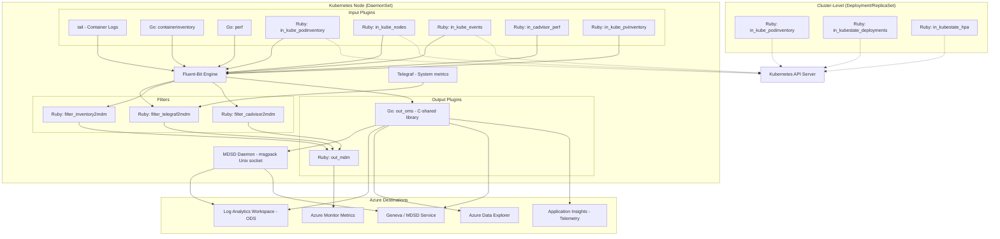

# AGENTS.md — Docker-Provider

AI coding agent reference for the Azure Monitor for Containers (Container Insights) repository.

## Setup Commands

```bash
# Clone
git clone https://github.com/microsoft/Docker-Provider.git && cd Docker-Provider

# Go (required for plugin compilation)
# Install Go 1.25.7 — must match go.mod version
go version  # verify: go1.25.7

# Ruby (required for Fluent plugins and tests)
gem install fluentd -v 1.14.2 --no-document
gem install ipaddress --no-document

# Build (Linux)
cd build/linux && make        # produces .deb/.rpm packages + shell bundle
cd ../..                      # return to repo root

# Docker image (multi-arch)
docker build -f kubernetes/linux/Dockerfile.multiarch -t ciprod:dev .
```

## Code Style

### Go (`source/plugins/go/`)

- `camelCase` for exported/unexported functions; `PascalCase` for exported types
- `UPPER_CASE` for constants (e.g., `ContainerLogDataType`, `InsightsMetricsDataType`)
- Always `if err != nil { return err }` — never ignore errors
- Use `testify` assertions in tests, `golang/mock` for mocking
- Output plugin functions are `//export`-ed as C symbols — signatures are fixed
- Two Go modules: `source/plugins/go/src/go.mod` and `source/plugins/go/input/go.mod`

### Ruby (`source/plugins/ruby/`)

- `snake_case` for methods and variables; `PascalCase` for classes
- Fluent plugins inherit `Fluent::Plugin::Input`, `Output`, or `Filter`
- Register with `Fluent::Plugin.register_input("plugin_name", self)`
- Use `begin/rescue => e` with `ApplicationInsightsUtility.sendExceptionTelemetry(e)` in rescue blocks
- Use `oj` gem for JSON, `msgpack` for MDSD serialization
- Class-level `@@` variables for plugin state; `Singleton` pattern for shared services
- Tests use minitest via `test_driver.rb`

### Shell (`scripts/`, `build/`, `kubernetes/linux/`)

- `UPPER_CASE` for variables; always quote `"$VARIABLE"`
- Start scripts with `set -e` (fail on error)
- Use `#!/bin/bash` shebang
- Source shared functions from `test/unit-tests/test_framework.sh`

### Python (`test/e2e/`)

- `snake_case` for functions and variables
- Use `pytest` fixtures with `scope='session'` for expensive setup
- Follow existing patterns in `test/e2e/src/tests/`

### PowerShell (`build/windows/`, `test/unit-tests/`)

- `PascalCase` for function names; `$PascalCase` for variables
- Use Pester 5.3.3 `Describe`/`It`/`Should` blocks
- Use `PSScriptAnalyzer` for linting

## Testing Instructions

### 1. Bash Unit Tests

```bash
chmod +x test/unit-tests/test_main.sh test/unit-tests/test_framework.sh
find test/unit-tests/test_functions -name "*.sh" -exec chmod +x {} \;
find test/unit-tests/test_cases -name "*.sh" -exec chmod +x {} \;
./test/unit-tests/test_main.sh
```

### 2. Go Unit Tests

```bash
./test/unit-tests/run_go_tests.sh
# Internally runs:
#   cd source/plugins/go/src && go generate && GOUNITTEST=true ISTEST=true go test .
```

### 3. Ruby Unit Tests

```bash
# Prerequisites
gem install fluentd -v 1.14.2 --no-document
gem install ipaddress --no-document
fluentd --setup ./fluent

./test/unit-tests/run_ruby_tests.sh
# Internally runs: ruby test/unit-tests/test_driver.rb
```

### 4. PowerShell Unit Tests (Windows)

```powershell
Install-Module -Name Pester -RequiredVersion 5.3.3 -Force -SkipPublisherCheck
Install-Module -Name PSScriptAnalyzer -Force
./test/unit-tests/test_main.ps1
```

### 5. E2E & Ginkgo Tests (in-cluster)

```bash
pytest test/e2e/                    # Python E2E against live LA workspace
ginkgo ./test/ginkgo-e2e/*          # Ginkgo E2E tests
```

## Dev Environment Tips

- **Go setup:** Ensure `GOPATH` is set. Both Go modules use `go 1.25.7`. Run `go mod tidy` in both `source/plugins/go/src/` and `source/plugins/go/input/` after dependency changes.
- **Ruby gems:** The container image uses Ruby 3.3.x with fluentd 1.16.3 in production, but tests run against fluentd 1.14.2.
- **Docker builds:** The multi-arch Dockerfile has 3 stages: `golang-builder` (compile), `builder` (install deps), `distroless_image` (production). Build args: `TARGETARCH` (amd64/arm64), `IMAGE_TAG`.
- **Unit test flags:** Go tests require `GOUNITTEST=true ISTEST=true`. Ruby tests set `$in_unit_test = true` to suppress telemetry calls.
- **Config files:** DaemonSet reads from `/etc/opt/microsoft/docker-cimprov/out_oms.conf`. ReplicaSet reads from a different path based on `CONTROLLER_TYPE` env var.
- **MDSD sockets:** Linux uses Unix domain sockets; Windows uses named pipes. Test both paths when modifying `PostDataHelper()`.

## Recommended AI Workflow

### 1. Explore

```
# Understand the data flow for the feature area
"Show me how container logs flow from Fluent-Bit tail input through out_oms.go to Log Analytics"
"What Ruby input plugins collect Kubernetes inventory data?"
```

### 2. Plan

```
# Describe the change scope before coding
"I need to add a new data type for network flow logs. This requires:
 - New constant in oms.go
 - New MDSD socket client initialization
 - New PostDataHelper routing branch
 - Unit test in out_oms_test.go"
```

### 3. Code

```
# Be specific about files and patterns
"Add a new Go input plugin following the pattern in source/plugins/go/input/containerinventory/"
"Add a Ruby filter plugin inheriting Fluent::Plugin::Filter, registered as 'myfilter'"
```

### 4. Commit

```bash
git add -A
git commit -m "Add network flow log support to out_oms plugin (#1234)"
# Target ci_prod branch for PRs
git push origin feature/network-flow-logs
```

## PR Instructions

- **Target branch:** `ci_prod` (default)
- **Commit messages:** Freeform with PR/issue refs (e.g., `Fix container log V2 schema (#1234)`)
- **CI checks:** Unit tests (Bash, Go, Ruby, PowerShell), CodeQL, DevSkim run automatically
- **Required:** All unit tests must pass. No new Trivy/CodeQL findings.
- **Reviewers:** See `CODEOWNERS` for ownership rules.

## Architecture Diagram


