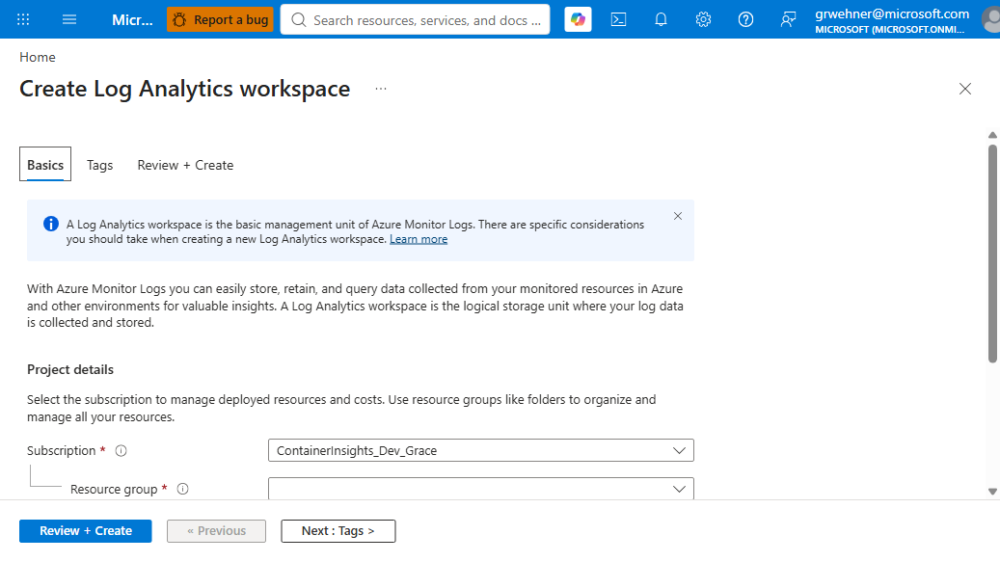
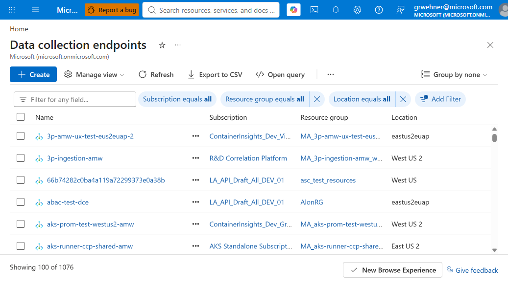
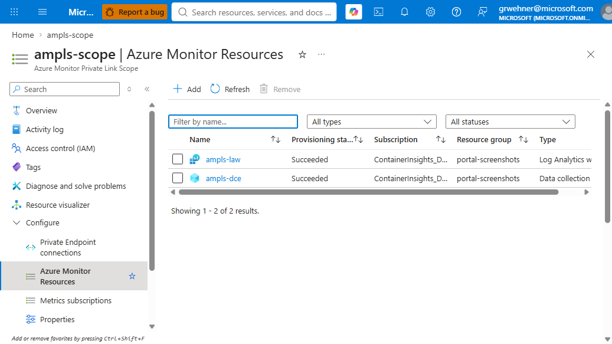
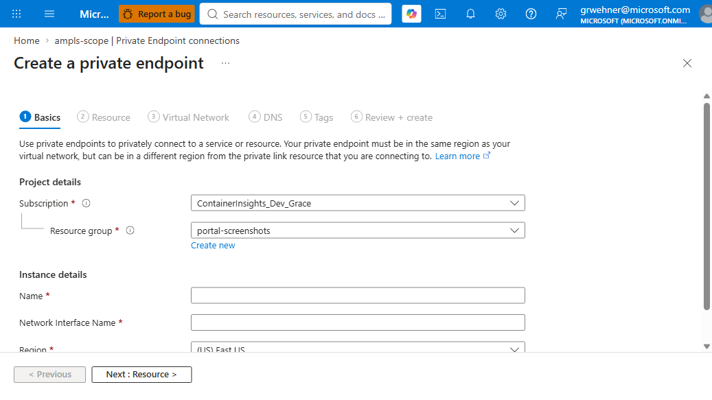
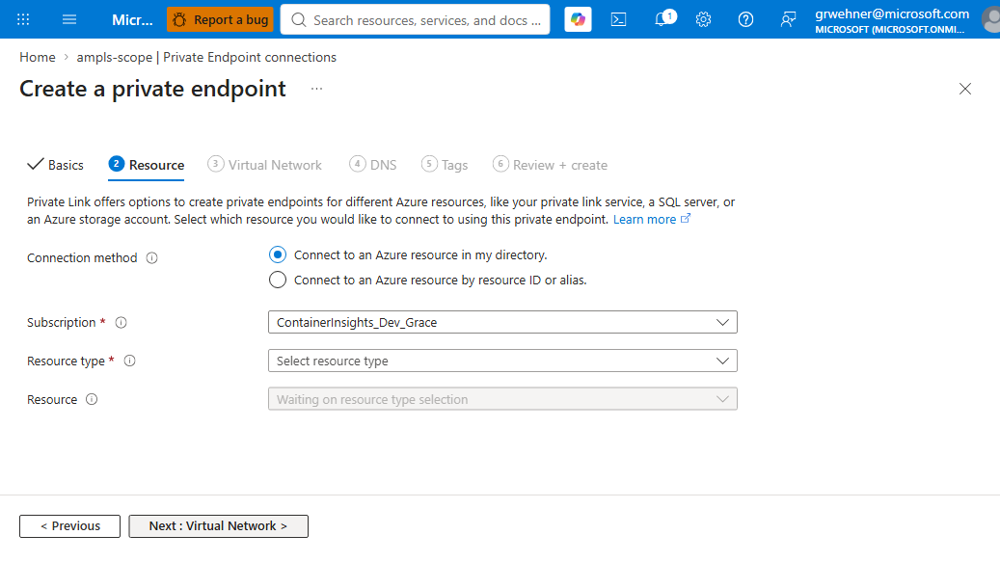
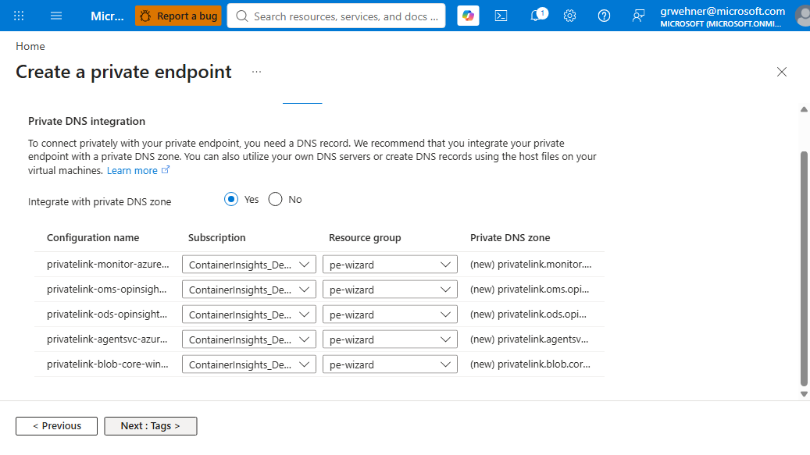
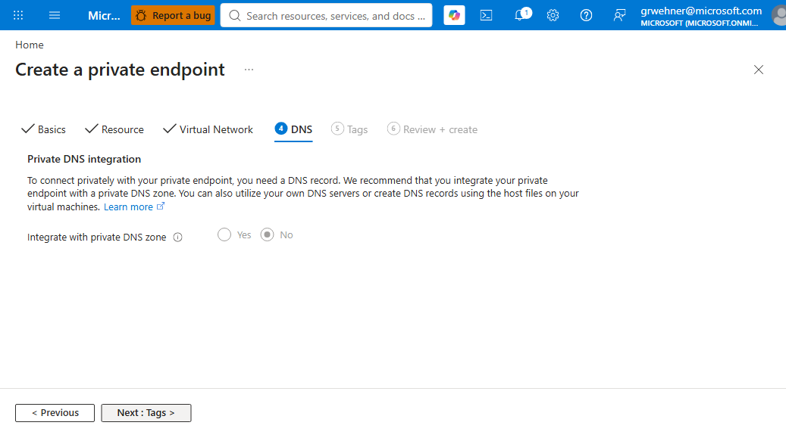
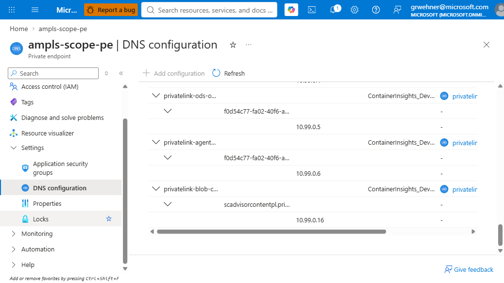
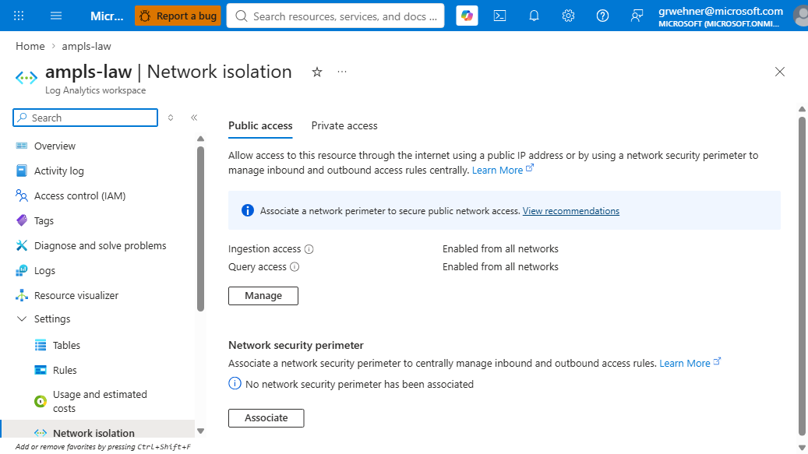
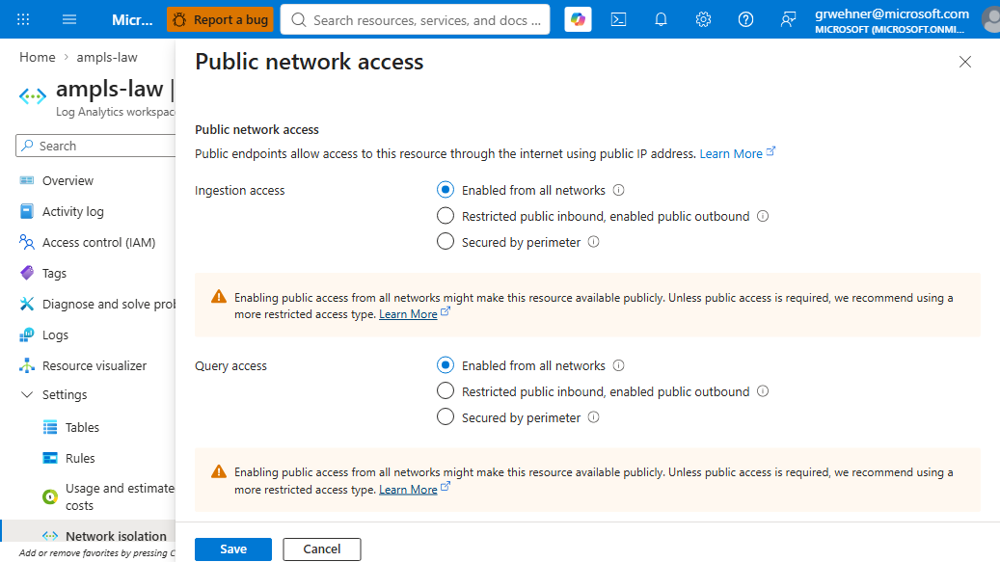

# Tutorial: Monitor Azure Kubernetes Service (AKS) with Log Analytics behind Azure Monitor Private Link Scope (AMPLS)

This tutorial walks through the complete end-to-end configuration required to send monitoring data from an Azure Kubernetes Service (AKS) cluster to a Log Analytics workspace over Azure Private Link, using an Azure Monitor Private Link Scope (AMPLS).

By the end, you will have:

- An AMPLS with a private endpoint reachable from your AKS cluster's VNET
- A Log Analytics workspace configured for private-only ingestion
- All five required Private DNS zones created, linked to the workload VNET, and integrated with the private endpoint
- Verified that DNS resolution from inside the cluster returns private IP addresses
- Verified that data is flowing into the workspace

> [!IMPORTANT]
> The most common failure mode for AKS + AMPLS + Log Analytics is a **DNS resolution gap** that leaves the workspace's ODS ingestion endpoint resolving to a public IP address. When the workspace is set to accept only private-link ingestion, uploads then fail with HTTP 403. Follow every step of this tutorial and complete the verification in Step 8 before declaring success.

## Prerequisites

- An Azure subscription with permissions to create private link scopes, private endpoints, private DNS zones, Log Analytics workspaces, and Data Collection Endpoints.
- An existing or planned AKS cluster with a bring-your-own VNET (BYO VNET). Managed CNI networks that don't expose a subnet resource ID are not supported for this pattern.
- The Azure CLI (2.55.0 or later) with the `monitor-control-service` extension:
  ```bash
  az extension add --name monitor-control-service --allow-preview true --yes
  ```
- `kubectl` configured for the AKS cluster.

## Architecture overview

You will create the following resources and relationships:

```
                                  ┌───────────────────────────────────────┐
                                  │  Azure Monitor Private Link Scope     │
                                  │           (global resource)           │
                                  │  ┌─────────────────────────────────┐  │
                                  │  │  Scoped resources               │  │
                                  │  │   • Log Analytics workspace     │  │
                                  │  │   • Data Collection Endpoint    │  │
                                  │  └─────────────────────────────────┘  │
                                  └───────────────┬───────────────────────┘
                                                  │
                                       ┌──────────┴───────────┐
                                       │  Private Endpoint    │  ← lives in your workload VNET
                                       │  groupId=azuremonitor│
                                       │  privateDnsZoneGroup:│
                                       │   • A record for LA workspace ODS
                                       │   • A record for DCE handler + ingest
                                       │   • A record for global handlers
                                       │   • A record for automation svc
                                       │   • A record for AI Profiler blob storage
                                       └──────────┬───────────┘
                                                  │
    ┌──────────────────────────────────────┬──────┴──────┬──────────────────────────────────┐
    ▼                                      ▼             ▼                                  ▼
┌──────────────────────────┐  ┌──────────────────────┐ ┌────────────────────────┐ ┌──────────────────────────┐
│ privatelink.monitor.     │  │ privatelink.ods.     │ │ privatelink.oms.       │ │ privatelink.agentsvc.    │
│   azure.com              │  │  opinsights.azure.com│ │  opinsights.azure.com  │ │  azure-automation.net    │
│  + privatelink.blob.core.│  │                      │ │                        │ │                          │
│   windows.net            │  │                      │ │                        │ │                          │
└──────────────────────────┘  └──────────────────────┘ └────────────────────────┘ └──────────────────────────┘
    ▲                                      ▲             ▲                                  ▲
    │       Each of these five zones must have a `virtualNetworkLinks` entry pointing at the AKS VNET.
    │       Portal wizard auto-integration only creates links to the private endpoint's own VNET.
    │       Manual setup, IaC, or hub-and-spoke topologies must add each link explicitly.
```

## Required Private DNS zones

Every AMPLS Private Endpoint targeting the `azuremonitor` subresource requires **five separate** Private DNS zones. They are separate top-level DNS domains and cannot be merged:

| Zone | Endpoints it covers | Why it matters |
|---|---|---|
| `privatelink.monitor.azure.com` | Global handlers, Data Collection Endpoints, Application Insights | Configuration retrieval, DCE ingestion |
| `privatelink.ods.opinsights.azure.com` | Log Analytics workspace ingestion (`{workspaceId}.ods.opinsights.azure.com`) | **Data upload path for Container Insights, syslog, VM Insights, and other Log Analytics ingestion** |
| `privatelink.oms.opinsights.azure.com` | Legacy OMS onboarding endpoint | Required for legacy authentication paths |
| `privatelink.agentsvc.azure-automation.net` | Log Analytics agent service | Required for Log Analytics agent (MMA/AMA) |
| `privatelink.blob.core.windows.net` | Solution pack storage, Application Insights Profiler backing store | Required for solution and Profiler traffic |

Each of these zones must be:

1. Created (in any resource group; central "network" subscription is common in enterprise setups).
2. Referenced by the Private Endpoint's `privateDnsZoneGroup` — this is what causes A records to be populated automatically when scoped resources are added.
3. Linked to the AKS VNET via `virtualNetworkLinks` — this is what causes DNS queries **from inside the cluster** to be resolved against the zone.

> [!NOTE]
> Step 2 and Step 3 are independent. It is possible for a zone to have correct A records (step 2 done) but return public IPs from inside the cluster (step 3 missed). This is the most common failure mode observed in production support cases.

## Step 1 — Set variables or parameters

If you're using the Azure portal, skip this step; the portal collects these values in each wizard.

# [Azure CLI](#tab/cli)

```bash
# Change these to match your environment
SUB=<your-subscription-id>
LOC=westus3
RG_MONITORING=aks-monitoring-rg     # holds LAW, DCE, AMPLS, PE, zones
RG_AKS=<your-aks-resource-group>    # existing AKS cluster's RG
AKS_NAME=<your-aks-cluster-name>
VNET_NAME=<your-aks-vnet-name>
VNET_RG=<your-aks-vnet-rg>          # can be the same as RG_AKS
PE_SUBNET_NAME=<subnet-for-private-endpoint>  # a dedicated /27 or larger subnet
LAW=aks-law
DCE=aks-dce
AMPLS=aks-ampls
PE=aks-ampls-pe

az account set --subscription $SUB
az group create -n $RG_MONITORING -l $LOC
```

# [Bicep](#tab/bicep)

Save the following as `main.bicep`. You'll append resources to this file in each step. Deploy at the end of Step 5 with a single `az deployment group create`.

```bicep
// main.bicep — see full assembled template at the end of this tutorial
targetScope = 'resourceGroup'

@description('Location for regional resources')
param location string = resourceGroup().location

@description('Log Analytics workspace name')
param workspaceName string = 'aks-law'

@description('Data Collection Endpoint name')
param dceName string = 'aks-dce'

@description('AMPLS name')
param amplsName string = 'aks-ampls'

@description('Private endpoint name')
param peName string = 'aks-ampls-pe'

@description('Resource ID of the subnet where the PE NIC will live')
param peSubnetId string

@description('Resource ID of the AKS cluster VNET (zones will be linked to this VNET)')
param aksVnetId string
```

Deploy at the end of Step 5:

```bash
az group create -n aks-monitoring-rg -l westus3
az deployment group create \
  -g aks-monitoring-rg -f main.bicep \
  -p peSubnetId=<pe-subnet-id> aksVnetId=<aks-vnet-id>
```

---

## Step 2 — Create the Log Analytics workspace and Data Collection Endpoint

# [Azure portal](#tab/portal)

Create the Log Analytics workspace:

1. In the portal, search for **Log Analytics workspaces** and select **Create**.
2. On the **Basics** tab, choose your subscription and resource group, enter a **Name** (for example, `aks-law`), and select your region.
3. Select **Review + create**, then **Create**.



Create the Data Collection Endpoint:

1. Search for **Monitor** in the portal, then select **Data Collection Endpoints** in the left navigation.
2. Select **Create**.
3. On the **Basics** tab, choose your subscription and resource group, enter a **Name** (for example, `aks-dce`), select the same region as your AKS cluster, and leave **Public network access** as **Enabled** for now.
4. Select **Review + create**, then **Create**.



# [Azure CLI](#tab/cli)

```bash
LAW_ID=$(az monitor log-analytics workspace create \
  --resource-group $RG_MONITORING --workspace-name $LAW --location $LOC \
  --query id -o tsv)

DCE_ID=$(az monitor data-collection endpoint create \
  --resource-group $RG_MONITORING --name $DCE --location $LOC \
  --public-network-access Enabled \
  --query id -o tsv)
```

# [Bicep](#tab/bicep)

Append to `main.bicep`:

```bicep
resource workspace 'Microsoft.OperationalInsights/workspaces@2022-10-01' = {
  name: workspaceName
  location: location
  properties: {
    sku: { name: 'PerGB2018' }
    // Left Enabled during setup; locked down in Step 7 after DNS is verified.
    publicNetworkAccessForIngestion: 'Enabled'
    publicNetworkAccessForQuery: 'Enabled'
  }
}

resource dce 'Microsoft.Insights/dataCollectionEndpoints@2023-03-11' = {
  name: dceName
  location: location
  properties: {
    networkAcls: {
      publicNetworkAccess: 'Enabled'
    }
  }
}
```

---

Note: `publicNetworkAccessForIngestion` is left as `Enabled`. We will disable it in Step 7 after private link is fully wired up. Doing so up-front would prevent any pre-existing agent from talking to the workspace during the changeover window.

## Step 3 — Create the AMPLS and scope in the workspace and DCE

# [Azure portal](#tab/portal)

Create the Azure Monitor Private Link Scope:

1. Search for **Azure Monitor Private Link Scopes** in the portal and select **Create**.
2. On the **Basics** tab, choose your subscription and resource group, enter a **Name** (for example, `aks-ampls`), and leave both **Query access mode** and **Ingestion access mode** as **Open** — we will restrict them later if desired.
3. Select **Review + create**, then **Create**.

Add the workspace and DCE as scoped resources:

1. Open the newly created AMPLS.
2. In the left navigation, select **Azure Monitor Resources**.
3. Select **Add**, choose your Log Analytics workspace, and select **Apply**.
4. Select **Add** again, choose your Data Collection Endpoint, and select **Apply**.

You should see both resources listed under **Azure Monitor Resources**.



# [Azure CLI](#tab/cli)

```bash
# AMPLS is a global resource
AMPLS_ID=$(az resource create \
  --resource-group $RG_MONITORING \
  --name $AMPLS \
  --resource-type Microsoft.Insights/privateLinkScopes \
  --api-version 2021-07-01-preview \
  --location Global \
  --properties '{"accessModeSettings":{"queryAccessMode":"Open","ingestionAccessMode":"Open"}}' \
  --query id -o tsv)

az monitor private-link-scope scoped-resource create \
  --resource-group $RG_MONITORING --scope-name $AMPLS \
  --name law-conn --linked-resource $LAW_ID

az monitor private-link-scope scoped-resource create \
  --resource-group $RG_MONITORING --scope-name $AMPLS \
  --name dce-conn --linked-resource $DCE_ID
```

# [Bicep](#tab/bicep)

Append to `main.bicep`:

```bicep
resource ampls 'Microsoft.Insights/privateLinkScopes@2021-07-01-preview' = {
  name: amplsName
  location: 'global'
  properties: {
    accessModeSettings: {
      queryAccessMode: 'Open'
      ingestionAccessMode: 'Open'
    }
  }
}

resource lawScope 'Microsoft.Insights/privateLinkScopes/scopedResources@2021-07-01-preview' = {
  parent: ampls
  name: 'law-conn'
  properties: {
    linkedResourceId: workspace.id
  }
}

resource dceScope 'Microsoft.Insights/privateLinkScopes/scopedResources@2021-07-01-preview' = {
  parent: ampls
  name: 'dce-conn'
  properties: {
    linkedResourceId: dce.id
  }
}
```

---

## Step 4 — Create the private endpoint in the AKS VNET

The private endpoint's NIC must live in a subnet inside the same VNET as your AKS cluster (or in a peered VNET with a working DNS forwarder — see the troubleshooting section).

> [!TIP]
> **The Azure portal wizard's DNS integration option is the safest path.** If you select **Integrate with private DNS zone = Yes**, the portal creates all five required DNS zones, links each to the private endpoint's VNET, and attaches each to the private endpoint in one action. This is Step 5 done for you.
>
> If you use the CLI, IaC, or the portal wizard with **Integrate = No**, you must perform Step 5 manually. Missing any zone silently breaks the corresponding data path.

# [Azure portal (recommended)](#tab/portal)

1. Open your AMPLS in the portal.
2. In the left navigation, select **Private Endpoint connections**.
3. Select **Private endpoint** to launch the create wizard.

Fill out the wizard tabs:

**Basics tab**
- **Subscription**, **Resource group**: same as your AMPLS
- **Name**: `aks-ampls-pe` (or similar)
- **Region**: same as your AKS cluster



**Resource tab**
- **Resource type**: `Microsoft.Insights/privateLinkScopes` (pre-filled)
- **Resource**: your AMPLS (pre-filled)
- **Target sub-resource**: `azuremonitor`



**Virtual Network tab**
- **Virtual network**: your AKS cluster's VNET
- **Subnet**: your dedicated private-endpoint subnet (do not use the AKS node subnet)
- Leave **Network policy for private endpoints** at the default
- Leave **Private IP configuration** at **Dynamically allocate IP address**

**DNS tab**
- **Integrate with private DNS zone**: **Yes** — this is the critical selection
- The portal shows all five zones it will create for the `azuremonitor` sub-resource. Verify all five appear (monitor, oms, ods, agentsvc, blob).
- Leave the auto-generated Configuration names as-is unless you have a specific naming convention.



> [!WARNING]
> On the **Resource** tab, if you chose **Connect to an Azure resource by resource ID or alias** instead of **Connect to an Azure resource in my directory**, the **Integrate with private DNS zone** option on the DNS tab will be **disabled**, forcing you to manage the five zones manually (Step 5). Use the in-directory picker whenever possible.
>
> 

**Review + create**: verify, then select **Create**.

Once the private endpoint deploys, the portal has already:

- Created five Private DNS zones (`privatelink.monitor.azure.com`, `privatelink.ods.opinsights.azure.com`, `privatelink.oms.opinsights.azure.com`, `privatelink.agentsvc.azure-automation.net`, `privatelink.blob.core.windows.net`) in the same resource group as the PE.
- Linked each zone to the AKS VNET via `virtualNetworkLinks`.
- Attached each zone to the private endpoint's `privateDnsZoneGroup`.
- Populated A records inside each zone for the scoped LAW's ODS FQDN, the DCE endpoints, and other global endpoints.

Verify by opening the PE's **DNS configuration** blade. You should see 5 top-level Configuration rows (one per zone), each expandable to show its A records:



You can proceed directly to Step 6.

# [Azure CLI](#tab/cli)

Create the PE without DNS integration; Step 5 handles the five zones explicitly.

```bash
VNET_ID=$(az network vnet show -g $VNET_RG -n $VNET_NAME --query id -o tsv)
PE_SUBNET_ID=$(az network vnet subnet show -g $VNET_RG --vnet-name $VNET_NAME -n $PE_SUBNET_NAME --query id -o tsv)

az network private-endpoint create \
  --resource-group $RG_MONITORING --name $PE --location $LOC \
  --subnet $PE_SUBNET_ID \
  --private-connection-resource-id $AMPLS_ID \
  --group-id azuremonitor \
  --connection-name ampls-conn
```

You must proceed to Step 5 to create + link + attach the five zones.

# [Bicep](#tab/bicep)

Append to `main.bicep`. Bicep does not have an "auto-integrate DNS zone" flag — the equivalent is defining the `privateDnsZoneGroup` child resource (in Step 5).

```bicep
resource pe 'Microsoft.Network/privateEndpoints@2023-05-01' = {
  name: peName
  location: location
  properties: {
    subnet: { id: peSubnetId }
    privateLinkServiceConnections: [
      {
        name: 'ampls-conn'
        properties: {
          privateLinkServiceId: ampls.id
          groupIds: [ 'azuremonitor' ]
        }
      }
    ]
  }
  dependsOn: [ lawScope, dceScope ]
}
```

You must proceed to Step 5 to create + link + attach the five zones.

---

## Step 5 — Create the five Private DNS zones, link them to the AKS VNET, and attach them to the private endpoint

> [!NOTE]
> If you used the **Azure portal** in Step 4 with **Integrate = Yes**, this step is already complete — skip to Step 6. This step is required only if you used the CLI, Bicep/ARM, or the portal with **Integrate = No**.

This is the step where most misconfigurations occur when done manually. Missing any one zone breaks the corresponding data path. Missing a VNET link causes pods to fall back to public DNS resolution even though A records are present.

# [Azure portal (manual DNS)](#tab/portal)

For each of the five zones (`privatelink.monitor.azure.com`, `privatelink.ods.opinsights.azure.com`, `privatelink.oms.opinsights.azure.com`, `privatelink.agentsvc.azure-automation.net`, `privatelink.blob.core.windows.net`):

**5a. Create the zone**
1. Search for **Private DNS zones** in the portal, select **Create**.
2. Choose your subscription and resource group, enter the zone name exactly as listed above.
3. Select **Review + create**, then **Create**.

**5b. Link the zone to the AKS VNET**
1. Open the newly created zone.
2. In the left navigation, select **Virtual network links**.
3. Select **Add**.
4. Enter a **Link name** (for example, `aks-vnet-link`).
5. Choose the AKS VNET.
6. Leave **Enable auto registration** off.
7. Select **OK**.

**5c. Attach the zone to the private endpoint**
1. Open your private endpoint in the portal.
2. In the left navigation, select **DNS configuration**.
3. Select **Add configuration**.
4. Enter a **Configuration name** (for example, `privatelink-ods`).
5. Choose the Private DNS zone you just created.
6. Select **Add**.

Repeat 5a–5c for each of the five zones. This is 15 portal actions total — the CLI loop in the next tab is faster and less error-prone.

# [Azure CLI](#tab/cli)

Loop over the five zones in one command:

```bash
ZONES=(
  privatelink.monitor.azure.com
  privatelink.ods.opinsights.azure.com
  privatelink.oms.opinsights.azure.com
  privatelink.agentsvc.azure-automation.net
  privatelink.blob.core.windows.net
)

for z in "${ZONES[@]}"; do
  # 5a. Create the zone
  az network private-dns zone create --resource-group $RG_MONITORING --name $z

  # 5b. Link the zone to the AKS VNET (this is what makes DNS resolve from pods)
  az network private-dns link vnet create \
    --resource-group $RG_MONITORING --zone-name $z \
    --name aks-vnet-link \
    --virtual-network $VNET_ID \
    --registration-enabled false

  # 5c. Attach the zone to the private endpoint (this is what populates A records)
  ZONE_ID=$(az network private-dns zone show --resource-group $RG_MONITORING --name $z --query id -o tsv)
  ZONE_KEY=$(echo $z | tr . -)
  az network private-endpoint dns-zone-group add \
    --resource-group $RG_MONITORING \
    --endpoint-name $PE \
    --name default \
    --zone-name $ZONE_KEY \
    --private-dns-zone $ZONE_ID
done
```

# [Bicep](#tab/bicep)

Append to `main.bicep`. This block creates all five zones, links each to the AKS VNET, and attaches all five to the PE's `privateDnsZoneGroup` in one deployment:

```bicep
var zones = [
  'privatelink.monitor.azure.com'
  'privatelink.ods.opinsights.azure.com'
  'privatelink.oms.opinsights.azure.com'
  'privatelink.agentsvc.azure-automation.net'
  'privatelink.blob.core.windows.net'
]

resource dnsZones 'Microsoft.Network/privateDnsZones@2020-06-01' = [for z in zones: {
  name: z
  location: 'global'
}]

resource vnetLinks 'Microsoft.Network/privateDnsZones/virtualNetworkLinks@2020-06-01' = [for (z, i) in zones: {
  name: '${z}/aks-vnet-link'
  location: 'global'
  properties: {
    virtualNetwork: { id: aksVnetId }
    registrationEnabled: false
  }
  dependsOn: [ dnsZones[i] ]
}]

resource dnsZoneGroup 'Microsoft.Network/privateEndpoints/privateDnsZoneGroups@2023-05-01' = {
  parent: pe
  name: 'default'
  properties: {
    privateDnsZoneConfigs: [for (z, i) in zones: {
      name: replace(z, '.', '-')
      properties: { privateDnsZoneId: dnsZones[i].id }
    }]
  }
}
```

Now deploy the complete `main.bicep`:

```bash
az deployment group create \
  -g aks-monitoring-rg -f main.bicep \
  -p peSubnetId=<pe-subnet-id> aksVnetId=<aks-vnet-id>
```

---

After Step 5c completes for all five zones (or Step 4 completed with portal auto-integration), verify that the workspace's A record has been created:

# [Azure portal](#tab/portal)

1. Open the **`privatelink.ods.opinsights.azure.com`** Private DNS zone in the portal.
2. In the left navigation, select **Recordsets**.
3. You should see exactly one A record whose name matches your workspace's **Workspace ID** (a GUID), with a value in the private-endpoint subnet's IP range.

If the record is missing, the private endpoint isn't attached to this zone. Revisit Step 5c.

# [Azure CLI](#tab/cli)

```bash
WSID=$(az monitor log-analytics workspace show --ids $LAW_ID --query customerId -o tsv)

az network private-dns record-set a list \
  --resource-group $RG_MONITORING \
  --zone-name privatelink.ods.opinsights.azure.com \
  --query "[?name=='$WSID'].{name:name, ip:aRecords[0].ipv4Address}" -o table
```

You should see exactly one row with a private IP address from the private endpoint's subnet.

---

## Step 6 — Deploy or reconfigure AKS in the same VNET

# [Azure portal](#tab/portal)

If your AKS cluster does not yet exist:

1. Search for **Kubernetes services** in the portal and select **Create → Create a Kubernetes cluster**.
2. On the **Basics** tab, choose your subscription and resource group, enter a **Cluster name**, and select the same region as your AMPLS.
3. Optionally, enable **API server VNET integration** or **Private cluster** for API-server private link (this is orthogonal to AMPLS).
4. On the **Networking** tab, under **Container networking**, choose **Azure CNI** (or **Azure CNI Overlay**).
5. Choose **Bring your own virtual network** and select your VNET and node subnet — the same VNET as the private endpoint from Step 4.
6. Complete the remaining tabs with your usual settings.
7. Select **Review + create**, then **Create**.

Associate the DCE with the cluster:

1. Open your DCE in the portal.
2. In the left navigation, select **Resources**.
3. Select **Add** and choose your AKS cluster.

For an existing cluster in the same VNET, no reconfiguration is needed for AMPLS itself — private link is a VNET-level concern. Only associate the DCE as described above.

# [Azure CLI](#tab/cli)

If your AKS cluster does not yet exist:

```bash
AKS_SUBNET_ID=$(az network vnet subnet show -g $VNET_RG --vnet-name $VNET_NAME -n <aks-subnet-name> --query id -o tsv)

az aks create \
  --resource-group $RG_AKS --name $AKS_NAME --location $LOC \
  --network-plugin azure --vnet-subnet-id $AKS_SUBNET_ID \
  --enable-private-cluster \
  --enable-managed-identity \
  --node-count 3 \
  --generate-ssh-keys
```

For an existing cluster in the same VNET, no reconfiguration is needed for AMPLS itself — private link is a VNET-level concern.

Associate the DCE with the cluster for configuration retrieval over private link:

```bash
CLUSTER_ID=$(az aks show -g $RG_AKS -n $AKS_NAME --query id -o tsv)
az monitor data-collection rule association create \
  --association-name configurationAccessEndpoint \
  --data-collection-endpoint-id $DCE_ID \
  --resource-uri $CLUSTER_ID
```

# [Bicep](#tab/bicep)

Creating an AKS cluster with Bicep involves a large `Microsoft.ContainerService/managedClusters` resource with your specific networking, identity, and node pool configuration — outside the scope of this tutorial. Follow the [AKS Bicep quickstart](/azure/aks/learn/quick-kubernetes-deploy-bicep) for that.

For an existing AKS cluster deployed via Bicep, add this data collection rule association in your AMPLS Bicep or a separate module to bind the DCE to the cluster:

```bicep
@description('Resource ID of the AKS cluster')
param aksClusterId string

// Reference the AKS cluster as an existing resource
resource aks 'Microsoft.ContainerService/managedClusters@2024-01-01' existing = {
  scope: resourceGroup(split(aksClusterId, '/')[4])
  name: split(aksClusterId, '/')[8]
}

resource dceAssoc 'Microsoft.Insights/dataCollectionRuleAssociations@2022-06-01' = {
  name: 'configurationAccessEndpoint'
  scope: aks
  properties: {
    dataCollectionEndpointId: dce.id
  }
}
```

Add `aksClusterId` to your parameters block in Step 1 and pass it when you deploy.

---

## Step 7 — Enable monitoring and lock down the workspace

# [Azure portal](#tab/portal)

Enable Container Insights:

1. Open your AKS cluster in the portal.
2. In the left navigation, under **Monitoring**, select **Insights**.
3. Select **Configure Azure Monitor**.
4. Choose your Log Analytics workspace (`aks-law`).
5. Under **Authentication**, choose **Managed identity**.
6. Select **Configure**.

Wait a few minutes for the monitoring addon to deploy. You can verify by checking that the `ama-logs` daemonset pods are in the `Running` state under **Workloads → Daemon sets → kube-system**.

Lock down the workspace:

1. Open your Log Analytics workspace in the portal.
2. In the left navigation, under **Settings**, select **Network Isolation**.
3. On the **Public access** tab, select **Manage**.

   

4. Under **Ingestion access**, choose **Restricted public inbound, enabled public outbound** (which disables public ingestion) or **Secured by perimeter** if you have a Network Security Perimeter set up.
5. Leave the **Query access** setting according to your preference.
6. Select **Save**.

   

# [Azure CLI](#tab/cli)

Enable Container Insights with AAD-managed-identity auth:

```bash
az aks enable-addons \
  --resource-group $RG_AKS --name $AKS_NAME --addons monitoring \
  --workspace-resource-id $LAW_ID \
  --enable-msi-auth-for-monitoring true
```

Now that the private data path is in place, lock down the workspace to only accept private-link ingestion:

```bash
az monitor log-analytics workspace update \
  --ids $LAW_ID \
  --set properties.publicNetworkAccessForIngestion=Disabled
```

# [Bicep](#tab/bicep)

Enable the monitoring add-on by adding `addonProfiles.omsagent` to your AKS cluster's Bicep resource. Because this requires modifying the AKS resource definition itself, we recommend running the `az aks enable-addons` CLI command directly against the existing cluster (see the CLI tab) — otherwise you must reconcile the full AKS Bicep resource with your existing cluster's state.

If you own the AKS Bicep and want to declare the addon there, add:

```bicep
resource aksCluster 'Microsoft.ContainerService/managedClusters@2024-01-01' = {
  // ... existing AKS cluster properties ...
  properties: {
    // ... existing properties ...
    addonProfiles: {
      omsagent: {
        enabled: true
        config: {
          logAnalyticsWorkspaceResourceID: workspace.id
          useAADAuth: 'true'
        }
      }
    }
  }
}
```

Lock down the workspace by updating the Step 2 workspace resource to set `publicNetworkAccessForIngestion: 'Disabled'`. This is a change to the resource declared in Step 2:

```bicep
resource workspace 'Microsoft.OperationalInsights/workspaces@2022-10-01' = {
  name: workspaceName
  location: location
  properties: {
    sku: { name: 'PerGB2018' }
    publicNetworkAccessForIngestion: 'Disabled'  // ← was 'Enabled' in Step 2; flip AFTER Step 8 verifies
    publicNetworkAccessForQuery: 'Enabled'
  }
}
```

> [!IMPORTANT]
> Do not flip `publicNetworkAccessForIngestion` to `Disabled` in the same deployment as the initial setup. Deploy Steps 2–6 first with `Enabled`, complete Step 8 verification, then run a second deployment with `Disabled`. This avoids a chicken-and-egg where the workspace is locked down before the private DNS path is proven.

---

## Step 8 — Verify DNS resolution from inside the cluster

This step is what catches the most common misconfiguration. **Do not skip it, and do not substitute a portal-only check.** The portal's PE **DNS configuration** blade shows what A records exist inside your Private DNS zones — but that says nothing about whether the pod's DNS resolver can actually reach them. The two are independent.

Use `kubectl` regardless of whether the rest of your setup used the portal:

```bash
az aks get-credentials -g $RG_AKS -n $AKS_NAME --overwrite-existing

# Wait for ama-logs pods to be Running
kubectl -n kube-system rollout status ds/ama-logs --timeout=5m

WSID=$(az monitor log-analytics workspace show --ids $LAW_ID --query customerId -o tsv)

kubectl -n kube-system exec ds/ama-logs -c ama-logs -- sh -c "
for h in \
  global.handler.control.monitor.azure.com \
  ${WSID}.ods.opinsights.azure.com \
  ${WSID}.oms.opinsights.azure.com \
  ${WSID}.agentsvc.azure-automation.net ; do
  echo \"=== \$h ===\"
  getent hosts \$h || echo NXDOMAIN
done"
```

**Expected outcome**: every FQDN resolves to a `10.x.x.x` address on the private endpoint's subnet.

If any FQDN returns a **public** IP (typically `20.x.x.x`, `40.x.x.x`, or `52.x.x.x`), or `NXDOMAIN`, jump to the troubleshooting section below.

> [!IMPORTANT]
> Do not substitute `curl -v` or `nslookup` from a jumphost for this check. The pod's DNS resolver is what mdsd/AMA uses to upload data. A jumphost in a different subnet or VNET may resolve differently.
>
> Also note the workspace-scoped nature of these FQDNs: `ods.opinsights.azure.com`, `oms.opinsights.azure.com`, and `agentsvc.azure-automation.net` are **not** resolvable as bare hostnames. Only `{workspaceId}.<domain>` resolves. Firewall or DNS forwarder rules that use the bare domain will pass their own syntax checks and still leave your workspace unreachable.

## Step 9 — Verify data is flowing to the workspace

Wait five minutes after Step 8 succeeds, then check the workspace.

# [Azure portal](#tab/portal)

Two ways to verify:

**Container Insights UI**
1. Open your AKS cluster in the portal.
2. Under **Monitoring**, select **Insights**.
3. The **Cluster**, **Nodes**, **Controllers**, and **Containers** tabs should populate with data.

**KQL query**
1. Open your Log Analytics workspace in the portal.
2. In the left navigation, select **Logs**.
3. Run:
   ```kusto
   union ContainerLogV2, KubeEvents, KubePodInventory
   | where TimeGenerated > ago(10m)
   | summarize count() by Type
   ```
4. You should see nonzero counts for `KubeEvents`, `KubePodInventory`, and (once workload pods generate stdout logs) `ContainerLogV2`.

# [Azure CLI](#tab/cli)

```bash
az monitor log-analytics query --workspace $WSID \
  --analytics-query "union ContainerLogV2, KubeEvents, KubePodInventory
                     | where TimeGenerated > ago(10m)
                     | summarize count() by Type" -o table
```

You should see nonzero counts for `KubeEvents`, `KubePodInventory`, and (once workload pods generate stdout logs) `ContainerLogV2`.

---

## Troubleshooting

### Data isn't appearing in the workspace

Rank the checks in this order:

1. **Step 8 — DNS resolution from inside the pod.** This is the single most valuable diagnostic. If any of the four FQDNs return a public IP, the corresponding Private DNS zone is either not linked to the AKS VNET (Step 5b missed) or not attached to the private endpoint (Step 5c missed).

2. **Private DNS zone → VNET links.** Verify each zone is linked to your AKS VNET:
   ```bash
   for z in "${ZONES[@]}"; do
     echo "=== $z ==="
     az network private-dns link vnet list \
       --resource-group $RG_MONITORING --zone-name $z \
       --query "[].{link:name, vnet:virtualNetwork.id, status:virtualNetworkLinkState}" -o table
   done
   ```
   Expected: each zone shows one link named `aks-vnet-link` with `Completed` status pointing at your AKS VNET.

3. **Private endpoint's DNS zone group.** Verify all five zones are integrated with the PE:
   ```bash
   az network private-endpoint dns-zone-group show \
     --resource-group $RG_MONITORING --endpoint-name $PE --name default \
     --query "privateDnsZoneConfigs[].{name:name, zone:privateDnsZoneId}" -o table
   ```
   Expected: five rows, one per zone.

4. **Scoped resources on the AMPLS.** Verify LAW + DCE are actually scoped:
   ```bash
   az monitor private-link-scope scoped-resource list \
     --resource-group $RG_MONITORING --scope-name $AMPLS \
     --query "[].{name:name, linked:linkedResourceId}" -o table
   ```

5. **Workspace network access mode.** Confirm the setting is what you expect:
   ```bash
   az monitor log-analytics workspace show --ids $LAW_ID \
     --query "{ingest:publicNetworkAccessForIngestion, query:publicNetworkAccessForQuery}"
   ```
   If ingestion is `Disabled` and Step 8 shows a public IP, ingestion will fail with HTTP 403 at the workspace layer. Fix DNS (Step 5) first, then rerun Step 8 to confirm before treating the workspace's setting as the cause.

### Hub-and-spoke: private endpoint lives in a hub VNET, AKS in a spoke

Portal auto-integration and `az network private-dns link vnet create` in Step 5b link zones only to a single VNET. In a hub-and-spoke topology, run Step 5b once for the hub VNET and once for each spoke that needs to resolve the FQDNs — OR configure the spoke to use a DNS server in the hub (Azure Private DNS Resolver, or a DNS forwarder VM). VNET peering by itself does not propagate Private DNS zone resolution.

### The workspace-scoped FQDN pattern surprises

`ods.opinsights.azure.com`, `oms.opinsights.azure.com`, and `agentsvc.azure-automation.net` are not resolvable on their own. Only workspace-scoped subdomains resolve:

- `{workspaceId}.ods.opinsights.azure.com`
- `{workspaceId}.oms.opinsights.azure.com`
- `{workspaceId}.agentsvc.azure-automation.net`

Firewall allow-lists, DNS conditional forwarders, and Azure Policy rules must target the parent domain (`*.ods.opinsights.azure.com`, etc.) or the workspace-scoped FQDN — not the bare parent alone.

### After a fix, force the ama-logs pods to reload DNS

Pod-side DNS caching means changes take effect on the next resolve. To make the change immediate:

```bash
kubectl -n kube-system delete pod -l component=ama-logs-agent
```

New pods start within seconds. Repeat Step 8 to confirm private resolution before running Step 9.

## Complete assembled `main.bicep`

The Bicep tabs throughout Steps 1–5 build up a single file. Here is the complete assembled `main.bicep` for reference:

```bicep
targetScope = 'resourceGroup'

@description('Location for regional resources')
param location string = resourceGroup().location

@description('Log Analytics workspace name')
param workspaceName string = 'aks-law'

@description('Data Collection Endpoint name')
param dceName string = 'aks-dce'

@description('AMPLS name')
param amplsName string = 'aks-ampls'

@description('Private endpoint name')
param peName string = 'aks-ampls-pe'

@description('Resource ID of the subnet where the PE NIC will live')
param peSubnetId string

@description('Resource ID of the AKS cluster VNET (zones will be linked to this VNET)')
param aksVnetId string

var zones = [
  'privatelink.monitor.azure.com'
  'privatelink.ods.opinsights.azure.com'
  'privatelink.oms.opinsights.azure.com'
  'privatelink.agentsvc.azure-automation.net'
  'privatelink.blob.core.windows.net'
]

resource workspace 'Microsoft.OperationalInsights/workspaces@2022-10-01' = {
  name: workspaceName
  location: location
  properties: {
    sku: { name: 'PerGB2018' }
    // Change to 'Disabled' AFTER Step 8 verifies DNS resolves privately.
    publicNetworkAccessForIngestion: 'Enabled'
    publicNetworkAccessForQuery: 'Enabled'
  }
}

resource dce 'Microsoft.Insights/dataCollectionEndpoints@2023-03-11' = {
  name: dceName
  location: location
  properties: {
    networkAcls: { publicNetworkAccess: 'Enabled' }
  }
}

resource ampls 'Microsoft.Insights/privateLinkScopes@2021-07-01-preview' = {
  name: amplsName
  location: 'global'
  properties: {
    accessModeSettings: {
      queryAccessMode: 'Open'
      ingestionAccessMode: 'Open'
    }
  }
}

resource lawScope 'Microsoft.Insights/privateLinkScopes/scopedResources@2021-07-01-preview' = {
  parent: ampls
  name: 'law-conn'
  properties: { linkedResourceId: workspace.id }
}

resource dceScope 'Microsoft.Insights/privateLinkScopes/scopedResources@2021-07-01-preview' = {
  parent: ampls
  name: 'dce-conn'
  properties: { linkedResourceId: dce.id }
}

resource pe 'Microsoft.Network/privateEndpoints@2023-05-01' = {
  name: peName
  location: location
  properties: {
    subnet: { id: peSubnetId }
    privateLinkServiceConnections: [
      {
        name: 'ampls-conn'
        properties: {
          privateLinkServiceId: ampls.id
          groupIds: [ 'azuremonitor' ]
        }
      }
    ]
  }
  dependsOn: [ lawScope, dceScope ]
}

resource dnsZones 'Microsoft.Network/privateDnsZones@2020-06-01' = [for z in zones: {
  name: z
  location: 'global'
}]

resource vnetLinks 'Microsoft.Network/privateDnsZones/virtualNetworkLinks@2020-06-01' = [for (z, i) in zones: {
  name: '${z}/aks-vnet-link'
  location: 'global'
  properties: {
    virtualNetwork: { id: aksVnetId }
    registrationEnabled: false
  }
  dependsOn: [ dnsZones[i] ]
}]

resource dnsZoneGroup 'Microsoft.Network/privateEndpoints/privateDnsZoneGroups@2023-05-01' = {
  parent: pe
  name: 'default'
  properties: {
    privateDnsZoneConfigs: [for (z, i) in zones: {
      name: replace(z, '.', '-')
      properties: { privateDnsZoneId: dnsZones[i].id }
    }]
  }
}

output workspaceId string = workspace.id
output dceId string = dce.id
output amplsId string = ampls.id
```

Deploy with:

```bash
az deployment group create \
  -g aks-monitoring-rg -f main.bicep \
  -p peSubnetId=<pe-subnet-id> aksVnetId=<aks-vnet-id>
```

To convert to an ARM JSON template, use `az bicep build --file main.bicep`.

For Terraform users, the [`azurerm_monitor_private_link_scope`](https://registry.terraform.io/providers/hashicorp/azurerm/latest/docs/resources/monitor_private_link_scope), [`azurerm_monitor_private_link_scoped_service`](https://registry.terraform.io/providers/hashicorp/azurerm/latest/docs/resources/monitor_private_link_scoped_service), [`azurerm_private_endpoint`](https://registry.terraform.io/providers/hashicorp/azurerm/latest/docs/resources/private_endpoint) (with a five-entry `private_dns_zone_group.private_dns_zone_ids`), and [`azurerm_private_dns_zone_virtual_network_link`](https://registry.terraform.io/providers/hashicorp/azurerm/latest/docs/resources/private_dns_zone_virtual_network_link) resources map directly to the Bicep resources above. Make sure the `private_dns_zone_ids` array includes **all five** zones.

## Related content

- [Azure Monitor Private Link Scope (AMPLS) concepts](/azure/azure-monitor/fundamentals/private-link-security)
- [Design an AMPLS configuration](/azure/azure-monitor/fundamentals/private-link-design)
- [Azure Private Endpoint DNS reference](/azure/private-link/private-endpoint-dns) — authoritative list of 5 zones for AMPLS
- [Container Insights overview](/azure/azure-monitor/containers/container-insights-overview)
- [Enable Container Insights](/azure/azure-monitor/containers/kubernetes-monitoring-enable)
