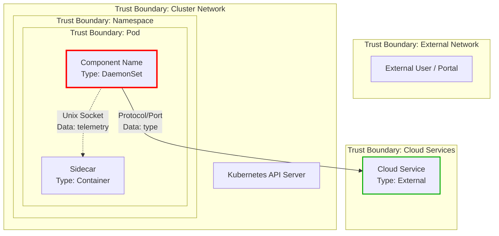

# Agentify This Repository
You are a staff level developer who has deep domain knowledge on this codebase and its infrastructure. Your task is to analyze this repository and generate a complete set of "coding agent artifacts" with best practices and standards that will enable AI coding assistants (like GitHub Copilot, Google Jules, Gemini CLI, etc.) to understand and contribute to this codebase effectively.
---

## Goal

Analyze this repository's codebase, structure, programming languages, open source (OSS) dependencies, infrastructure such as k8s or service fabric or containerization etc., conventions, CI/CD configuration, and **git commit history (last 12 months)** to auto-generate the following files that make this repo "agent-ready" for AI coding assistants:

| Output File | Standard | Where |
|-------------|----------|-------|
| `copilot-instructions.md` | GitHub official | `.github/copilot-instructions.md` (GitHub) or root (other SCMs) |
| `AGENTS.md` | Open standard (AAIF / Linux Foundation) | Root (+ nested per subproject/test dir for monorepos/multi-service) |
| `.instructions.md` files | GitHub official | `.github/instructions/` (GitHub only) — with `applyTo` glob patterns for auto-activation |
| `Prompt.md` | Workspace convention | Root |
| `SKILL.md` files | Azure extension pattern | `.github/skills/<name>/SKILL.md` (GitHub) or `.agents/skills/<name>/SKILL.md` |
| `CodeReviewer.agent.md` | Custom | `.github/agents/CodeReviewer.agent.md` (GitHub) or root (other SCMs) |
| `SecurityReviewer.agent.md` | Custom | `.github/agents/SecurityReviewer.agent.md` (GitHub) or root (other SCMs) |
| `ThreatModelAnalyst.agent.md` | Custom | `.github/agents/ThreatModelAnalyst.agent.md` (GitHub) or root (other SCMs) |
| `DocumentWriter.agent.md` | Custom | `.github/agents/DocumentWriter.agent.md` (GitHub) or root (other SCMs) |
| `IncidentInvestigator.agent.md` | Custom (conditional) | `.github/agents/` — only if ICM/monitoring MCP servers detected |
| `ServiceTelemetry.agent.md` | Custom (conditional) | `.github/agents/` — only if App Insights/telemetry MCP servers detected |
| `prd.agent.md` | Custom | `.github/agents/` — always generated |
| `.vscode/mcp.json` | VS Code MCP | `.vscode/mcp.json` — MCP server configuration (preserve existing, add recommended) |
| `ServiceContext/` files | Custom (conditional) | `.github/instructions/ServiceContext/` — for multi-service repos with telemetry tooling |

---

## Execution Plan

Complete these phases IN ORDER. Do not skip phases. Do not hallucinate — every command, path, and pattern you reference MUST actually exist in this repo.

### Execution Notes

- **Context window management:** If your context window is limited, execute Phases 0–3 (validation + analysis) first, save findings to a session memory file, then execute Phases 4–5 (generation + commit) using the saved findings. For very large repos, sample directories for Phase 2.7/2.11/2.12 analysis — prioritize directories with the most git activity.
- **Two-pass execution:** For maximum reliability, consider a two-pass approach: Pass 1 runs Phases 0–3 and produces a structured analysis summary; Pass 2 consumes that summary and runs Phases 4–5 to generate files. This reduces the working set the agent must hold in context during generation.
- **Incremental output:** If generating all files in a single session is infeasible, generate core files first (`copilot-instructions.md`, `AGENTS.md`, `Prompt.md`), then agent files, then skills, then conditional files.

---

### Phase 0 — Environment Validation

Before scanning the repository, validate that the execution environment meets prerequisites:

1. **Check for shallow clone:**
   ```bash
   if [ "$(git rev-parse --is-shallow-repository)" = "true" ]; then
     echo "WARNING: Shallow clone detected. Git history analysis (Phase 3) will be incomplete."
     echo "Run 'git fetch --unshallow' for complete history, or proceed with limited skill generation."
   fi
   ```

2. **Check git history depth:**
   ```bash
   COMMIT_COUNT=$(git log --oneline --since="12 months ago" 2>/dev/null | wc -l)
   echo "Commits in last 12 months: $COMMIT_COUNT"
   if [ "$COMMIT_COUNT" -lt 50 ]; then
     echo "WARNING: Limited commit history ($COMMIT_COUNT commits). Skill generation may be limited."
   fi
   ```

3. **Check CLI tool availability:**
   ```bash
   # Check for GitHub CLI (needed for Phase 3.4 PR review analysis on GitHub repos)
   which gh >/dev/null 2>&1 && echo "gh CLI: available" || echo "gh CLI: NOT available — PR review analysis will use fallback method"

   # Check for Azure CLI (needed for Phase 3.4 on Azure DevOps repos)
   which az >/dev/null 2>&1 && echo "az CLI: available" || echo "az CLI: NOT available — PR review analysis will use fallback method"
   ```

4. **Check repository write access** (for Phase 5 branch creation):
   ```bash
   git branch --list >/dev/null 2>&1 && echo "Git write access: OK" || echo "WARNING: Cannot create branches — Phase 5 will be skipped"
   ```

5. **Check for git submodules:**
   ```bash
   if [ -f ".gitmodules" ]; then
     echo "Git submodules detected. Submodule directories will be excluded from Phase 2 scanning."
     git submodule status
   fi
   ```

Record the results and adapt subsequent phases accordingly:
- If shallow clone and cannot unshallow → Phase 3 skill generation uses available history only; note limitation in Output Summary.
- If `gh`/`az` CLI unavailable → Phase 3.4 uses commit-pattern fallback instead of PR API analysis.
- If read-only repo → Skip Phase 5 branch creation; output files as suggestions only.
- If submodules present → Exclude submodule directories from Phase 2 file tree walk.

---

### Phase 1 — Detect SCM Provider

Determine which source control host this repo uses:

1. Read `.git/config` and extract the `origin` remote `url` value. If no `origin` remote exists, use the first remote listed.
2. Match the URL against known providers:
   - `github.com` or `github.dev` → **GitHub**
   - `dev.azure.com` or `visualstudio.com` → **Azure DevOps**
   - `gitlab.com` → **GitLab**
   - `bitbucket.org` → **Bitbucket**
   - No `.git/` directory or unrecognized remote → **Unknown**
3. Cross-check with provider-specific files (`.github/`, `azure-pipelines.yml`, `.gitlab-ci.yml`).
4. **Extract repository identity** from the remote URL:
   - Parse **owner** (org/user) and **repo name** from the URL.
   - For HTTPS URLs: `https://github.com/<owner>/<repo>.git` → owner=`<owner>`, repo=`<repo>`
   - For SSH URLs: `git@github.com:<owner>/<repo>.git` → owner=`<owner>`, repo=`<repo>`
   - For Azure DevOps: `https://dev.azure.com/<org>/<project>/_git/<repo>` → org=`<org>`, project=`<project>`, repo=`<repo>`
   - Record the full remote URL, owner/org, and repo name — these are used in the Output Summary.
5. Record the provider — it determines file placement and which files to generate.

**SCM Adaptation Matrix:**

| File | GitHub | Azure DevOps | GitLab / Other |
|------|--------|-------------|----------------|
| `copilot-instructions.md` | `.github/copilot-instructions.md` | Root `copilot-instructions.md` | Root `copilot-instructions.md` |
| `.instructions.md` files | `.github/instructions/*.instructions.md` | **Skip** (not supported) | **Skip** |
| `AGENTS.md` | Root + nested for monorepos | Root + nested for monorepos | Root + nested for monorepos |
| `Prompt.md` | Root | Root | Root |
| Skill files | `.github/skills/<name>/SKILL.md` | `.agents/skills/<name>/SKILL.md` | `.agents/skills/<name>/SKILL.md` |
| `CodeReviewer.agent.md` | `.github/agents/CodeReviewer.agent.md` | Root `CodeReviewer.agent.md` | Root `CodeReviewer.agent.md` |
| `DocumentWriter.agent.md` | `.github/agents/DocumentWriter.agent.md` | Root `DocumentWriter.agent.md` | Root `DocumentWriter.agent.md` |
| `SecurityReviewer.agent.md` | `.github/agents/SecurityReviewer.agent.md` | Root `SecurityReviewer.agent.md` | Root `SecurityReviewer.agent.md` |
| `ThreatModelAnalyst.agent.md` | `.github/agents/ThreatModelAnalyst.agent.md` | Root `ThreatModelAnalyst.agent.md` | Root `ThreatModelAnalyst.agent.md` |
| `IncidentInvestigator.agent.md` | `.github/agents/IncidentInvestigator.agent.md` | Root | Root |
| `ServiceTelemetry.agent.md` | `.github/agents/ServiceTelemetry.agent.md` | Root | Root |
| `prd.agent.md` | `.github/agents/prd.agent.md` | Root | Root |
| `.vscode/mcp.json` | `.vscode/mcp.json` | `.vscode/mcp.json` | `.vscode/mcp.json` |
| `ServiceContext/` | `.github/instructions/ServiceContext/` | Root `ServiceContext/` | Root `ServiceContext/` |

---

### Phase 1.5 — Detect MCP Server Configuration & Existing Agent Infrastructure

Before scanning the codebase, detect what AI-agent infrastructure already exists. This determines what to preserve, extend, and generate.

#### 1.5.1 MCP Server Detection & Repo Hosting Classification

##### 1.5.1.1 Classify Repo Hosting Type

Using the SCM provider detected in Phase 1, classify the repo as **internal (ADO)** or **external (GitHub/public)**:

| SCM Provider | Remote URL Pattern | Classification |
|-------------|-------------------|----------------|
| Azure DevOps | `dev.azure.com/*`, `*.visualstudio.com/*` | **Internal (ADO)** |
| GitHub | `github.com/<microsoft>/*`, `github.com/<azure>/*` (public repos) | **External (GitHub)** |
| GitHub | `github.com/<org>/*` (private/enterprise) | **External (GitHub)** — use public MCP servers only unless org policy allows internal servers |
| GitLab / Bitbucket / Other | Any | **External** — use public MCP servers only |

Record the classification as `repo_hosting_type` = `ado_internal` | `github_external` | `other_external`. This value drives which MCP servers are eligible for inclusion in `.vscode/mcp.json` (see File 13).

##### 1.5.1.2 Detect Existing MCP Configuration

Search for MCP (Model Context Protocol) server configurations:

| Config File | Editor/Tool | Location |
|-------------|-------------|----------|
| `.vscode/mcp.json` | VS Code | Workspace-level MCP servers |
| `.cursor/mcp.json` | Cursor | Cursor MCP servers |
| `~/.config/claude/claude_desktop_config.json` | Claude Desktop | User-level MCP servers |
| `mcp.json` at root | Generic | Repo-scoped MCP config |

Record whether `.vscode/mcp.json` exists (`mcp_json_exists` = `true` | `false`). This determines behavior in File 13:
- **If `mcp_json_exists` = `false`:** File 13 MUST create `.vscode/mcp.json` with applicable servers.
- **If `mcp_json_exists` = `true`:** File 13 MUST preserve all existing server entries and only append new applicable servers that are not already present.

For each MCP server found in any config file, record:
- **Server name** (e.g., `ado`, `appInsights`, `kusto`, `icm`, `ev2`)
- **Type** (`stdio`, `http`, `sse`)
- **Command/URL** — what it connects to
- **Purpose** — classify each server:

| MCP Category | Examples | Enables |
|-------------|----------|--------|
| **Source Control** | Azure DevOps (`@anthropic-ai/azure-devops-mcp`), GitHub (`@anthropic-ai/github-mcp`) | PR management, work items, branch operations |
| **Documentation** | Microsoft Learn (`learn.microsoft.com/api/mcp`) | Official docs search, code sample lookup, page fetch |
| **Telemetry/APM** | App Insights (custom dotnet project), Datadog, New Relic | Live telemetry queries, KQL, metric analysis |
| **Query Engine** | Kusto (`@mcp-apps/kusto-mcp-server`), BigQuery | Ad-hoc data queries against production logs |
| **Incident Management** | ICM, PagerDuty, OpsGenie | Alert triage, incident investigation |
| **Deployment** | EV2, ArgoCD, Flux | Rollout status, deployment history |
| **Knowledge Base** | Confluence, Notion, Wiki | Internal documentation |

**This data directly determines:**
- Whether to generate `IncidentInvestigator.agent.md` (requires ICM/monitoring MCP)
- Whether to generate `ServiceTelemetry.agent.md` (requires App Insights/telemetry MCP)
- What MCP tools the `CodeReviewer` agent should reference (e.g., Microsoft Docs for validation)
- What MCP tools the `SecurityReviewer` agent should reference (e.g., Microsoft Security and Azure Security Docs for validation)
- What operational skills can leverage MCP tools (e.g., Kusto query skills, EV2 rollout skills)

#### 1.5.2 Existing Agent File Inventory

Scan for ALL existing agent artifacts:

| File/Directory | What to Check |
|----------------|---------------|
| `.github/agents/*.agent.md` | Custom agent definitions — parse frontmatter for `tools:` and `description:` |
| `.github/skills/*/SKILL.md` | Custom skills — parse `name:`, `description:`, triggers |
| `.github/instructions/*.instructions.md` | Instruction files — parse `applyTo:` patterns, context loading chains |
| `.github/instructions/ServiceContext/` | Domain knowledge base — README, domain/, telemetry/, playbooks/, ontology/ |
| `.github/copilot-instructions.md` | Root instructions — service routing, skill catalogue, MCP usage guidelines |
| `Tests/AGENTS.md`, `*/AGENTS.md` | Nested AGENTS.md files with directory-specific guidance |
| `.agents/skills/*/SKILL.md` | Alternative skill location |
| `**/*.prompt.md` | Reusable prompt files — operational tasks, code generation, livesite, capacity. Categorize by purpose. **Exclude** `agentify.prompt.md` (the generation prompt itself). |
| `agent-docs/`, `docs/agents/` | Agent-facing documentation trees — index files, deep docs, cross-cutting guides |

For each existing file:
1. **Read and understand** its purpose and content
2. **Parse the frontmatter** (YAML between `---` delimiters) for `applyTo`, `tools`, `description`
3. **Record** what it covers (so we don't regenerate or overwrite)
4. **Identify gaps** — what could be improved based on the Phase 2-3 analysis

**Critical rule:** Existing human-authored agent artifacts take precedence. Do NOT overwrite them. Only generate new files or suggest enhancements to existing ones.

#### 1.5.2.1 Analyze Existing Documentation Architecture

If existing agent artifacts are found, analyze HOW they structure context delivery:

1. **Progressive disclosure pattern** — Does the repo use a multi-level documentation tree?
   - Level 0: Root file always in context (e.g., `Agents.md` or `copilot-instructions.md`)
   - Level 1: Index files (~200 lines each) loaded on topic match
   - Level 2: Deep docs loaded only when index files link to them
   - Record the tree structure and reuse it when generating new artifacts.

2. **Semantic routing tables** — Does the root file contain tables with "Read when..." columns that map topics to documentation files? These columns serve as semantic triggers that tell agents WHEN to load which documents. Record the routing pattern for replication.

3. **Mandatory rules enforcement** — Does the root file use numbered "Mandatory Rule" sections with explicit violation warnings (e.g., "Do NOT attempt manually", "Violation of this rule will result in...")? These force agent behavior more effectively than guidelines.

4. **Critical skills designation** — Are certain skills marked as mandatory ("MUST use") with explicit prohibitions against manual implementation? Record which skills have this enforcement level.

5. **Ultra-minimal redirect pattern** — Does `copilot-instructions.md` serve as a tiny stub (< 20 lines) that redirects all intelligence to `Agents.md`? If so, adopt this pattern — it avoids duplication and centralizes routing logic.

6. **Documentation eval tests** — Does the repo have a test framework for validating that agent artifacts produce correct responses? Look for `docs-eval-tests/`, `benchmark-*.ps1`, `evaluation-schema.json`, or `question.md` + `expected-answer.md` pairs.

#### 1.5.3 Multi-Service Architecture Detection

Detect if the repo hosts multiple services (beyond simple monorepo packages):

- Multiple `*.sfproj` (Service Fabric applications) → multiple deployable services
- Multiple `Dockerfile` → multiple containerized services
- `docker-compose.yml` or `compose.yml` with multiple `services:` definitions → multiple containerized services
- Multiple `*Application/` directories with independent startup code
- Shared libraries referenced by multiple service projects
- Service routing rules in existing copilot-instructions.md

If multi-service detected, record:
- **Service names and code project mappings** (e.g., `AMCS → FrontEnd/, BackEnd/, Handler/`)
- **Shared libraries** (e.g., `Common/`, `Cache/`, `EntityStore/`)
- **Cross-service dependencies** (e.g., `ServiceA.ControlEngine` references `ServiceB.DataContracts`)
- **ARM resource types per service** (if applicable)
- **Service-specific routing keywords** (operation names, resource types)

This drives:
- Service-specific `.instructions.md` files with `applyTo` patterns
- Service routing rules in `copilot-instructions.md`
- ServiceContext directory structure with per-service domain files

---

### Phase 2 — Scan Repository Structure

Analyze the codebase to build a mental model of the repo. Collect ALL of the following:

#### 2.1 Languages & Percentages

Walk the file tree (**excluding** `.git`, `node_modules`, `__pycache__`, `venv`, `.venv`, `dist`, `build/output`, `build/dist`, `vendor`, `.tox`, `.eggs`, `*.egg-info`, and submodule directories listed in `.gitmodules`). Note: Only exclude `build/` subdirectories containing compiled artifacts (`.o`, `.class`, `.pyc`); preserve `build/` directories containing source Makefiles, scripts, or installer code.

Map file extensions to languages and compute percentages:

- `.py` → Python, `.ts`/`.tsx` → TypeScript, `.js`/`.jsx` → JavaScript, `.java` → Java, `.go` → Go, `.rs` → Rust, `.cs` → C#, `.rb` → Ruby, `.php` → PHP, `.swift` → Swift, `.kt` → Kotlin, `.cpp`/`.cc`/`.h` → C++, `.c` → C, `.sh` → Shell, `.sql` → SQL, `.lua` → Lua, `.yaml`/`.yml` → YAML, `.ps1`/`.psm1` → PowerShell, `.bicep` → Bicep, `.tf` → HCL/Terraform, `.scala` → Scala, `.dart` → Dart

Report top languages with file counts.

#### 2.2 Frameworks & Libraries

Parse dependency/build files to identify frameworks:

| File | What to Extract |
|------|----------------|
| `requirements.txt`, `pyproject.toml`, `setup.py`, `Pipfile` | Python packages — look for Django, Flask, FastAPI, agent-framework, copilot-sdk, pytest, etc. |
| `package.json` | Node packages — look for React, Next.js, Vue, Angular, Express, Jest, Vitest, etc. |
| `pom.xml`, `build.gradle`, `build.gradle.kts` | Java/Kotlin — Spring Boot, Quarkus, JUnit, TestNG, etc. |
| `go.mod` | Go modules — gin, echo, fiber, etc. |
| `Cargo.toml` | Rust crates — actix, tokio, serde, etc. |
| `*.csproj`, `*.sln`, `Directory.Build.props` | .NET — ASP.NET Core, xUnit, NUnit, etc. |
| `Gemfile` | Ruby — Rails, RSpec, Sinatra, etc. |
| `composer.json` | PHP — Laravel, Symfony, PHPUnit, etc. |

Record framework name + version constraint for each.

#### 2.3 Build Systems & CI/CD

Identify build configuration:

- **Build files:** `Makefile`, `Dockerfile`, `docker-compose.yml`, `Taskfile.yml`, `justfile`, `Earthfile`
- **CI/CD configs and extract build/test/lint commands from them:**
  - `.github/workflows/*.yml` (GitHub Actions)
  - `azure-pipelines.yml` or `.azure-pipelines/` (Azure Pipelines)
  - `.gitlab-ci.yml` (GitLab CI)
  - `Jenkinsfile` (Jenkins)
  - `.circleci/config.yml` (CircleCI)
  - `bitbucket-pipelines.yml` (Bitbucket)
- **Package manager scripts:** `package.json` `scripts` block, `Makefile` targets, `pyproject.toml` `[tool.taskipy]` or `[project.scripts]`

Extract the exact commands for: **install/bootstrap**, **build**, **test**, **lint/format**, **run/start**.

#### 2.4 Directory Structure

Compute a depth-limited tree (max 4 levels). Identify standard patterns:

- `src/`, `lib/`, `app/`, `pkg/` → source code
- `test/`, `tests/`, `spec/`, `__tests__/` → test code
- `docs/`, `doc/` → documentation
- `config/`, `conf/`, `settings/` → configuration
- `scripts/`, `tools/`, `bin/` → utilities
- `infra/`, `infrastructure/`, `deploy/`, `k8s/`, `terraform/`, `bicep/` → infrastructure
- `.github/`, `.azure-pipelines/` → CI/CD

#### 2.5 Monorepo Detection

Check for monorepo indicators:

- Multiple `package.json` files at different depths
- `pnpm-workspace.yaml`, `lerna.json`, `nx.json`, `turbo.json`
- Multiple `requirements.txt` or `pyproject.toml` at different paths
- Cargo workspace (`[workspace]` in root `Cargo.toml`)
- Multiple `go.mod` files
- `*.sln` referencing multiple `*.csproj`

If monorepo: identify each subproject's path, languages, and frameworks.

#### 2.6 Testing Patterns

- Detect test frameworks from dependencies (pytest, jest, mocha, vitest, JUnit, go test, xUnit, RSpec, PHPUnit)
- Identify test file locations and naming conventions (`test_*.py`, `*.test.ts`, `*_test.go`, `*Test.java`)
- Extract test commands from CI config or package manager scripts

#### 2.7 Code Conventions (sample up to 5 files per language)

- Naming: `snake_case` vs `camelCase` vs `PascalCase`
- Import style: absolute vs relative, grouped vs ungrouped
- Type annotations: present or absent
- Docstrings/comments: style and density
- Error handling patterns
- Logging patterns

#### 2.8 Entry Points

- `main()` functions, `if __name__ == "__main__"` blocks
- `package.json` `main`/`bin` fields
- Dockerfile `CMD`/`ENTRYPOINT`
- Startup scripts (`startup.sh`, `entrypoint.sh`)

#### 2.9 Existing Agent/Copilot Files & Context Architecture

Check what already exists: `.github/copilot-instructions.md`, `AGENTS.md`, `.github/instructions/`, `Prompt.md`, `DESIGN.md`, `.agents/`, `CodeReviewer.agent.md` (or `.github/agents/CodeReviewer.agent.md`), `DocumentWriter.agent.md` (or `.github/agents/DocumentWriter.agent.md`), `**/*.prompt.md` (reusable prompt files). Report what's present and what's missing.

**Additionally, analyze the ARCHITECTURE of existing agent files:**

1. **Context loading chains** — Do instruction files reference other files to load? Map the chain:
   - Layer 1: `copilot-instructions.md` (always loaded) → routes to...
   - Layer 2: `.instructions.md` files with `applyTo` globs (auto-loaded on file match) → tells agent to load...
   - Layer 3: ServiceContext files (loaded on demand by agents) → provides domain knowledge for...
   - Layer 4: Skills (loaded only when invoked by keyword trigger)

2. **Agent tool declarations** — Parse `tools:` frontmatter in `.agent.md` files. Record which MCP servers each agent uses (e.g., `'appinsights/*'`, `'icm/*'`, `'ado/*'`, `'microsoft.docs.mcp/*'`).

3. **Skill trigger design** — Analyze how skills declare their trigger phrases, anti-patterns (DO NOT USE FOR), and service scoping. Record the pattern for consistency.

4. **ServiceContext structure** — If a `ServiceContext/` directory exists, analyze its organization:
   - Domain knowledge files (actors, nouns, business flows, validation rules)
   - Telemetry context (query guides, operation catalogues, schemas)
   - Investigation playbooks (incident response, troubleshooting)
   - Machine-readable ontologies (JSON/YAML knowledge bases)
   - Monitor configurations (per-monitor JSON files)
   - File prefix convention (shared vs service-specific files)

5. **PR template integration** — Check for `.azuredevops/pull_request_template.md`, `.github/pull_request_template.md`, or similar. If present, the PR-related skill should reference it.

6. **Nested AGENTS.md files** — Check for `Tests/AGENTS.md`, `docs/AGENTS.md`, or similar nested files. These provide directory-specific test patterns, decision trees, and coding guides. Record their structure for replication.

#### 2.10 Linter, Formatter & Static Analysis Configs

Search the repo for tool configuration files that define enforceable code quality rules. These are the **authoritative source** for code review criteria — more reliable than sampling code manually.

| Config File | Tool | Language |
|-------------|------|----------|
| `.eslintrc`, `.eslintrc.js`, `.eslintrc.json`, `.eslintrc.yml`, `eslint.config.js` | ESLint | JavaScript/TypeScript |
| `.prettierrc`, `prettier.config.js` | Prettier | JS/TS/CSS/Markdown |
| `.rubocop.yml` | RuboCop | Ruby |
| `.pylintrc`, `.flake8`, `pyproject.toml` `[tool.pylint]`/`[tool.ruff]`/`[tool.flake8]` | Pylint/Flake8/Ruff | Python |
| `mypy.ini`, `pyproject.toml` `[tool.mypy]` | mypy | Python |
| `.golangci.yml`, `.golangci.yaml` | golangci-lint | Go |
| `rustfmt.toml`, `.rustfmt.toml` | rustfmt | Rust |
| `clippy.toml`, `.clippy.toml` | Clippy | Rust |
| `.editorconfig` | EditorConfig | All languages |

For `.editorconfig` specifically: extract `indent_style`, `indent_size`, `end_of_line`, `charset`, and `max_line_length` values. These ARE the authoritative code formatting rules and must be reflected in `AGENTS.md` Code Style and `.instructions.md` formatting rules.
| `.clang-format`, `.clang-tidy` | clang-format/clang-tidy | C/C++ |
| `checkstyle.xml`, `pmd.xml` | Checkstyle/PMD | Java |
| `.luacheckrc` | Luacheck | Lua |
| `shellcheck` directives in scripts, `.shellcheckrc` | ShellCheck | Shell/Bash |

For each config found:
1. **Parse the rules** — extract severity levels, disabled rules, custom rule overrides.
2. **Identify enforced patterns** — what the team has explicitly chosen to enforce (these become review checklist items).
3. **Identify suppressed rules** — what the team has intentionally disabled (do NOT flag these in reviews).
4. **Record CI integration** — is this tool run in CI? If so, the review can defer to automation for those checks.

#### 2.11 Security Posture & Tooling

Scan the repo for security-related configurations, tools, and patterns. This data feeds directly into the CodeReviewer's STRIDE-based security checks and the `security-review` skill.

**Security tool configs to detect:**

| Config / File | Tool | Purpose |
|---------------|------|--------|
| `.trivyignore`, `trivy.yaml` | Trivy | Container/dependency vulnerability scanning |
| `.snyk`, `.snyk.d/` | Snyk | Dependency vulnerability scanning |
| `dependabot.yml` / `renovate.json` | Dependabot/Renovate | Automated dependency updates |
| `.gitleaks.toml` | Gitleaks | Secret/credential leak detection |
| `.secretlintrc.json` | Secretlint | Secret detection |
| `.pre-commit-config.yaml` | pre-commit | Pre-commit hooks (often includes secret scanners) |
| `codeql-analysis.yml` or `codeql/` | CodeQL | Static analysis / SAST |
| `devskim.json`, `.devskim/` | DevSkim | Security pattern matching |
| `bandit.yaml`, `.bandit` | Bandit | Python security linter |
| `gosec` config in `.golangci.yml` | gosec | Go security linter |
| `brakeman.yml` | Brakeman | Ruby/Rails security scanner |
| `semgrep.yml`, `.semgrep/` | Semgrep | Multi-language SAST |
| `SECURITY.md` | Convention | Security policy / responsible disclosure |
| `security/`, `certs/`, `tls/` | Convention | Security-related code directories |

**Security patterns to identify in source code (sample up to 10 files):**

1. **Authentication/authorization patterns** — How does the codebase handle authn/authz? (OAuth, JWT, mTLS, RBAC, service accounts)
2. **Secret management** — Are secrets loaded from env vars, Key Vault, config files? Look for `os.Getenv`, `ENV[]`, `process.env`, Key Vault SDK usage.
3. **Input validation** — Are there validation/sanitization libraries in use? Where are trust boundaries?
4. **Cryptography usage** — Any hashing, encryption, TLS configuration? Note algorithms used.
5. **Network exposure** — Exposed ports in Dockerfiles, ingress configs, API endpoints.
6. **Privilege levels** — Container security context, `USER` directives in Dockerfiles, file permissions in scripts.

#### 2.12 Telemetry & Observability Patterns

Scan the repo to build a complete picture of existing telemetry instrumentation. This data feeds the CodeReviewer's telemetry gap detection and the `telemetry-authoring` skill.

**Telemetry SDK/library detection — search dependency files for:**

| Library / SDK | Language | Type |
|---------------|----------|------|
| `applicationinsights`, `azure-monitor-opentelemetry`, `opencensus` | Python | APM / Traces |
| `applicationinsights` gem, `opentelemetry-sdk` gem | Ruby | APM / Traces |
| `appinsights`, `ApplicationInsightsUtility` (custom) | Go/Ruby | APM / Telemetry helper |
| `opentelemetry-api`, `opentelemetry-sdk`, `@opentelemetry/*` | Go/JS/Python/Java | OTel traces/metrics |
| `prometheus/client_golang`, `prom-client`, `prometheus_client` | Go/JS/Python | Metrics |
| `statsd`, `datadog`, `newrelic`, `sentry-sdk` | Multi-lang | APM / Error tracking |
| `log4j`, `logback`, `serilog`, `winston`, `pino`, `zap`, `logrus` | Multi-lang | Structured logging |
| `fluentd`, `fluent-bit` plugins | Ruby/Go | Log pipeline |

**Telemetry patterns to identify in source code (sample up to 10 files per language):**

1. **Telemetry initialization** — How is the telemetry SDK initialized? Where? (startup code, middleware, plugin registration)
2. **Metric emission patterns** — What custom metrics does the code emit? (`track_metric`, `record`, `counter.Add`, `histogram.Observe`). Note metric names, labels/dimensions, and where they're emitted.
3. **Trace/span patterns** — Are distributed traces created? What span naming conventions are used? Are context/correlation IDs propagated?
4. **Custom event tracking** — Are custom events tracked? (`track_event`, `trackEvent`, `TelemetryClient.TrackEvent`). What event names and properties are standard?
5. **Error telemetry** — Are exceptions/errors reported to telemetry? (`track_exception`, `captureException`, `TelemetryClient.TrackException`). Which error paths have telemetry and which don't?
6. **Health/heartbeat signals** — Are there health check endpoints, liveness/readiness probes, or heartbeat timers that emit telemetry?
7. **Telemetry configuration** — Instrumentation keys, connection strings (via env vars — note the var names, NOT values), sampling rates, export endpoints.
8. **Telemetry gating** — Is telemetry conditional? (feature flags, environment checks, `$in_unit_test` guards). Are there code paths that intentionally skip telemetry?

**Build a telemetry inventory:**

For each module/component, record:
- Whether it has telemetry instrumentation (yes/no)
- What type (metrics, traces, events, errors, logs)
- The telemetry helper/utility used (e.g., `ApplicationInsightsUtility`, custom wrapper, direct SDK)
- Entry points and error paths covered vs. uncovered

This inventory becomes the baseline for gap detection during code review.

#### 2.13 Domain Knowledge & Operational Context

Detect whether the repo has (or needs) structured domain knowledge that agents require for effective reasoning. This is critical for repos with:
- Complex business logic (multi-step CRUD flows, validation chains, config propagation)
- Multi-service architectures (service boundaries, cross-service dependencies)
- Operational tooling (incident response, deployment, monitoring)

**Scan for existing domain knowledge:**

| Pattern | What it Indicates |
|---------|-------------------|
| `*ontology*.json`, `*ontology*.yaml` | Machine-readable knowledge bases (resources, operations, actors, validation rules) |
| `*actors*.md`, `*nouns*.md` | Domain vocabulary and actor definitions |
| `*business-flows*.md`, `*flows*.md` | End-to-end process diagrams |
| `*playbook*.md`, `*runbook*.md` | Incident response / operational procedures |
| `*query-guide*.md`, `*telemetry*.md` | Telemetry query patterns and schemas |
| `*operations-catalogue*.md` | Enumeration of operation names / API operations |
| `*validation*.md`, `*validations*.md` | Business rule documentation |
| `MonitorsV2/`, `monitors/`, `alerts/` | Monitor/alert configurations |

**If the repo has production telemetry (MCP-connected App Insights, Kusto, etc.):**
Build a telemetry context inventory:
- What tables exist (requests, dependencies, customMetrics, customEvents, traces, exceptions)
- What `operation_Name` values map to which code entry points
- What `customDimensions` keys are standard per table (e.g., `Cluster`, `Region`, `RoleInstance`)
- What scope/filtering patterns are needed (e.g., stamp=cluster, cloud_RoleName=service role)

#### 2.14 Infrastructure & Deployment Patterns

Detect the infrastructure-as-code and deployment patterns:

| Pattern | Technology |
|---------|-----------|
| `*.bicep`, `bicep/` | Azure Bicep (ARM templates) |
| `*.tf`, `terraform/` | Terraform |
| `**/k8s/`, `**/helm/`, `charts/` | Kubernetes / Helm |
| `*.sfproj`, `*Application/` | Service Fabric |
| `Ev2/`, `Ev2-RA/`, `Deployment/` | Express V2 deployment (Azure) |
| `.azure/`, `azure.yaml` | Azure Developer CLI (azd) |
| `serverless.yml`, `sam-template.yml` | Serverless Framework / AWS SAM |
| `Pulumi.*` | Pulumi |

For each detected IaC pattern:
1. **Identify config files** — parameters, settings, environment-specific overrides
2. **Identify generators** — code that generates deployment artifacts from source-of-truth files
3. **Map config precedence** — how do default → environment → region → stamp settings cascade?
4. **Identify deployment targets** — regions, environments (canary, production), stamps
5. **Record deployment commands** — how to deploy, validate, roll back
6. **Detect config override dimensionality** — Some repos have multi-dimensional config overrides (e.g., default → environment → stamp → color/variant). Look for:
   - Base default settings files (e.g., `proddefaultsettings.xml`, `defaults.json`)
   - Per-environment overrides (e.g., `Environments_<stamp>.xml`, `<env>.yaml`)
   - Per-variant overrides (e.g., red/black, canary/stable, primary/secondary)
   - PowerShell/script helpers that manage config file modifications programmatically (NEVER edit config XML/JSON manually if helpers exist)
   - Regex-based filtering on environment names or variant identifiers
7. **Detect config helper scripts** — If the repo uses helper scripts/cmdlets to modify configuration files (e.g., PowerShell modules for XML manipulation), record them. Skills MUST use these helpers rather than editing config files directly.

This feeds infrastructure skills (region onboarding, config propagation) and the CodeReviewer (deployment-awareness checks).

---

### Phase 3 — Analyze Git Commit History (Last 12 months)

Run `git log` to analyze the last 12 months of commit history. This data drives **skill file generation**.

```bash
git log --since="12 months ago" --pretty=format:"%h|%s|%an|%ad" --date=short
```

Also get file-level change stats:

```bash
git log --since="12 months ago" --pretty=format:"%h|%s" --numstat --diff-filter=AMRD --no-merges
```

> **Note:** Use `--numstat` (not `--stat`) for machine-parseable output. Use `--no-merges` to filter merge commit noise. For very large repos (>5000 commits in 12 months), consider narrowing the window or sampling.

From the commit history, identify **recurring development patterns** by categorizing commits:

#### 3.1 Pattern Categories to Detect

| Pattern | Commit Signal | Skill Name |
|---------|--------------|------------|
| **Dependency Updates** | Commits touching `requirements.txt`, `package.json`, `pom.xml`, `go.mod`, `Cargo.toml`, `*.csproj`; messages matching `bump`, `update`, `upgrade`, `dependabot`, `renovate` | `dependency-update` |
| **Adding Tests for Features** | Commits that add both a source file and a corresponding test file (e.g., `foo.py` + `test_foo.py`); messages matching `add test`, `test for`, `coverage` | `test-authoring` |
| **Bug Fixes** | Messages matching `fix`, `bugfix`, `hotfix`, `patch`, `resolve`; touching existing source files without new files | `bug-fix` |
| **New Feature Development** | Commits adding new source files + updating route/config/schema files; messages matching `feat`, `feature`, `add`, `implement` | `feature-development` |
| **Refactoring** | Messages matching `refactor`, `restructure`, `rename`, `extract`, `move`; modifying many files without adding new ones | `code-refactoring` |
| **Documentation Updates** | Commits touching only `.md`, `docs/`, `README`, `CHANGELOG`; messages matching `doc`, `readme`, `changelog` | `documentation` |
| **CI/CD Changes** | Commits touching `.github/workflows/`, `azure-pipelines.yml`, `.gitlab-ci.yml`, `Dockerfile`, `docker-compose.yml` | `ci-cd-pipeline` |
| **Configuration & Infrastructure** | Commits touching `*.bicep`, `*.tf`, `k8s/`, `helm/`, `chart/`, config files | `infrastructure` |
| **Database Migrations** | Commits touching `migrations/`, `alembic/`, files matching `*migration*`, `*schema*` | `database-migration` |
| **API Changes** | Commits touching route files, API schemas, OpenAPI specs, GraphQL schemas | `api-development` |
| **Security Fixes** | Messages matching `security`, `CVE`, `vulnerability`, `auth`; touching auth/security files | `security-patch` |
| **Critical Vulnerability Fixes** | Commits touching `go.mod`, `go.sum`, `package.json`, `package-lock.json`, `.trivyignore`; messages matching `CVE`, `vulnerability`, `trivy`, `critical`, `high`, `security.*bump`, `bump.*security`, `dependabot.*security`, `build(deps):`; Dependabot/Renovate PRs for security updates | `fix-critical-vulnerabilities` |
| **Performance Optimization** | Messages matching `perf`, `optimize`, `cache`, `speed`, `latency` | `performance-optimization` |

#### 3.2 Pattern Analysis Method

For each detected pattern:
1. **Count** how many commits match (minimum 3 commits in 12 months to qualify as a skill).
2. **Extract** the specific files, directories, and commands involved.
3. **Identify** the typical workflow: what files are touched together, what tests should be run, what CI checks matter.
4. **Note** any team conventions: commit message format, branch naming, review requirements.

#### 3.3 Frequency-Based Prioritization

Rank patterns by commit frequency. Generate skill files only for patterns with ≥ 3 occurrences. Order skills from most to least frequent.

#### 3.3.1 PR-Based Skill Discovery (Supplementary)

If commit-level analysis yields few skill candidates, supplement with PR-level analysis. Analyze the N most recent merged PRs (N=50–100) to identify multi-file change patterns that constitute repeatable workflows:

1. For each PR, extract the set of files changed and group them by co-change patterns.
2. Identify PRs that follow the same multi-file template (e.g., "config interface + Settings.xml + proddefaultsettings.xml" always change together).
3. For each co-change pattern with ≥ 3 PR occurrences, extract the workflow steps from the PR diffs and descriptions.
4. Cross-reference with existing skills from Phase 1.5.2 — only generate new skills for patterns not already covered.

This approach catches skills that commit-message-based analysis might miss (e.g., PRs with generic commit messages like "update config" that actually follow a complex multi-file workflow).

#### 3.4 PR Review Feedback Analysis (Last 12 Months)

Analyze pull request review comments to identify **what reviewers repeatedly flag**. This data directly feeds the CodeReviewer agent's language-specific best practices and common issues sections.

**For GitHub repos**, use the `gh` CLI:

```bash
# List merged PRs from the last 12 months
gh pr list --state merged --limit 100 --json number,title,createdAt,mergedAt,changedFiles

# For each PR with review comments, extract review feedback
gh pr view <number> --json reviews,reviewRequests,comments

# Get review comments (the richest signal for review patterns)
DATE_12M_AGO=$(date -d '12 months ago' +%Y-%m-%dT%H:%M:%SZ 2>/dev/null || date -v-12m +%Y-%m-%dT%H:%M:%SZ)
gh api repos/{owner}/{repo}/pulls/comments --paginate --jq ".[] | select(.created_at > \"$DATE_12M_AGO\") | {body: .body, path: .path, diff_hunk: .diff_hunk}"
```

**For Azure DevOps repos**, use the `az` CLI:

```bash
az repos pr list --status completed --top 100 --output json
az repos pr reviewer list --id <pr-id>
```

**For repos without CLI access**, fall back to analyzing commit patterns:
- Commits with `fixup!`, `squash!`, or amended messages suggest reviewer-requested changes.
- Commits immediately following a merge that touch the same files suggest post-review fixes.
- Force-push patterns in branch history indicate review iterations.

**From the review comments, extract:**

1. **Recurring feedback themes** — Group comments by category:
   - Style/formatting issues (naming, imports, whitespace)
   - Missing tests or insufficient test coverage
   - Error handling gaps
   - Security concerns (secrets, input validation)
   - Performance concerns (N+1 queries, memory leaks, unnecessary allocations)
   - Documentation gaps (missing docstrings, unclear comments)
   - Logic errors or edge cases
   - API design issues (breaking changes, inconsistent patterns)

2. **Language-specific review patterns** — For each detected language, identify what reviewers focus on:
   - **Go**: error handling (`if err != nil`), goroutine leaks, context propagation, interface compliance
   - **Python**: type hints, exception handling specificity, f-string vs format, async patterns
   - **Ruby**: frozen string literal, method visibility, block vs proc, idiomatic patterns
   - **TypeScript/JavaScript**: strict typing, null checks, async/await vs promises, import hygiene
   - **Shell/Bash**: quoting, `set -e` usage, portability, shellcheck compliance
   - **Java**: null safety, resource management (try-with-resources), generics, exception hierarchy
   - **C#**: nullable reference types, IDisposable, async patterns, LINQ usage
   - **Rust**: ownership patterns, unwrap avoidance, error type design, lifetime annotations

3. **Top-N issues by frequency** — Rank the most commonly flagged issues. The top 10 become the CodeReviewer agent's priority checklist items.

4. **Reviewer personas** — Identify if different reviewers focus on different aspects (e.g., one reviewer focuses on security, another on performance). This informs review scope.

#### 3.5 Commit Message Convention Detection

Analyze the last 100 commit messages to detect the team's commit message format:

```bash
git log --oneline -100 --pretty=format:"%s"
```

Check for:
- **Conventional Commits** — messages matching `^(feat|fix|docs|style|refactor|perf|test|build|ci|chore|revert)(\(.+\))?!?:` → record as Conventional Commits
- **Jira/issue prefixes** — messages matching `^[A-Z]+-\d+` → record as issue-prefixed
- **Merge commit format** — `Merge pull request #\d+` or `Merged PR \d+:` → note the merge strategy
- **Freeform** — no consistent pattern detected

Record the detected convention. Use it when generating Phase 5 commit messages and when populating `AGENTS.md` PR Instructions. If the repo uses a format other than Conventional Commits, adapt the Phase 5 commit message to match.

---

### Phase 4 — Create Branch & Generate Output Files

#### 4.0 Create the Agentify Branch

Before generating any files, create a dedicated branch. All generated files MUST be committed to this branch — never commit directly to the current branch.

```bash
# Create and switch to the agentify branch
git checkout -b copilot/agentify
```

**Branch naming rules:**
- The branch MUST be named `copilot/agentify`.
- If `copilot/agentify` already exists, append a timestamp: `copilot/agentify-<YYYYMMDD-HHMMSS>` (e.g., `copilot/agentify-20260304-143022`).

Now generate each file using the data collected in Phases 0–3. Follow the exact format specifications below.

---

## Output File Specifications

### File 1: `copilot-instructions.md`

**Location:** `.github/copilot-instructions.md` (GitHub) or root `copilot-instructions.md` (other SCMs).

**Constraint:** Keep to ≤ 2 pages (~4000 characters). Be concise and specific. This file is **Layer 1** — loaded automatically every session, regardless of what file the user opens. It must serve as the **router** that directs the agent to deeper context.

**Format:**

```markdown
# Repository Instructions

## Summary
<!-- One paragraph: what this repo is, primary languages, frameworks, runtime requirements -->

## General Guidelines

<!-- Numbered list of cross-cutting rules that apply to ALL tasks. Include: -->
<!-- 1. Code style instruction file reference (e.g., "Load .github/instructions/code-of-code-conduct.instructions.md for C# code") -->
<!-- 2. PR template skill reference (e.g., "Use #fill-pr-template skill for PRs") -->
<!-- 3. Revert rule: "If newer commits make prior changes unnecessary, revert them" -->

## Multi-Service Architecture (if detected in Phase 1.5.3)
<!-- Service routing rules — map code directories, ARM types, and operation names to services -->
<!-- Example:
     - `FrontEnd/`, `BackEnd/`, `Handler/` → **ServiceA**
     - `OaFrontend/`, `OaBackend/` → **ServiceB**
     - ARM type `Microsoft.Insights/dataCollection*` → **ServiceA**
     - **If unclear**: Ask the user which service they are working with. -->

## MCP Server Usage Guidelines (if MCP servers detected in Phase 1.5.1)
<!-- For each MCP server, specify:
     - When to use it (e.g., "Use ADO MCP for PR creation, work items, branch operations")
     - Required parameters (e.g., project name, repository ID)
     - Context loading requirements (e.g., "Before any App Insights query, read ALL ServiceContext files")
     - Cross-references to skills that use the MCP server -->

## Context Loading for Telemetry & Investigations
<!-- If ServiceContext files exist, describe the loading procedure:
     1. Enumerate ServiceContext directory recursively
     2. Read README.md first
     3. Read shared (unprefixed) files
     4. Read service-specific (prefixed) files based on service involved -->

## Custom Agents
<!-- Table of custom agents with triggers and descriptions -->
<!-- Example:
     | Agent | Triggers | Description |
     |-------|----------|-------------|
     | @IncidentInvestigator | investigate CRI, triage incident | Triage incidents using ICM + telemetry | -->

## Task-Specific Skills
<!-- Table of all skills with triggers, service scope, and descriptions -->
<!-- Include a note: "Before invoking a skill, check the Service column. If 'Ask user', determine which service." -->
<!-- If Phase 2.14 detected complex multi-file workflows (config management, deployment, etc.),
     add a CRITICAL SKILLS subsection listing skills that MUST be used — never bypassed:

     ### Critical Skills — You MUST Use These
     | Skill | You MUST use this skill when... |
     |-------|--------------------------------|
     | add-config-setting | Adding ANY new setting to any service |
     | updating-manifests | Changing ANY existing setting in manifest files |

     ⚠️ Violation: manually performing these tasks instead of using the skill = incomplete changes. -->
<!-- Example:
     | Skill | Triggers | Service | Description |
     |-------|----------|---------|-------------|
     | #fill-pr-template | fill PR, generate PR | Any | Fill PR template from git log |
     | #stream-onboarding | onboard stream, add stream | ServiceA | Add a new data stream | -->

## Build Instructions
<!-- EXACT commands to bootstrap, build, test, lint, and run. Include prerequisites and versions.
     Every command must actually work in this repo. -->

## Known Patterns & Gotchas
<!-- Build quirks, timing-sensitive commands, required env setup, common pitfalls.
     Things that would trip up someone (or an agent) new to this repo. -->
```

**Rules:**
- Every command you list MUST exist in the repo (verify against CI config, package.json scripts, Makefile targets).
- Every path you reference MUST exist in the directory tree.
- Do NOT include generic advice — only repo-specific facts.
- Do NOT include credentials, secrets, or connection strings.
- Multi-service routing rules must be **exhaustive** — every directory and ARM type maps to exactly one service.
- MCP usage guidelines must include the **exact** project/repo IDs for SCM MCP tools.
- Skills catalogue must match the actual SKILL.md files generated.
- The file serves as a **router** — it should tell agents WHERE to find information, not duplicate it.

**Architecture choice — redirect vs. inline:**
If Phase 1.5.2.1 detected an existing ultra-minimal redirect pattern (copilot-instructions.md is < 20 lines and points to Agents.md), preserve that pattern. Generate the substantial content in `Agents.md` instead, and keep `copilot-instructions.md` as a one-directive redirect. This avoids duplication and centralizes all routing, mandatory rules, skill catalogues, and documentation tables in a single file (`Agents.md`) that both `AGENTS.md`-aware tools and `copilot-instructions.md`-aware tools can consume.

If no existing pattern is detected, use the inline format above (copilot-instructions.md contains all routing content directly).

---

### File 2: `AGENTS.md`

**Location:** Root of the repository.

**Standard:** [AGENTS.md open standard](https://agents-md.org/) — supported by GitHub Copilot, Codex CLI, Google Jules, Gemini CLI, Cursor, Amp, RooCode, Zed, Factory, and 60k+ open-source projects.

**Format:**

```markdown
# AGENTS.md

## Setup Commands
<!-- Step-by-step commands to get a working dev environment from a fresh clone.
     Include: install dependencies, create env files, start services, seed data. -->

## Code Style
<!-- Language-specific conventions ACTUALLY used in this repo (detected from code samples).
     Naming conventions, import ordering, type annotation policy, formatter/linter config. -->

## Testing Instructions
<!-- Test framework, exact command to run tests, expected behavior.
     Where test files live, naming convention, how to add a new test.
     CI test plan and required coverage thresholds if any. -->

## Dev Environment Tips
<!-- Editor config, recommended extensions, env var setup, debugging instructions.
     Local service dependencies (databases, queues, etc.). -->

## PR Instructions
<!-- Commit message format, branch naming convention, required checks.
     Review expectations, merge strategy, changelog requirements. -->

## Mandatory Rules
<!-- If the repo has behavioral rules that agents MUST follow, express them as numbered mandatory
     rules with explicit violation warnings. This pattern forces agent compliance more effectively
     than general guidelines.
     Example:
     ### Mandatory Rule 1 — Read Docs First
     BEFORE answering any question, scan the documentation table, identify all matching docs,
     and read them. Skipping this = wrong answers.
     ### Mandatory Rule 2 — Use Skills Before Manual Changes
     For each subtask, check the skills list. If a matching skill exists, MUST use it.
     ⚠️ Violation: manually performing a task when a skill exists = incomplete changes.

     Only include this section if the repo has complex workflows where manual execution is error-prone. -->

## Deeper Documentation
<!-- If the repo has extensive documentation, create a routing table with semantic triggers:
     | Document | Path | Read when... |
     |----------|------|---------------|
     | Hinting Guide | agent-docs/hinting/index.md | Working on hinting service, troubleshooting hinting |
     The "Read when..." column tells agents WHEN to load each document — this is more effective
     than expecting agents to discover docs via search. -->

## Architecture Diagram
<!-- Generate a Mermaid diagram showing major components and their relationships.
     Include: services, data stores, message queues, external dependencies, deployment targets.
     This dramatically improves agent understanding of component relationships in complex repos.
     Example:
     ```mermaid
     graph TD
       A[Web Frontend] --> B[API Gateway]
       B --> C[Service A]
       B --> D[Service B]
       C --> E[(Database)]
       D --> F[(Cache)]
     ```
     Only include components that actually exist in the repo.
     For simpler repos (< 5 major components), a brief text description suffices. -->
```

**For monorepos:** Generate a root `AGENTS.md` covering repo-wide conventions, PLUS a nested `AGENTS.md` inside each subproject directory with project-specific instructions. Nested files inherit from root (nearest-file-wins).

**Rules:**
- Setup Commands must produce a working environment when followed literally.
- Code Style must reflect what the code ACTUALLY does, not generic best practices.
- Testing Instructions must include the exact test command that CI runs.
- Mandatory Rules should only be generated for repos with complex multi-file workflows where manual execution is demonstrably error-prone (detected from skill complexity and config patterns in Phase 2.14).
- Documentation routing tables should use "Read when..." descriptions derived from the actual doc content, not generic topic labels.

---

### File 3: `.github/instructions/*.instructions.md` (GitHub repos only)

**Skip this file entirely for Azure DevOps, GitLab, Bitbucket, or unknown SCMs.**

Generate **two categories** of instruction files:

#### Category A: Language/Framework Instructions

Generate one file per detected language/framework. Name the file after the language or framework (e.g., `code-of-code-conduct.instructions.md`, `python.instructions.md`, `typescript-react.instructions.md`).

**Format:**

```markdown
---
applyTo: "**/*.cs"
description: Code style, design patterns, and best practices for C# code in this repository.
---

<!-- Concise, actionable coding rules for this language/framework in THIS repo.
     5-15 bullet points. Derived from actual code conventions detected in Phase 2. -->
```

**Frontmatter fields:**
- `applyTo` (required): glob pattern — `"**/*.py"`, `"**/*.ts,**/*.tsx"`, `"src/**/*.java"`, etc.
- `description` (optional but recommended): explains when this file activates.

**Content should cover (derived from Phase 2.7 code conventions and Phase 2.10 linter configs):**
- Design patterns enforced (DI, IoC, no singletons, no static state)
- Code style (naming, import order, line length, formatting)
- Error handling patterns (specific exceptions, throw for stack trace, retry patterns)
- Telemetry conventions (correlationId propagation, what to log, what not to log)
- Testing conventions (scenario-based, integration over unit, naming, placement)
- Configuration patterns (strongly typed, injected, environment-aware)
- Caching patterns (key namespacing, shared key generation)
- Comments policy (self-explanatory code, doc comments that become swagger)

#### Category B: Service-Context Instructions (for multi-service repos)

If Phase 1.5.3 detected multiple services, generate one instruction file PER SERVICE that auto-activates when editing that service's code:

**Format:**

```markdown
---
applyTo: "FrontEnd/**,BackEnd/**,ControlEngine/**,Handler/**,DataContracts/**"
---

# <ServiceName> Context

You are working on **<ServiceName>** code. Load these service-specific files from `.github/instructions/ServiceContext/`:

1. `ontology/<service>-service-ontology.json` — comprehensive ontology
2. `domain/<service>-actors-and-nouns.md` — actors, nouns, controller → operation map
3. `domain/<service>-business-flows.md` — end-to-end flow diagrams

Also load shared (unprefixed) files: `telemetry/query-guide.md`, `telemetry/schemas/*.md`, `playbooks/*.md`.

**Note:** If debugging crosses into <OtherService> code, also load `<other>-` prefixed files.
```

These instruction files serve as the **Layer 2 bridge** between always-loaded `copilot-instructions.md` (Layer 1) and on-demand ServiceContext files (Layer 3). When a user opens a file matching the `applyTo` glob, the instruction file auto-activates and tells the agent which deeper context files to load.

**Rules for all instruction files:**
- Each rule must be observable in the existing codebase.
- Do NOT include generic language best practices unless the repo actually follows them.
- Keep each file to 5–15 rules (language files) or focused context-loading instructions (service files).
- Service-context files should list specific files to load, not vague instructions.

---

### File 4: `Prompt.md`

**Location:** Root of the repository.

**Purpose:** A reusable task-spec template that any developer (or agent) can use to describe new work in this repo.

**Format:**

```markdown
# <Project Name>

<One-paragraph high-level description of what this project is>

## Tech Stack

| Component | Technology |
|-----------|------------|
<!-- Populated from Phase 2 scan data -->

## Architecture Overview
<!-- Brief description of how the codebase is structured, key modules, data flow -->

## Functional Requirements
### 1) <Requirement description>
### 2) <Requirement description>

## Non-Functional Requirements
<!-- Performance, security, observability, deployment requirements detected from the repo -->

## Expected Project Files
<!-- Key files and their purposes, based on actual directory structure -->

## Environment Variables
<!-- List env vars found in .env.example, .env.template, config files, CI configs.
     Do NOT include actual secret values — only variable names and descriptions. -->

## Acceptance Criteria
<!-- Derived from CI checks, test requirements, linting rules -->
```

**When to use `Prompt.md` vs. `prd.agent.md`:**
- **`Prompt.md`** is a lightweight task-spec template for smaller tasks, quick specs, or handing context to an AI for immediate implementation. Developers copy and fill it in.
- **`prd.agent.md`** is an interactive agent that generates formal Product Requirements Documents for larger features requiring phased implementation, cross-team communication, and architectural planning. Developers invoke it via `@prd` in chat.

---

### File 5: `.agents/skills/<name>/SKILL.md` — Commit-History-Driven Skills

**Location:** `.agents/skills/<skill-name>/SKILL.md`

Generate skill files ONLY for patterns detected in Phase 3 (git commit history analysis) with **≥ 3 occurrences in the last 12 months**.

**Format for each skill:**

```markdown
# <Skill Name>

## Description
<What this skill helps the agent do, derived from the commit pattern>

USE FOR: <comma-separated trigger phrases that should activate this skill>
DO NOT USE FOR: <anti-patterns — tasks that sound similar but should NOT use this skill>

## Instructions

### When to Apply
<Conditions under which this pattern is used in this repo>

### Step-by-Step Procedure
1. <Step based on actual workflow observed in commits>
2. <Step>
3. ...

### Files Typically Involved
<!-- List the specific files/directories that commits in this pattern touch -->

### Validation
<!-- How to verify the change is correct — test commands, CI checks, review criteria -->

## Examples from This Repo
<!-- Reference 2-3 actual commit messages/SHAs that demonstrate this pattern -->

## References
<!-- Links to relevant docs, style guides, or related files in this repo -->
```

**Skill directory structure:** Skills are directories, not standalone files. A skill directory may contain:
- `SKILL.md` — the primary skill definition (required)
- Per-service guides (e.g., `HINTING_SERVICE.md`, `MSTORE_SERVICE.md`) — when a skill's workflow differs by service
- Supporting scripts (e.g., `scripts/automate_request.ps1`) — automation helpers invoked by skill steps
- Reference data (e.g., `Important_Metrics.md`, pipeline mappings) — domain knowledge needed during execution
- TSG files (e.g., `tsgs/check-ingestion-health.md`) — troubleshooting procedures for livesite skills

Generate supporting files when the skill's workflow:
- Varies significantly per service (create per-service guide files)
- Requires automation scripts that are non-trivial (create script files)
- References domain-specific data that would bloat the main SKILL.md (create reference files)

**Skill chaining:** Skills may reference other skills as prerequisites or follow-up steps. When a skill's workflow naturally leads to another skill (e.g., incident exploration → account-stamp lookup → TSG execution), include a "## Related Skills" section with explicit chaining guidance:
```markdown
## Related Skills
- After identifying the affected account, use `get-account-stamp-info` to resolve the home stamp.
- If investigation reveals a service issue, hand off to `run-livesite-tsg` with the collected context.
```

**MCP pre-flight checks:** Skills that depend on MCP servers must include a "## Prerequisites" section that validates MCP availability before executing. Format:
```markdown
## Prerequisites
- Verify MCP server `<server-name>` is available: call `mcp_<server>_<test_operation>` with a minimal query.
- If the MCP server is unavailable, inform the user and stop — do NOT proceed with degraded data.
```

**Skill activation disambiguation:** When a skill's trigger phrases overlap with other skills or general tasks, include an explicit disambiguation table:
```markdown
## Activation Rules
| User says... | Use this skill? | Why / Instead use |
|-------------|----------------|-------------------|
| "create DRI bug" | YES | Exact match |
| "create a bug" | NO | Generic — use ADO MCP directly |
```

#### Required Skill Definitions (generate if pattern detected)

**`dependency-update` — Updating packages/dependencies:**

```
USE FOR: update dependency, bump package, upgrade library, renovate, dependabot, update requirements, update package.json
DO NOT USE FOR: adding a brand new dependency, removing a dependency, major version migration

Instructions should cover:
- Which dependency files to modify (specific to this repo)
- How to run install/lock after changes
- What tests to run to verify nothing broke
- CI checks that validate dependency changes
- Whether lockfiles should be committed
```

**`test-authoring` — Adding tests for new code:**

```
USE FOR: add test, write test, test coverage, test for feature, add unit test, add integration test
DO NOT USE FOR: fixing a flaky test, refactoring tests, test infrastructure changes

Instructions should cover:
- Test framework and config used in this repo
- File naming convention (test_*.py, *.test.ts, etc.)
- Where test files should be placed (relative to source)
- How to run tests locally
- Coverage requirements if any
- Common test patterns/fixtures used in this repo (detected from existing tests)
```

**`bug-fix` — Fixing bugs:**

```
USE FOR: fix bug, resolve issue, patch, hotfix, debug, error fix
DO NOT USE FOR: feature development, refactoring, performance optimization

Instructions should cover:
- How to reproduce issues in this repo's environment
- Testing expectations (must add regression test)
- Commit message format for fixes
- Related CI checks
```

**`feature-development` — Adding new features:**

```
USE FOR: add feature, implement, new endpoint, new component, new module, create
DO NOT USE FOR: bug fixes, refactoring, documentation only changes

Instructions should cover:
- File placement conventions (where new modules go)
- Required accompanying files (tests, docs, schemas)
- Configuration/registration steps (routes, providers, plugins)
- PR checklist for new features
```

**`code-refactoring` — Refactoring existing code:**

```
USE FOR: refactor, restructure, rename, extract method, move file, simplify, clean up
DO NOT USE FOR: adding features, changing behavior, fixing bugs

Instructions should cover:
- How to verify behavior is preserved (test commands)
- Import/reference update procedure
- When to split into multiple commits
```

Generate additional skills for any other patterns found with ≥ 3 occurrences:
- `ci-cd-pipeline` — modifying CI/CD workflows
- `documentation` — updating docs and READMEs
- `infrastructure` — changing IaC, Dockerfiles, Helm charts
- `database-migration` — schema changes and migrations
- `api-development` — API endpoint changes
- `security-patch` — security-related fixes
- `performance-optimization` — speed/memory improvements

#### Operational & Investigation Skills (MCP-Dependent)

The following skill categories should be generated **only if matching MCP servers were detected in Phase 1.5.1** AND the commit history or codebase shows related patterns. These skills leverage MCP tools for live data access.

**Investigation Skills** (require telemetry/incident MCP servers):

- `cri-investigation` — Triage Customer-Reported Incidents: classify ownership, diagnose if service-owned, route correctly. Requires ICM MCP + telemetry MCP.
- `service-incident-investigation` — Investigate automated service alerts (CPU, availability, latency, dependencies). Requires telemetry MCP.
- `cosmosdb-spike-investigation` — Investigate Cosmos DB spikes (499s, throttling, latency, partition issues). Requires telemetry MCP + Kusto MCP.

**Query Skills** (require Kusto/telemetry MCP servers):

- `arm-kusto-query` — Query ARM production logs (HttpIncomingRequests, HttpOutgoingRequests, Jobs, Deployments). Requires Kusto MCP. Generate if the service has ARM resource provider logs.
- `pipeline-kusto-query` — Query ingestion pipeline logs. Requires Kusto MCP. Generate if the service has data pipeline components.
- `telemetry-lookup` — Look up resource associations via telemetry queries. Requires telemetry MCP.

**Deployment & Infrastructure Skills** (require deployment MCP servers or detected IaC):

- `ev2-rollout-query` — Query EV2 rollout history. Requires EV2 MCP. Generate if the repo uses EV2 for deployment.
- `region-onboarding` — Onboard a new region. Generate if commit history shows region-addition patterns (≥ 2 occurrences).
- `iac-config-propagation` — Safely propagate config changes through IaC generators and generated artifacts. Generate if the repo has layered IaC (generators → generated files).

**Operational Skills** (require ADO/SCM MCP servers or detected operations patterns):

- `fill-pr-template` — Fill out PR template from git log. Generate if repo has a PR template (`.azuredevops/pull_request_template.md`, `.github/PULL_REQUEST_TEMPLATE.md`).
- `jit-command-generation` — Generate JIT (Just-In-Time) access commands. Generate if repo has JIT access patterns in docs or scripts.
- `safefly-checklist` — Generate deployment validation checklist. Generate if repo has SafeFly/deployment-checklist patterns.
- `monitoring-setup` — Set up monitoring configurations (DCR, DCRA, dashboards). Generate if repo manages monitoring resources.

**Domain-Specific Skills** (from commit patterns + codebase analysis):

- `stream-onboarding` — Onboard a new data stream/entity type. Generate if commit history shows stream-addition patterns. Typical in data pipeline services.
- `add-api-version` — Add support for a new API version. Generate if the repo has multi-version API support (ARM, REST API versioning).
- `add-action-operation` — Add a new operational action (Geneva Action, management action). Generate if the repo has an extensible actions/operations framework.
- `add-e2e-test-operation` — Add a new test operation to an existing E2E test framework. Generate if the repo has a JSON-driven or data-driven E2E test system.

**Format guidance for operational skills:**

Unlike code-change skills that describe file modifications, operational skills should:
1. Declare required MCP tools in a "## Prerequisites" section
2. Include the exact MCP tool call patterns (tool name, key parameters)
3. Reference ServiceContext files that provide domain knowledge needed for the skill
4. Include "## Trigger Phrases" matching the copilot-instructions.md skill table
5. Include "## Anti-Patterns" — tasks that sound similar but should NOT use this skill

#### Always-Generated Skill: `telemetry-authoring`

The `telemetry-authoring` skill is **always generated** (exempt from the ≥3 commits rule) because consistent telemetry coverage is a universal observability requirement.

**`telemetry-authoring` — Adding Telemetry Following Existing Patterns:**

```
USE FOR: add telemetry, add metrics, add tracing, add observability, instrument code, track event, emit metric, add logging, add Application Insights, add OpenTelemetry, telemetry gap, missing telemetry
DO NOT USE FOR: fixing broken telemetry pipelines, configuring telemetry infrastructure (Fluent Bit, Log Analytics), dashboard creation, alert rule authoring

Instructions should cover:

1. Telemetry Pattern Discovery — Before adding ANY telemetry:
   - Identify the repo's telemetry SDK/library from Phase 2.12 inventory.
   - Identify the telemetry helper/wrapper used (e.g., `ApplicationInsightsUtility`, custom module).
   - Sample 3-5 existing files WITH telemetry in the same module to learn the exact pattern:
     - How are telemetry clients initialized or imported?
     - What method/function names are used to emit telemetry?
     - What naming conventions are used for metrics/events/spans?
     - What dimensions/properties/labels are standard?
     - Are there retry/error wrappers around telemetry calls?
   - NEVER introduce a new telemetry SDK or pattern — always follow the existing one.

2. What to Instrument — Apply telemetry to these code areas (prioritize in order):

   a. **Error paths** (highest priority)
      - Every `rescue`/`catch`/`except`/`if err != nil` block that represents an unexpected failure
      - Include: error type/class, error message, stack trace, operation context
      - Pattern: `track_exception` / `TrackException` / telemetry error helper

   b. **Entry points and API boundaries**
      - HTTP handlers, gRPC endpoints, message queue consumers, scheduled jobs
      - Track: operation name, duration, success/failure, request metadata (NOT request bodies or PII)
      - Pattern: span/trace creation at the start, status recording at the end

   c. **External calls** (outbound HTTP, database queries, SDK calls)
      - Track: target service, operation, duration, response status/error
      - Pattern: wrap call with span or metric timer

   d. **Critical business logic**
      - State transitions, data processing milestones, cache hits/misses
      - Track: custom events with relevant dimensions
      - Pattern: `track_event` / `TrackEvent` with properties hash/dict

   e. **Startup and shutdown**
      - Component initialization, health check registration, graceful shutdown
      - Track: startup duration, initialization success/failure, version info

3. Telemetry Conventions (derived from Phase 2.12 existing patterns):
   - Metric naming: `<component>.<operation>.<measurement>` (e.g., `container_inventory.collect.duration`)
   - Event naming: `<ComponentAction>` (e.g., `KubeInventoryCollected`, `FlushFailed`)
   - Standard dimensions/properties to include on all telemetry:
     - `computer` / `hostname`
     - `controller_type` (DaemonSet/ReplicaSet if applicable)
     - `container_type`
     - Operation-specific context
   - Error telemetry must include: error class/type, message, source location

4. Anti-Patterns to Avoid:
   - Do NOT log sensitive data (credentials, tokens, PII, request bodies with user data)
   - Do NOT add telemetry inside tight loops (will generate excessive volume)
   - Do NOT use `puts`/`print`/`fmt.Println` for production telemetry — use the structured telemetry SDK
   - Do NOT create new TelemetryClient instances — reuse the existing singleton/shared instance
   - Do NOT emit telemetry in unit test code paths (respect `$in_unit_test` or `GOUNITTEST` guards)
   - Do NOT hardcode instrumentation keys — use env vars (`APPLICATIONINSIGHTS_AUTH`, `TELEMETRY_APPLICATIONINSIGHTS_KEY`, etc.)

5. Validation:
   - Verify the telemetry import/require statement matches existing files
   - Verify metric/event names follow the repo's naming convention
   - Verify dimensions/properties match the standard set
   - Run existing unit tests to ensure telemetry additions don't break test isolation
   - Check that telemetry is gated for unit test environments
```

#### Always-Generated Skill: `security-review`

Unlike other skills that require ≥ 3 commit occurrences, the `security-review` skill is **always generated** because security review is a universal requirement regardless of commit history.

**`security-review` — STRIDE-Based Security Review:**

```
USE FOR: security review, threat model, STRIDE analysis, credential leak check, secret scan, vulnerability review, security audit, hardening review, attack surface review
DO NOT USE FOR: performance optimization, functional bug fixes, code style issues, feature implementation

Instructions should cover:

1. STRIDE Threat Model Checklist — Apply to every PR that modifies:
   - Authentication/authorization logic
   - Network-facing code (API endpoints, listeners, ingress)
   - Data handling (parsing, serialization, storage)
   - Infrastructure (Dockerfiles, Helm charts, Terraform, scripts)
   - Dependency changes

   For each STRIDE category, check:

   **Spoofing (Identity)**
   - Are authentication checks present at all entry points?
   - Are tokens/credentials validated before use (not just checked for presence)?
   - Is there protection against token replay or session hijacking?
   - Are service-to-service calls authenticated (mTLS, service accounts, managed identity)?

   **Tampering (Data Integrity)**
   - Is input validated and sanitized at trust boundaries?
   - Are checksums or signatures verified for external data (downloads, API responses, configs)?
   - Are file permissions restrictive (no world-writable files)?
   - Is data integrity maintained in transit (TLS) and at rest (encryption)?

   **Repudiation (Auditability)**
   - Are security-relevant actions logged (auth attempts, permission changes, data access)?
   - Do logs include sufficient context (who, what, when) without leaking sensitive data?
   - Are audit logs tamper-resistant (append-only, shipped to external system)?

   **Information Disclosure (Confidentiality)**
   - No hardcoded secrets, API keys, tokens, passwords, or connection strings in code.
   - No secrets in log output, error messages, or stack traces.
   - Are env vars used for secrets (not config files committed to repo)?
   - Is sensitive data masked in logs (`***`, `[REDACTED]`)?
   - Are debug endpoints or verbose error responses disabled in production configs?
   - Are TLS certificates and private keys excluded from the repo (check .gitignore)?

   **Denial of Service (Availability)**
   - Are there resource limits (timeouts, max payload sizes, rate limiting)?
   - Are unbounded loops or recursive calls protected against pathological input?
   - Are goroutines/threads bounded (no goroutine leaks, thread pool limits)?
   - Are container resource limits set (CPU/memory limits in k8s manifests, Dockerfiles)?

   **Elevation of Privilege (Authorization)**
   - Is authorization checked at the correct granularity (not just "is authenticated")?
   - Are containers running as non-root (USER directive in Dockerfile)?
   - Are RBAC roles following least-privilege principle?
   - Are privileged operations (exec, mount, hostNetwork) justified and documented?
   - Are security contexts set in Kubernetes manifests (readOnlyRootFilesystem, drop capabilities)?

2. Credential & Secret Leak Detection — Scan every changed file for:
   - Hardcoded strings matching secret patterns:
     - API keys: patterns like `AKIA[0-9A-Z]{16}` (AWS), `AIza[0-9A-Za-z\-_]{35}` (GCP), hex strings > 32 chars
     - Connection strings: `Server=...;Password=...`, `mongodb://...@...`, `postgres://...:...@`
     - Tokens: `Bearer <token>`, `ghp_`, `gho_`, `github_pat_`, `xoxb-`, `xoxp-`
     - Private keys: `-----BEGIN (RSA |EC |OPENSSH )?PRIVATE KEY-----`
     - Passwords in config: `password=`, `passwd=`, `secret=`, `api_key=` followed by non-variable values
   - Secrets in test fixtures or example configs (even test secrets can leak)
   - `.env` files or secret configs that should be in `.gitignore`
   - Base64-encoded blobs that decode to credentials

3. Weak Security Patterns — Flag these anti-patterns per language:

   **All Languages:**
   - Disabled TLS verification (`InsecureSkipVerify`, `verify=False`, `NODE_TLS_REJECT_UNAUTHORIZED=0`)
   - Weak crypto algorithms (MD5, SHA1 for security purposes, DES, RC4)
   - Hardcoded IP addresses or hostnames (should be configurable)
   - Broad file permissions (0777, 0666, world-readable)
   - Empty catch/except blocks that swallow security errors
   - HTTP instead of HTTPS in production URLs

   **Go:**
   - `#nosec` annotations — verify each is justified with a comment explaining why
   - Unchecked `err` returns from security-sensitive functions (crypto, auth, TLS)
   - Using `fmt.Sprintf` to build SQL queries (SQL injection)
   - `exec.Command` with unsanitized user input (command injection)

   **Python:**
   - `eval()`, `exec()`, `__import__()` with user input
   - `pickle.loads()` on untrusted data (deserialization attack)
   - `subprocess.shell=True` with user input
   - SQL string formatting instead of parameterized queries
   - `assert` used for security checks (stripped in optimized mode)

   **Ruby:**
   - `eval`, `send`, `public_send` with user-controlled input
   - `system()`, backtick execution with unsanitized input
   - `YAML.load` instead of `YAML.safe_load` (deserialization)
   - Mass assignment without strong parameters

   **Shell/Bash:**
   - Unquoted variables in commands (injection risk)
   - `curl | sh` or `curl | bash` patterns
   - `chmod 777` or overly permissive permissions
   - Secrets passed as command-line arguments (visible in process list)
   - Missing `set -e` allowing silent failures in security-critical scripts

   **TypeScript/JavaScript:**
   - `innerHTML` with user input (XSS)
   - `eval()`, `Function()` constructor with dynamic input
   - `child_process.exec` with unsanitized input
   - Disabled CORS restrictions or `Access-Control-Allow-Origin: *`

   **C#:**
   - `Process.Start` with unsanitized user input (command injection)
   - `dynamic` type misuse bypassing compile-time type safety
   - Disabled SSL validation in `HttpClientHandler` (`ServerCertificateCustomValidationCallback` returning `true`)
   - `BinaryFormatter.Deserialize` on untrusted data (deserialization attack — use `System.Text.Json` instead)
   - SQL string concatenation instead of parameterized queries (`SqlCommand` with string interpolation)
   - `AllowHtml` attribute without corresponding output encoding (XSS)
   - Using `Random` instead of `RandomNumberGenerator` for security-sensitive values

   **Java:**
   - `Runtime.getRuntime().exec()` with unsanitized user input (command injection)
   - `ObjectInputStream.readObject()` on untrusted data (deserialization — use allowlists or safe alternatives)
   - JNDI injection via user-controlled lookup strings (Log4Shell-style: `InitialContext.lookup`)
   - `java.util.Random` for security-sensitive values (use `java.security.SecureRandom`)
   - SQL string concatenation instead of `PreparedStatement`
   - Missing `HttpOnly`/`Secure` flags on cookies
   - Overly broad exception catching (`catch (Exception e)`) that swallows security errors

   **Rust:**
   - `unsafe` blocks — verify each is justified with a safety comment explaining invariants
   - `.unwrap()` or `.expect()` on paths reachable by user input (use proper error handling)
   - FFI boundary trust — data crossing FFI boundaries must be validated on both sides
   - Unchecked arithmetic in security-sensitive contexts (use `checked_*` methods)
   - Raw pointer dereferencing without bounds checking

   **C/C++:**
   - Buffer overflow patterns: `strcpy`, `strcat`, `sprintf`, `gets` (use `strncpy`, `strncat`, `snprintf`, `fgets`)
   - Format string vulnerabilities: `printf(user_input)` instead of `printf("%s", user_input)`
   - Use-after-free and double-free patterns
   - Integer overflow/underflow in size calculations or buffer allocations
   - Missing bounds checking on array/buffer access
   - `system()` with unsanitized input (command injection)

   **Infrastructure (Dockerfiles, k8s, Helm):**
   - Running as root without justification
   - Using `latest` tags (non-reproducible builds)
   - Secrets in ENV instead of mounted secrets
   - Privileged containers or hostNetwork without justification
   - Missing security contexts (readOnlyRootFilesystem, runAsNonRoot)
   - Exposed ports that should be internal-only

4. CI Security Integration — Verify:
   - Are SAST tools (CodeQL, Semgrep, DevSkim) running in CI? (Phase 2.11)
   - Are dependency scanners (Trivy, Snyk, Dependabot) configured? (Phase 2.11)
   - Are secret scanners (Gitleaks, detect-secrets) in pre-commit or CI?
   - If tools are missing, recommend their addition in the review.

Validation:
- Run existing security CI checks (CodeQL, Trivy, DevSkim from Phase 2.11)
- Verify .gitignore excludes secret files (*.pem, *.key, .env)
- Confirm SECURITY.md exists and describes responsible disclosure
```

#### Always-Generated Skill: `fix-critical-vulnerabilities`

The `fix-critical-vulnerabilities` skill is **always generated** (exempt from the ≥3 commits rule) because critical and high vulnerability remediation is a universal security requirement. This skill uses the **actual vulnerability scanning tools detected in Phase 2.11** to identify and fix vulnerabilities.

**`fix-critical-vulnerabilities` — Identify and Fix Critical/High Vulnerabilities:**

```
USE FOR: fix critical vulnerability, fix high vulnerability, CVE fix, trivy fix, security vulnerability remediation, patch CVE, fix security scan failure, resolve critical CVE, fix high CVE, dependency vulnerability fix, container image vulnerability, OS vulnerability fix, library vulnerability fix, vulnerability scan failure, security compliance fix
DO NOT USE FOR: general dependency updates without security motivation, adding new security scanning tools, security architecture review (use security-review), writing security policies, threat modeling (use security-review), low/medium severity vulnerabilities unless explicitly requested

Instructions should cover:

1. Vulnerability Discovery — Identify the scanning tools ACTUALLY used in this repo from Phase 2.11:

   a. **Detect repo scanning tools** — Parse CI/CD configs (`.github/workflows/`, `.pipelines/`, `.gitlab-ci.yml`) to identify:
      - Container image scanners (Trivy, Grype, Snyk Container, etc.)
      - Dependency/SCA scanners (Dependabot, Renovate, Snyk, OWASP Dependency-Check)
      - SAST tools (CodeQL, Semgrep, Gosec, DevSkim, Brakeman, Bandit)
      - Binary scanners (BinSkim)
      - Any other security scanning tools in the CI pipeline

   b. **Run the repo's own scanning tools locally** to get the current vulnerability report:
      - For Trivy: `trivy image --severity CRITICAL,HIGH <image>` or `trivy fs --severity CRITICAL,HIGH --scanners vuln .`
      - For Trivy on dependency files: `trivy fs --severity CRITICAL,HIGH --scanners vuln <path-to-go.mod-or-package.json>`
      - For Gosec: `gosec ./...` in the relevant Go directories
      - For npm audit: `npm audit --audit-level=high` in Node.js directories
      - For Go vulnerabilities: `govulncheck ./...` in Go module directories
      - Use the EXACT tool versions and flags configured in the repo's CI pipeline

   c. **Parse scan results** — Extract:
      - CVE ID (e.g., `CVE-2024-xxxxx`)
      - Severity (CRITICAL or HIGH only — ignore MEDIUM/LOW unless explicitly requested)
      - Affected package/library name and current version
      - Fixed version (if available)
      - Vulnerability type (OS package, Go module, npm package, container base image, binary)
      - File path where the vulnerable dependency is declared

2. Vulnerability Triage — Categorize each finding:

   a. **Direct dependency vulnerabilities** — The repo directly depends on the vulnerable package
      - Check: Is the package in `go.mod` `require` (not `indirect`), or in `package.json` `dependencies`/`devDependencies`?
      - Priority: HIGH — these are directly fixable

   b. **Transitive dependency vulnerabilities** — A dependency of a dependency is vulnerable
      - Check: Is it an `// indirect` entry in `go.mod`, or nested in `package-lock.json`?
      - Priority: MEDIUM — may require bumping the parent dependency

   c. **OS/base image vulnerabilities** — The container base image has vulnerable packages
      - Check: What base image does the Dockerfile use? Is there a newer tag/digest?
      - Priority: HIGH if base image update available, LOWER if upstream hasn't patched yet

   d. **Already-ignored vulnerabilities** — Check `.trivyignore` or equivalent ignore files
      - If a CVE is already in the ignore list with justification, skip it
      - If a CVE is in the ignore list without justification, flag it for review

3. Fix Implementation — Apply fixes by vulnerability type:

   a. **Go module vulnerabilities:**
      - Update the specific package: `go get <package>@<fixed-version>`
      - Run `go mod tidy` to clean up
      - If multiple `go.mod` files exist (monorepo/multi-module), update ALL affected modules
      - Identify all `go.mod` locations from Phase 2 dependency scan
      - For indirect dependencies: bump the direct parent that pulls in the vulnerable transitive dep
      - Verify with `go mod graph | grep <vulnerable-package>` that the old version is gone

   b. **npm package vulnerabilities:**
      - Run `npm audit fix` first for automatic fixes
      - For remaining issues: manually update in `package.json` and run `npm install`
      - For breaking changes: evaluate if major version bump is safe, check changelogs
      - Regenerate `package-lock.json`

   c. **Container base image vulnerabilities:**
      - Check if a newer base image tag is available with the fix
      - Update the `FROM` line in Dockerfile(s)
      - For pinned digests: update to the new digest
      - Rebuild and re-scan to verify the fix

   d. **OS package vulnerabilities (in container):**
      - If the Dockerfile has a package install step (`tdnf install`, `apt-get install`, `apk add`), update to the fixed version
      - If no fixed version is available upstream, document in `.trivyignore` with date and justification

   e. **Unfixable vulnerabilities:**
      - If no fix is available, add to `.trivyignore` (or equivalent) with:
        - CVE ID
        - Date added
        - Reason (e.g., "No fix available upstream as of YYYY-MM-DD")
        - Link to upstream issue tracking the fix
      - Set a reminder/TODO to re-check in 30 days

4. Build and Test — After applying fixes:

   a. **Build all affected components:**
      - Run the repo's build command (from Phase 2.3 build system detection)
      - For Go: `cd otelcollector/opentelemetry-collector-builder && make all` (or the specific component)
      - For TypeScript: `cd tools/az-prom-rules-converter && npm run build`
      - Ensure the build succeeds with no new errors

   b. **Run the repo's test suites:**
      - Run unit/integration tests for affected components
      - For Go: `go test ./...` in each affected module directory
      - For Ginkgo E2E: `cd otelcollector/test/ginkgo-e2e/<suite> && go test -v ./...`
      - For TypeScript: `npm test`
      - Ensure all tests pass — vulnerability fixes should NOT change behavior

   c. **Re-run vulnerability scan:**
      - Run the same scanning tool(s) from step 1 again
      - Verify the targeted CVEs are no longer reported
      - Confirm no NEW critical/high vulnerabilities were introduced by the update

   d. **Run SAST tools if configured:**
      - If CodeQL, Gosec, DevSkim, or other SAST tools are in CI (from Phase 2.11), run them locally
      - Ensure no new findings were introduced by the dependency changes

5. Commit and Document:

   a. **Commit message format** — Follow repo's Conventional Commits convention:
      - Single CVE: `fix: patch CVE-YYYY-NNNNN in <package> (<component>)`
      - Multiple CVEs in one package: `fix: update <package> to <version> for CVE-YYYY-NNNNN, CVE-YYYY-MMMMM`
      - Batch update: `fix: remediate critical/high vulnerabilities in <component>`

   b. **PR description** — Include:
      - Table of CVEs fixed (ID, severity, package, old version → new version)
      - Scan tool used and command to reproduce
      - Test results summary
      - Any CVEs that could NOT be fixed and why

   c. **Update ignore files** — If any CVEs were added to `.trivyignore`:
      - Include justification comment above each entry
      - Set a follow-up date

Files Typically Involved:
- `go.mod`, `go.sum` (all module locations from Phase 2 scan)
- `package.json`, `package-lock.json`
- `Dockerfile`, `build/linux/Dockerfile`, `build/windows/Dockerfile`
- `.trivyignore` or equivalent ignore files
- `.github/workflows/` scan configs (to understand scan flags/severity thresholds)
- `.pipelines/` Azure DevOps pipeline configs (for CI scan configuration)
- `Makefile` (for build targets)

Validation:
- Build succeeds for all affected components
- All existing tests pass (unit, integration, E2E)
- Re-scan shows targeted CVEs are resolved
- No new critical/high vulnerabilities introduced
- Ignore file entries (if any) have proper justification
- Commit message follows Conventional Commits format
```

---

### File 6: `CodeReviewer.agent.md`

**Location:** `.github/agents/CodeReviewer.agent.md` (GitHub) or root `CodeReviewer.agent.md` (other SCMs).

**Purpose:** A custom agent definition that enables AI assistants to perform structured code reviews following this repo's conventions, CI checks, and quality standards.

**Format:**

```markdown
---
<!-- YAML frontmatter: Declare MCP tools the reviewer can use.
     Only include tools for MCP servers detected in Phase 1.5.1. -->
tools:
  - <mcp_server_name>   # e.g., microsoft_docs — for validating code against official docs
  - <mcp_server_name>   # e.g., ado — for fetching PR details, linked work items
description: "<ServiceName> Code Reviewer"
<!-- If multi-service repo detected in Phase 1.5.3, scope the description to a specific service -->
---

# CodeReviewer Agent

## Description
You are a code reviewer for this repository. Your job is to review pull requests and code changes for correctness, style, security, and adherence to project conventions.

<!-- If Phase 1.5.1 detected a Microsoft Docs MCP server, add: -->
When reviewing code that interacts with Azure services, SDKs, or cloud patterns, use the Microsoft Docs MCP tools (`microsoft_docs_search`, `microsoft_code_sample_search`) to validate code against official best practices. Cite official docs in review comments when relevant.

## Review Philosophy
<!-- Derived from Phase 3.4 PR review feedback analysis.
     Extract the TOP 5 review priorities ranked by how often they appear in actual PR comments.
     This gives the reviewer a data-driven focus area, not just a generic checklist.
     Example:
     1. Thread safety & concurrency (35% of review comments)
     2. Telemetry gaps — missing error/perf tracking (22%)
     3. Error handling — swallowed exceptions, missing context (18%)
     4. Configuration usage — hardcoded values, missing validation (14%)
     5. Test coverage — missing edge cases, integration gaps (11%)
-->

## Context Loading
<!-- If multi-service architecture detected (Phase 1.5.3), instruct the reviewer
     to load the relevant service context BEFORE reviewing code. -->
Before reviewing, determine which service the changed files belong to using the service routing rules in `copilot-instructions.md`. Then load the corresponding:
- Service-context instruction file (`.github/instructions/<service>-context.instructions.md`)
- Domain knowledge files referenced by that instruction file
- Relevant playbooks if the PR touches a known workflow

## Scope
<!-- Define what this reviewer focuses on and what it should skip -->
- File types and directories to review (derived from Phase 2.4)
- Types of changes to focus on (logic, config, tests, infra)
- What to skip (auto-generated files, vendored code, lock files)

## Review Triggers
<!-- When this agent should be invoked -->
- On pull requests targeting primary branches
- On code changes exceeding a threshold (e.g., > 10 lines changed)
- Excluded: documentation-only PRs, dependency bumps (unless config changes)

## PR Diff Method
<!-- CRITICAL: Specify the correct way to obtain the diff for review.
     ⚠️ Anti-pattern: Do NOT use `git diff origin/master...HEAD` — this compares against the
     current tip of master, which may include commits merged AFTER the PR was created,
     producing an inaccurate diff.
     ✅ Correct approach per SCM provider:
     - **GitHub:** `gh pr diff <number>` (preferred) or `git diff $(gh pr view <number> --json baseRefOid -q .baseRefOid)...HEAD`
     - **Azure DevOps:** `az repos pr diff --id <id>` (if available) or fetch base SHA from PR metadata via `az repos pr show --id <id> --query sourceRefName`
     - **Generic git:** `git diff $(git merge-base origin/main HEAD)...HEAD` to find the correct merge-base
     Always use the PR's own base..head range, never compare against the live tip of the target branch. -->

## Review Checklist
<!-- Derived from CI checks, linting rules, and team conventions detected in Phases 2–3 -->
- [ ] Code follows naming conventions (`<detected conventions>`)
- [ ] All new/modified functions have appropriate tests
- [ ] No secrets, credentials, or hardcoded configuration values
- [ ] Error handling follows repo patterns (`<detected patterns>`)
- [ ] Logging uses the project's logging conventions (`<detected logging approach>`)
- [ ] Imports follow the project's ordering/grouping style
- [ ] CI checks would pass (lint, build, test)
- [ ] No TODO/FIXME comments introduced without a linked issue

### Security Review Checklist (STRIDE)
<!-- This is a LIGHTWEIGHT security checklist for routine code reviews.
     For a full, deep-dive security audit, invoke the `@SecurityReviewer` agent or the `security-review` skill.
     Applied to every PR. Intensity scales with the type of change:
     - Auth/network/data changes → full STRIDE review (or escalate to @SecurityReviewer)
     - Internal logic changes → credential leak + weak pattern scan
     - Documentation-only → skip -->
- [ ] **Spoofing** — Authentication present at entry points; tokens validated, not just checked for presence
- [ ] **Tampering** — Input validated at trust boundaries; file permissions restrictive; data integrity in transit/rest
- [ ] **Repudiation** — Security-relevant actions logged with context (who/what/when); no sensitive data in logs
- [ ] **Information Disclosure** — No hardcoded secrets, keys, or credentials; secrets not in logs/errors; debug endpoints disabled
- [ ] **Denial of Service** — Resource limits set (timeouts, payload sizes, container CPU/memory); no unbounded loops/goroutines
- [ ] **Elevation of Privilege** — Authorization at correct granularity; containers non-root; RBAC least-privilege; security contexts set
- [ ] **Credential Leak Scan** — No API keys, tokens, passwords, private keys, or connection strings in changed files
- [ ] **Weak Pattern Scan** — No disabled TLS verification, weak crypto, shell injection vectors, or unsafe deserialization

### Telemetry Review Checklist
<!-- Applied to PRs that add or modify functional code. Skip for documentation-only or config-only changes. -->
- [ ] **New error paths have telemetry** — Every new `rescue`/`catch`/`except`/`if err != nil` block that represents an unexpected failure emits error telemetry
- [ ] **New entry points are instrumented** — New HTTP handlers, gRPC endpoints, message consumers, or scheduled jobs track operation name, duration, and success/failure
- [ ] **New external calls are tracked** — Outbound HTTP, database, or SDK calls record target, duration, and status
- [ ] **Telemetry follows existing patterns** — Uses the same SDK/helper, naming convention, and standard dimensions as neighboring code (Phase 2.12)
- [ ] **No telemetry regressions** — Existing telemetry calls are not removed without explanation
- [ ] **No sensitive data in telemetry** — Metric dimensions, event properties, and log fields do not contain PII, credentials, or request bodies
- [ ] **Test isolation preserved** — Telemetry is gated for unit test environments (respects test-mode env vars/flags)

## Language-Specific Best Practices
<!-- Generate one subsection PER detected language. Derive rules from THREE sources:
     1. Phase 2.7 code conventions (what the code actually does)
     2. Phase 2.10 linter/formatter configs (what tools enforce)
     3. Phase 3.4 PR review feedback (what reviewers repeatedly flag)
     Cross-reference all three to produce authoritative, repo-specific rules. -->

### <Language 1> (e.g., Go)
<!-- For each language, include: -->
- **Enforced by tooling** — Rules from linter configs (Phase 2.10) that CI runs automatically. The reviewer can trust these are caught.
- **Reviewer-focus items** — Patterns NOT caught by tooling that reviewers must check manually. Prioritize by frequency from Phase 3.4.
- **Idiomatic patterns** — Language-specific idioms observed in this repo's code (Phase 2.7). Flag deviations.
- **Common mistakes** — Top issues from PR review feedback (Phase 3.4) for this language.
- **Hot-path performance rules** — If the repo has latency-sensitive or high-throughput code paths (detected from profiling configs, performance-related comments, or ingestion/streaming pipelines), add domain-specific performance anti-patterns such as: avoid object creation in hot paths, prefer pooled/chunked data structures, no LINQ in tight loops, no unnecessary allocations, prefer struct-based iteration.

### <Language 2> (e.g., Ruby)
<!-- Repeat for each detected language -->

## Security Checks
<!-- Derived from Phase 2.11 security posture scan and the `security-review` skill's STRIDE checklist.
     This section should be populated with REPO-SPECIFIC security patterns, not generic advice. -->

### Credential & Secret Detection
- Scan all changed files for hardcoded secrets (API keys, tokens, passwords, private keys, connection strings)
- Verify `.gitignore` excludes secret file patterns (`*.pem`, `*.key`, `.env`, `*credentials*`)
- Check that env vars are used for secrets — not config files committed to the repo
- Flag Base64-encoded blobs that may contain credentials
- Verify test fixtures don't contain real credentials (even "test" secrets can leak)

### STRIDE Threat Assessment
<!-- For each changed file/module, evaluate which STRIDE categories apply.
     Not every category applies to every change — scale review intensity appropriately. -->
- **Spoofing**: Auth checks at entry points, token validation, service-to-service authentication
- **Tampering**: Input validation, checksum verification, file permission restrictions
- **Repudiation**: Security action logging, audit trail completeness
- **Information Disclosure**: Secret leaks in logs/errors, debug endpoint exposure, TLS configuration
- **Denial of Service**: Resource limits, timeout configuration, bounded concurrency
- **Elevation of Privilege**: Non-root containers, RBAC least-privilege, security contexts

### Weak Security Patterns
- No disabled TLS verification (`InsecureSkipVerify`, `verify=False`, `NODE_TLS_REJECT_UNAUTHORIZED=0`)
- No weak crypto (MD5/SHA1 for security, DES, RC4)
- No shell injection vectors (`eval`, `exec`, `system` with user input)
- No unsafe deserialization (`pickle.loads`, `YAML.load`, `JSON.parse` on untrusted input without schema validation)
- No SQL injection (string concatenation for queries instead of parameterized)
- No overly permissive file/directory permissions (0777, 0666)
- No HTTP in production URLs (must be HTTPS)
- No `latest` tags in container images (non-reproducible, potential supply chain risk)

### CI Security Tool Coverage
<!-- Report which security tools from Phase 2.11 are active in CI.
     For gaps, recommend additions. -->
- SAST: `<CodeQL / Semgrep / DevSkim — from Phase 2.11>`
- Dependency scanning: `<Trivy / Snyk / Dependabot — from Phase 2.11>`
- Secret scanning: `<Gitleaks / detect-secrets — from Phase 2.11 or recommend>`
- Container scanning: `<Trivy / Grype — from Phase 2.11 or recommend>`

## Telemetry Gap Detection
<!-- Derived from Phase 2.12 telemetry inventory. Applied to every PR that adds or modifies functional code. -->

### Existing Telemetry Baseline
<!-- Summarize from Phase 2.12:
     - Which telemetry SDK/library the repo uses
     - The telemetry helper/wrapper (e.g., `ApplicationInsightsUtility`)
     - Standard metric/event naming conventions
     - Standard dimensions/properties
     - Modules WITH telemetry vs. modules WITHOUT -->

### Gap Detection Rules
When reviewing changed files, compare against the Phase 2.12 telemetry inventory:

1. **Uninstrumented error paths** — If a new or modified error handling block does not emit error telemetry, flag it. Reference the nearest existing error telemetry pattern as the expected template.
2. **Uninstrumented entry points** — If a new public function, handler, or API endpoint lacks operation tracking (trace/span/metric), flag it. Reference existing instrumented entry points.
3. **Uninstrumented external calls** — If new outbound HTTP/gRPC/database calls don't track duration and status, flag it.
4. **Inconsistent patterns** — If telemetry IS present but uses a different SDK, naming convention, or dimension set than the repo standard, flag the deviation.
5. **Missing dimensions** — If telemetry is emitted but omits standard dimensions (e.g., `computer`, `controller_type`) that peer files include, flag the omission.
6. **Telemetry removal without justification** — If existing telemetry calls are removed or commented out, flag unless the PR description explains why.

### Telemetry Coverage by Module
<!-- Populated from Phase 2.12 inventory. Format:
     | Module/Directory | Has Telemetry | Type | Helper Used | Gaps |
     |------------------|---------------|------|-------------|------|
     This table gives the reviewer at-a-glance visibility into which areas are instrumented. -->

## Testing Expectations
<!-- From Phase 2.6 testing patterns — what test coverage is expected for changes -->

## Review Feedback Patterns
<!-- Derived from Phase 3.4 PR review feedback analysis -->

### Top Recurring Review Comments
<!-- Ranked list of most frequently flagged issues from PR reviews in the last 12 months.
     Each item should include: the issue pattern, approximate frequency, and an example. -->

### Review Anti-Patterns
<!-- Things that reviewers have explicitly accepted or approved that should NOT be flagged.
     Derived from suppressed linter rules (Phase 2.10) and approved PR patterns. -->

## Common Issues to Flag
<!-- Patterns from BOTH bug-fix commits (Phase 3.1) AND reviewer feedback (Phase 3.4).
     Prioritize issues that appear in both sources — these are the most impactful. -->
```

**Rules:**
- Review checklist items must map to actual CI checks and linting rules in this repo.
- Language-specific best practices MUST be derived from the three-source cross-reference (code conventions, linter configs, PR feedback) — not from generic language guides.
- Review Feedback Patterns must reference real themes observed in PR review comments from the last 12 months.
- Security Checks must be populated from Phase 2.11 security posture scan — STRIDE categories, credential patterns, and weak security patterns must be repo-specific.
- Telemetry Gap Detection must be populated from Phase 2.12 telemetry inventory — baseline patterns, gap detection rules, and coverage table must reflect actual instrumentation found in the repo.
- Common issues should reference real patterns observed in both the commit history and review feedback.

---

### File 7: `DocumentWriter.agent.md`

**Location:** `.github/agents/DocumentWriter.agent.md` (GitHub) or root `DocumentWriter.agent.md` (other SCMs).

**Purpose:** A custom agent definition that enables AI assistants to write and maintain documentation following this repo's doc structure, conventions, and standards.

**Format:**

```markdown
# DocumentWriter Agent

## Description
You are a technical writer for this repository. Your job is to create and maintain documentation that is accurate, consistent, and follows the project's documentation conventions.

## Audience & Tone
<!-- Detected from existing documentation -->
- Primary audience (developers, operators, end-users, or mixed)
- Writing tone (formal technical, conversational, tutorial-style)
- Use of second person ("you") vs third person vs imperative
- Assumed knowledge level of readers

## Documentation Structure
<!-- Detected from Phase 2.4 directory structure — where docs live, how they're organized -->

## Writing Conventions
<!-- Detected from existing .md files in the repo -->
- Heading style (ATX vs Setext)
- List formatting conventions
- Code block language annotation style
- Link style (inline vs reference)
- File naming convention for docs
- Maximum line length or wrapping convention

## Documentation Types
<!-- What kinds of documentation exist in this repo — READMEs, API docs, guides, changelogs, etc. -->

## Templates
<!-- Common documentation patterns observed in existing files -->

### README Template
<!-- Based on existing README structure in this repo -->

### Code Comment Conventions
<!-- Docstring/comment style detected from Phase 2.7 -->

## Cross-References
<!-- How docs reference other docs, code, or external resources in this repo -->

## Validation
- All file paths referenced in documentation must exist
- All code examples must be syntactically valid
- All links must point to valid targets
- Documentation must match actual codebase behavior
```

**Rules:**
- Documentation structure must reflect the actual `docs/`, `Documentation/`, or README layout in this repo.
- Writing conventions must be derived from existing documentation files, not generic style guides.
- Templates should mirror patterns found in existing documentation.

---

### File 8: `SecurityReviewer.agent.md`

**Location:** `.github/agents/SecurityReviewer.agent.md` (GitHub) or root `SecurityReviewer.agent.md` (other SCMs).

**Purpose:** A dedicated security analysis agent that performs deep, adaptive security assessments beyond the CodeReviewer's lightweight STRIDE checklist. While the CodeReviewer applies a quick security checklist during routine reviews, the SecurityReviewer is invoked explicitly for comprehensive threat modeling, attack surface analysis, and security architecture review.

**Format:**

```markdown
---
<!-- YAML frontmatter: Declare MCP tools the reviewer can use.
     Only include tools for MCP servers detected in Phase 1.5.1. -->
tools:
  - <mcp_server_name>   # e.g., microsoft_docs — for validating security patterns against official docs
description: "Dedicated Security Reviewer — deep threat modeling, attack surface analysis, and security architecture review"
---

# SecurityReviewer Agent

## Description
You are a security specialist for this repository. You perform deep security assessments that go beyond routine code review. You are invoked explicitly when a thorough security analysis is needed — for example, before major releases, after architecture changes, or when introducing new external attack surfaces.

## When to Use This Agent vs. CodeReviewer Security Checks
- **CodeReviewer** → Lightweight STRIDE checklist applied to every PR (fast, surface-level)
- **SecurityReviewer** → Deep-dive security analysis invoked explicitly (thorough, architectural)

Use `@SecurityReviewer` when:
- A PR introduces or modifies authentication/authorization logic
- New external-facing APIs or network endpoints are added
- Infrastructure changes modify security boundaries (network, RBAC, secrets)
- Preparing for a security audit or compliance review
- After a security incident to assess exposure

## Threat Modeling Methodology

### 1. Attack Surface Enumeration
- Identify all entry points (HTTP endpoints, gRPC services, message consumers, CLI commands)
- Map trust boundaries (external → internal, service → service, user → admin)
- Enumerate data flows crossing trust boundaries
- Identify secrets, credentials, and sensitive data storage locations

### 2. STRIDE Deep Analysis
For each identified attack surface, apply the full STRIDE model with exploitation scenarios:

**Spoofing:** Can an attacker impersonate a legitimate user, service, or component?
- Verify authentication at every entry point (not just top-level middleware)
- Check for token replay, session fixation, and credential stuffing vectors
- Verify service-to-service authentication (mTLS, service accounts, managed identity)

**Tampering:** Can an attacker modify data, code, or configuration?
- Input validation completeness at trust boundaries
- Data integrity verification for external inputs (checksums, signatures)
- Configuration file permissions and immutability
- Supply chain integrity (dependency pinning, image digests)

**Repudiation:** Can actions be performed without accountability?
- Audit logging coverage for security-relevant operations
- Log integrity (tamper-resistant, shipped to external system)
- Correlation IDs for tracing actions across services

**Information Disclosure:** Can sensitive data leak?
- Secrets in code, config, logs, error messages, telemetry
- Verbose error responses in production
- Debug endpoints, profiling endpoints, admin panels
- Data classification and access control for PII/sensitive data

**Denial of Service:** Can the service be made unavailable?
- Resource exhaustion vectors (memory, CPU, disk, connections)
- Algorithmic complexity attacks (regex DoS, hash collision)
- Missing rate limiting, circuit breakers, bulkheads
- Container/pod resource limits and health checks

**Elevation of Privilege:** Can an attacker gain unauthorized access?
- Vertical privilege escalation (user → admin)
- Horizontal privilege escalation (user A → user B's data)
- Container breakout vectors (privileged mode, host mounts, capabilities)
- RBAC configuration and least-privilege adherence

### 3. Dependency Security Assessment
- Audit direct and transitive dependency tree for known vulnerabilities
- Identify dependencies with poor security track records
- Check for pinned versions vs. floating ranges
- Verify dependency update automation (Dependabot/Renovate) is configured

### 4. Infrastructure Security Review
- Container image security (base image currency, non-root, minimal attack surface)
- Kubernetes security contexts and network policies
- Secret management patterns (env vars, mounted secrets, Key Vault)
- TLS configuration and certificate management
- Network exposure and ingress/egress rules

## Output Format
Produce a structured security assessment report:

### Findings Summary
| # | Severity | STRIDE | Finding | Location | Recommendation |
|---|----------|--------|---------|----------|----------------|

### Detailed Findings
For each finding:
- **Description:** What the vulnerability or risk is
- **Impact:** What an attacker could achieve
- **Exploitation scenario:** How it could be exploited (be specific)
- **Recommendation:** How to fix it (with code examples when applicable)
- **References:** Links to relevant security documentation or CWE numbers

### Positive Security Patterns
Note security practices the repo does well — this reinforces good patterns.
```

**Rules:**
- Only reference MCP tools actually detected in Phase 1.5.1.
- STRIDE analysis must be populated with repo-specific attack surfaces from Phase 2.8 (entry points), Phase 2.11 (security posture), and Phase 2.14 (infrastructure).
- Dependency assessment must reference the actual dependency files and scanning tools from Phase 2.2 and Phase 2.11.
- Do NOT duplicate the full STRIDE checklist from the `security-review` skill — instead, reference it: "For the procedural STRIDE checklist, invoke the `security-review` skill."

---

### File 9: `ThreatModelAnalyst.agent.md`

**Location:** `.github/agents/ThreatModelAnalyst.agent.md` (GitHub) or root `ThreatModelAnalyst.agent.md` (other SCMs).

**Purpose:** A dedicated threat model analysis agent that generates comprehensive, artifact-based threat models following the [Microsoft Threat Modeling methodology](https://learn.microsoft.com/en-us/azure/security/develop/threat-modeling-tool). Unlike the SecurityReviewer (which performs ad-hoc security assessments in chat), the ThreatModelAnalyst produces **persistent, timestamped artifacts** — Mermaid architecture diagrams with security boundaries, full STRIDE analysis matrices, and prioritized threat catalogues — all stored under the `threat-model/` directory at the repository root.

**When to use `@ThreatModelAnalyst` vs. `@SecurityReviewer`:**
- **SecurityReviewer** → Deep security review of a specific PR, module, or change (output stays in chat).
- **ThreatModelAnalyst** → Full threat model of the repository or subsystem with **persistent artifacts** (Mermaid diagrams, STRIDE tables, threat catalogues) committed to `threat-model/YYYY-MM-DD/`.

Use `@ThreatModelAnalyst` when:
- Performing an initial threat model for the repository
- Refreshing a threat model before a major release or compliance review
- Documenting security boundaries after architecture changes
- Generating audit-ready threat model documentation
- Periodic threat model refresh (recommended quarterly)

**Artifact Output Directory — MANDATORY:**

All artifacts MUST be generated under the `threat-model/` directory at the repository root. Every invocation MUST create a new date-stamped subdirectory using the current date to differentiate each run:

```
threat-model/
├── README.md                                    # Index of all threat model runs (append-only)
└── YYYY-MM-DD/                                  # Date-stamped directory per run
    ├── threat-model-report.md                   # Full threat model report with executive summary
    ├── threat-model-diagram.mmd                 # Mermaid diagram source file (security boundaries)
    ├── stride-analysis.md                       # Detailed STRIDE analysis table per component
    └── threat-catalogue.md                      # Prioritized threat catalogue with mitigations
```

If a directory for today's date already exists (multiple runs in one day), append a sequence number: `YYYY-MM-DD-2/`, `YYYY-MM-DD-3/`, etc.

**Format:**

```markdown
---
description: "Threat Model Analyst — generates STRIDE-based threat models with Mermaid security boundary diagrams, severity ratings, and timestamped artifacts under threat-model/"
tools:
  - mermaid   # Use Mermaid diagram tools for rendering and validating architecture diagrams
  <!-- Only include MCP tools for servers detected in Phase 1.5.1. -->
  - <mcp_server_name>   # e.g., microsoft_docs — for validating security patterns against official docs
---

# ThreatModelAnalyst Agent

## Description
You are a senior security architect specializing in threat modeling. You perform comprehensive threat model analysis following the **Microsoft Threat Modeling methodology** ([Microsoft Threat Modeling Tool](https://learn.microsoft.com/en-us/azure/security/develop/threat-modeling-tool)) and produce structured, persistent artifacts that include:

1. A **Mermaid architecture diagram** with clearly labeled security/trust boundaries
2. A **full STRIDE analysis** for every component crossing a trust boundary, with severity ratings
3. A **threat catalogue** with mitigations and residual risk assessment

All artifacts are generated under `threat-model/YYYY-MM-DD/` at the repository root.

## Methodology — Microsoft SDL Threat Modeling

Follow the four-question framework from the Microsoft SDL:

1. **What are we building?** — Identify components, data flows, and external dependencies
2. **What can go wrong?** — Apply STRIDE to each component and data flow
3. **What are we going to do about it?** — Document mitigations (existing and recommended)
4. **Did we do a good job?** — Validate completeness and residual risk

**Reference:** https://learn.microsoft.com/en-us/azure/security/develop/threat-modeling-tool

## Execution Procedure

### Step 1: Repository Analysis

Before generating any artifacts, perform a thorough codebase scan:

1. **Identify all components** — Read source code, Dockerfiles, Kubernetes manifests, Helm charts, deployment configs, and CI/CD pipelines. Map each to a named component with its type (DaemonSet, Deployment, Service, Sidecar, External Service, Secret Store, etc.).
2. **Identify all data flows** — Trace how data enters, moves through, and leaves the system. Include runtime flows (HTTP, gRPC, Unix sockets, file I/O) and management flows (config, secrets, credentials).
3. **Identify all external integrations** — Services, APIs, cloud resources, identity providers, storage backends.
4. **Identify trust boundaries** — Where does the trust level change? Map boundaries between:
   - External network ↔ Cluster network
   - Cluster network ↔ Node host
   - Node host ↔ Container
   - Container ↔ Container (sidecar)
   - Service ↔ External cloud API
   - User ↔ Control plane
   - Management plane ↔ Data plane
5. **Identify data sensitivity** — Classify data as: Public, Internal, Confidential, or Restricted (PII, secrets, credentials).
6. **Identify authentication and authorization mechanisms** — How does each component prove identity? What permissions does it hold?

### Step 2: Generate Mermaid Threat Model Diagram

Create a **Mermaid diagram** using the Mermaid diagram tools that shows:

- All components as nodes (with component type labels)
- All data flows as edges (labeled with protocol, port, and data type)
- **Security/trust boundaries** as Mermaid subgraphs with clear boundary labels
- Color coding using Mermaid styling: Red borders for high-risk components, Orange for medium, Green for hardened

Use this Mermaid pattern for trust boundaries:



Save the raw Mermaid source as `threat-model-diagram.mmd` for rendering in any Mermaid-compatible viewer. Also use the Mermaid diagram rendering/validation tools to verify the diagram is syntactically correct.

### Step 3: STRIDE Analysis

For **every component and data flow** that crosses a trust boundary, systematically evaluate all six STRIDE categories:

| STRIDE Category | Question | Focus Area |
|----------------|----------|------------|
| **S — Spoofing** | Can an attacker impersonate this component or its data source? | Authentication, identity verification, token validation |
| **T — Tampering** | Can data be modified in transit or at rest without detection? | Integrity controls, input validation, checksums, TLS |
| **R — Repudiation** | Can actions be performed without accountability? | Audit logging, non-repudiation, tamper-proof logs |
| **I — Information Disclosure** | Can sensitive data leak to unauthorized parties? | Encryption, access control, log sanitization, error messages |
| **D — Denial of Service** | Can the service be made unavailable? | Rate limits, resource quotas, circuit breakers, health checks |
| **E — Elevation of Privilege** | Can an attacker gain higher access than granted? | Least privilege, RBAC, container security context, capabilities |

### Severity Rating

Rate each threat using the **DREAD-aligned severity** model:

| Severity | Score | Criteria |
|----------|-------|----------|
| **Critical** | 9–10 | Remote exploitation, no authentication required, full system compromise, secrets exposure, data exfiltration at scale |
| **High** | 7–8 | Requires some access but leads to significant impact: privilege escalation, lateral movement, sensitive data access |
| **Medium** | 4–6 | Requires significant access or chain of exploits, limited blast radius, partial data exposure |
| **Low** | 1–3 | Theoretical risk, requires physical access or complex preconditions, minimal impact |

For each threat, also assess:
- **Likelihood**: How probable is exploitation given the deployment context?
- **Impact**: What is the worst-case outcome?
- **Existing Mitigations**: What controls are already in place in the codebase?
- **Residual Risk**: What risk remains after existing mitigations?
- **Recommended Mitigations**: What additional controls would reduce risk?

### Step 4: Generate Artifacts

Create the date-stamped directory and generate all four artifact files:

#### 4a. `threat-model-report.md` — Full Report

```markdown
# Threat Model Report — <Repository Name>

**Date:** YYYY-MM-DD
**Analyst:** @ThreatModelAnalyst (AI-assisted)
**Scope:** <What was analyzed — full repo, specific subsystem, specific PR>
**Methodology:** Microsoft SDL Threat Modeling + STRIDE
**Reference:** https://learn.microsoft.com/en-us/azure/security/develop/threat-modeling-tool

## Executive Summary

<2-3 paragraph summary: what was analyzed, key findings, overall risk posture,
 top 3 most critical threats, and recommended priority actions>

### Risk Summary

| Severity | Count | Top Threat |
|----------|-------|------------|
| Critical | N     | <Brief description> |
| High     | N     | <Brief description> |
| Medium   | N     | <Brief description> |
| Low      | N     | <Brief description> |

## System Overview

<Description of the system, its purpose, deployment model, and key components>

## Architecture Diagram with Security Boundaries

<Embed the Mermaid diagram here — rendered inline>

<Link to standalone diagram source: [threat-model-diagram.mmd](threat-model-diagram.mmd)>

## Trust Boundaries

| # | Boundary | From | To | Data Crossing | Auth Method |
|---|----------|------|----|---------------|-------------|
| TB-1 | <Name> | <Zone> | <Zone> | <Data types> | <Auth mechanism> |

## Data Flow Analysis

| # | Flow | Source | Destination | Protocol | Port | Data Classification | Encrypted |
|---|------|--------|-------------|----------|------|-------------------|-----------|
| DF-1 | <Name> | <Component> | <Component> | <HTTP/gRPC/socket> | <Port> | <Classification> | <Yes/No> |

## Component Security Posture

| Component | Runs As | Privileged | Network Exposure | Secrets Access | Risk Level |
|-----------|---------|-----------|-----------------|----------------|------------|
| <Name>    | <root/user> | <Yes/No> | <Ports/None> | <What secrets> | <Critical/High/Medium/Low> |

## STRIDE Analysis Summary

<Link to detailed analysis: [stride-analysis.md](stride-analysis.md)>

### Critical & High Findings

<List each Critical and High finding inline>

## Recommendations — Priority Actions

### Immediate (Critical)
1. <Action item with specific guidance>

### Short-term (High)
1. <Action item>

### Medium-term (Medium)
1. <Action item>

## Appendix

- Full threat catalogue: [threat-catalogue.md](threat-catalogue.md)
- STRIDE details: [stride-analysis.md](stride-analysis.md)
- Diagram source: [threat-model-diagram.mmd](threat-model-diagram.mmd)
```

#### 4b. `stride-analysis.md` — Detailed STRIDE Table

For each component/data flow crossing a trust boundary, produce a complete STRIDE matrix:

```markdown
# STRIDE Analysis — <Repository Name>

**Date:** YYYY-MM-DD

## Analysis Matrix

### <Component/Flow Name> (TB-N → TB-M)

| STRIDE | Threat ID | Threat Description | Severity | Likelihood | Impact | Existing Mitigations | Recommended Mitigations | Status |
|--------|-----------|-------------------|----------|-----------|--------|---------------------|------------------------|--------|
| S      | THREAT-001 | <Description> | Critical/High/Medium/Low | High/Medium/Low | <Impact> | <Existing> | <Recommended> | Open/Mitigated/Accepted |
| T      | THREAT-002 | ... | ... | ... | ... | ... | ... | ... |
| R      | THREAT-003 | ... | ... | ... | ... | ... | ... | ... |
| I      | THREAT-004 | ... | ... | ... | ... | ... | ... | ... |
| D      | THREAT-005 | ... | ... | ... | ... | ... | ... | ... |
| E      | THREAT-006 | ... | ... | ... | ... | ... | ... | ... |
```

#### 4c. `threat-catalogue.md` — Prioritized Catalogue

```markdown
# Threat Catalogue — <Repository Name>

**Date:** YYYY-MM-DD
**Total Threats Identified:** N

## Threats by Severity

### Critical Threats

| ID | STRIDE | Component | Threat | Likelihood | Impact | Mitigation Status |
|----|--------|-----------|--------|-----------|--------|-------------------|

### High Threats
<Same table format>

### Medium Threats
<Same table format>

### Low Threats
<Same table format>

## Mitigation Tracking

| Threat ID | Recommended Mitigation | Priority | Owner | Status | Target Date |
|-----------|----------------------|----------|-------|--------|-------------|
```

#### 4d. `threat-model-diagram.mmd` — Mermaid Source

The raw Mermaid diagram source from Step 2, saved as a standalone `.mmd` file. Use the Mermaid diagram validation tool to ensure the diagram is syntactically correct before saving.

### Step 5: Update README Index

After generating the date-stamped directory, update (or create) `threat-model/README.md` to index the new run:

```markdown
# Threat Model History

This directory contains threat model analysis artifacts for the repository.
Each subdirectory represents one analysis run, timestamped by date.

**Methodology:** Microsoft SDL Threat Modeling + STRIDE
**Reference:** https://learn.microsoft.com/en-us/azure/security/develop/threat-modeling-tool

| Date | Scope | Analyst | Critical | High | Medium | Low | Report |
|------|-------|---------|----------|------|--------|-----|--------|
| YYYY-MM-DD | <Scope description> | @ThreatModelAnalyst | N | N | N | N | [Report](YYYY-MM-DD/threat-model-report.md) |
```

If `threat-model/README.md` already exists, **append** the new row to the existing table — do NOT overwrite previous entries.

## Anti-Patterns — What NOT to Do

- Do NOT generate generic threat models — every threat must reference a specific component, data flow, or configuration in THIS repository
- Do NOT skip components because they seem "low risk" — assess everything crossing a trust boundary
- Do NOT assume mitigations work without verifying them in the codebase (check Dockerfiles, k8s manifests, RBAC, code)
- Do NOT forget supply chain risks — base images, dependencies, packages are all attack surfaces
- Do NOT place artifacts outside `threat-model/` — all output goes under that directory
- Do NOT overwrite previous runs — always create a new date-stamped directory
- Do NOT produce a threat model without a Mermaid diagram — the visual security boundary diagram is mandatory

## References

- [Microsoft Threat Modeling Tool](https://learn.microsoft.com/en-us/azure/security/develop/threat-modeling-tool)
- [STRIDE Threat Model](https://learn.microsoft.com/en-us/azure/security/develop/threat-modeling-tool-threats)
- [Microsoft SDL Practices](https://www.microsoft.com/en-us/securityengineering/sdl/practices)
- [OWASP Threat Modeling](https://owasp.org/www-community/Threat_Modeling)
- [Kubernetes Threat Matrix (Microsoft)](https://microsoft.github.io/Threat-Matrix-for-Kubernetes/)
```

**Rules:**
- Mermaid diagrams MUST use subgraph blocks to represent security/trust boundaries — every component must be placed inside its correct trust boundary.
- Mermaid diagram tool MUST be used to validate diagram syntax before saving the `.mmd` file.
- All artifacts MUST be generated under `threat-model/YYYY-MM-DD/` — never in the repo root or any other directory.
- Every run MUST create a new date-stamped directory — never overwrite previous analysis runs.
- `threat-model/README.md` is append-only — new rows are added to the index table, previous entries preserved.
- STRIDE analysis must cover every component and data flow crossing a trust boundary identified in Step 1.
- Severity ratings must use the DREAD-aligned scale defined above — not arbitrary labels.
- Every threat in the catalogue must have a unique THREAT-NNN identifier for tracking.
- Existing mitigations MUST be verified against actual codebase artifacts (Dockerfiles, manifests, code) — do not assume controls exist without evidence.
- The agent must reference the Phase 2.8 (entry points), Phase 2.11 (security posture), and Phase 2.14 (infrastructure) analysis data to populate repo-specific threats.

---

### File 10: `IncidentInvestigator.agent.md` (Conditional)

**Generate this file ONLY if** Phase 1.5.1 detected an incident management MCP server (ICM, PagerDuty, OpsGenie) **AND** an observability MCP server (App Insights, Datadog, Grafana, Kusto).

**Location:** `.github/agents/IncidentInvestigator.agent.md` (GitHub) or root `IncidentInvestigator.agent.md` (other SCMs).

**Purpose:** A specialized agent for triaging incidents and CRIs (Customer-Reported Incidents) by correlating incident metadata with production telemetry using MCP tools. Replaces manual runbooks with hypothesis-driven investigation.

**Format:**

```markdown
---
tools:
  - <incident_mcp>      # e.g., mcp_icm — for fetching incident details, timeline, impacted resources
  - <telemetry_mcp>     # e.g., mcp_appInsights — for querying request/dependency/exception telemetry
  - <kusto_mcp>         # e.g., mcp_kusto — for querying infrastructure/pipeline logs (if detected)
  - <docs_mcp>          # e.g., mcp_microsoft_docs — for looking up error codes and known issues (if detected)
description: "Incident Investigator — triage CRIs and service alerts using production telemetry"
---

# IncidentInvestigator Agent

## Description
You are an incident investigation expert for this service. You triage Customer-Reported Incidents (CRIs) and automated service alerts by correlating incident metadata with production telemetry. You follow a structured, hypothesis-driven investigation methodology.

## CRITICAL: Context Loading Mandate
<!-- If multi-service detected (Phase 1.5.3), add service routing -->
Before investigating any incident:
1. Determine which service is affected using the routing rules in `copilot-instructions.md`
2. Load ALL shared ServiceContext files from `.github/instructions/ServiceContext/`:
   - `README.md`, `domain/*.md`, `telemetry/*.md`, `playbooks/*.md`
3. Load service-specific (prefixed) files for the affected service
4. If the investigation crosses service boundaries, load BOTH service prefixes

**You cannot reason effectively about incidents without this domain knowledge.**

## Investigation Methodology

### Phase 1: Classification
<!-- Classify the incident before diving into telemetry -->
- Extract: severity, impacted resource IDs, time window, error messages, customer description
- Determine ownership: Is this owned by our service, or should it route to another team?
- Identify the investigation category: availability, latency, error rate, data loss, config issue

### Phase 2: Hypothesis Formation
<!-- Form 2-3 hypotheses based on the classification -->
- Based on the error pattern and affected component, form ranked hypotheses
- Each hypothesis should map to specific telemetry queries that would confirm or deny it
- Start with the most likely hypothesis

### Phase 3: Telemetry-Driven Verification
<!-- Use MCP tools to validate each hypothesis -->
- Execute targeted queries against the telemetry MCP servers
- For each hypothesis: query → analyze results → confirm or refute → move to next
- Track what you've confirmed and ruled out

### Phase 4: Root Cause and Remediation
<!-- Summarize findings and recommend actions -->
- State the confirmed root cause with supporting telemetry evidence
- Recommend immediate remediation steps
- Suggest preventive measures for the future

## Dynamic Learning Directive
- Observe schema discoveries from query results (field names, types, relationships)
- Remember what worked and what failed within the investigation session
- Adapt subsequent queries based on learnings from earlier results
- If a query fails, analyze the error and retry with corrections
- Build expertise progressively — don't ask the user for schema details you can discover

## Documentation Discipline
- Do NOT suggest committing every investigation finding
- Only recommend documentation updates for significant, reusable insights
- Prefer learning in-session over constant file updates
```

**Rules:**
- Only generate if both incident AND telemetry MCP servers are detected
- Tools in frontmatter must match actual MCP server names from Phase 1.5.1
- Investigation methodology must reference service-specific context files if multi-service detected
- Playbook references must point to actual playbook files discovered in Phase 2
- Consider adding **investigation session persistence** — persistent local investigation logs (e.g., `%userprofile%/incidents/{id}.md`) with append-only investigation sessions. Each session records timestamps, queries executed, hypotheses tested, and conclusions. This avoids rediscovery on re-investigation of the same incident.

---

### File 11: `ServiceTelemetry.agent.md` (Conditional)

**Generate this file ONLY if** Phase 1.5.1 detected an observability MCP server (App Insights, Datadog, New Relic, Kusto).

**Location:** `.github/agents/ServiceTelemetry.agent.md` (GitHub) or root `ServiceTelemetry.agent.md` (other SCMs).

**Purpose:** A specialized agent for querying and analyzing production telemetry with full service domain knowledge pre-loaded. Goes beyond generic query execution by understanding the service's operations, dependencies, and telemetry schema.

**Format:**

```markdown
---
tools:
  - <telemetry_mcp>     # e.g., mcp_appInsights — primary telemetry source
  - <kusto_mcp>         # e.g., mcp_kusto — secondary logs/metrics source (if detected)
description: "Service Telemetry — query and analyze production telemetry with full service context"
---

# ServiceTelemetry Agent

## Description
You are a telemetry analysis expert for this service. You help engineers query, analyze, and understand production telemetry data. You have deep knowledge of the service's operations, dependencies, and telemetry schema.

## CRITICAL: Context Loading Mandate
Before any telemetry query, load ALL ServiceContext files:
1. Use `list_dir` to enumerate `.github/instructions/ServiceContext/` recursively
2. Read `README.md` first — service description, project mappings, prefix convention
3. Read shared (unprefixed) files: `domain/`, `telemetry/`, `playbooks/`, `ontology/`
4. Read service-specific (prefixed) files based on which service is involved
5. If debugging crosses service boundaries, load both service prefixes

## Query Patterns
<!-- Derived from telemetry/query-guide.md if it exists, or from Phase 2.12 telemetry inventory -->
- Use the telemetry schemas to construct accurate queries
- Use the operations catalogue to understand valid operation names
- Apply scope filtering rules (subscription, resource group, region) as documented

## Dynamic Learning Within Sessions
- Observe schema from query results — learn field names, types, relationships dynamically
- Remember what worked and what failed — don't repeat failing query patterns
- Adapt subsequent queries based on earlier discoveries
- If a query fails, analyze the error before retrying with corrections

## Documentation Discipline
- Do not suggest committing every schema discovery
- Only recommend updating documentation if the insight is significant, reusable, and would benefit others
- Prefer learning in-session over constant file updates
```

**Rules:**
- Only generate if an observability MCP server is detected
- Tools in frontmatter must match actual MCP server names from Phase 1.5.1
- Context loading mandate must reference actual ServiceContext path structure

---

### File 12: `prd.agent.md`

**Location:** `.github/agents/prd.agent.md` (GitHub) or root `prd.agent.md` (other SCMs).

**Purpose:** A reusable PRD (Product Requirements Document) generation agent. Always generated regardless of MCP server availability.

**Format:**

```markdown
---
description: "Generate a PRD (Product Requirements Document) for new features or larger projects."
---

# PRD Agent

## Description
You generate structured Product Requirements Documents for proposed features or changes to this repository. You follow a consistent template and tailor the content to this project's architecture, tech stack, and conventions.

## PRD Template

### 1. Overview
- Feature name and one-line summary
- Problem statement: what user/developer pain does this solve?
- Success criteria: how do we know this is working?

### 2. Requirements
- Functional requirements (what the feature must do)
- Non-functional requirements (performance, security, compatibility)
- Out of scope (explicitly state what this does NOT include)

### 3. Architecture
- High-level design: which components/services are affected?
- Data flow: how does data move through the system?
- API changes: new/modified endpoints, contracts, or interfaces
- Dependencies: external services, packages, or infrastructure

### 4. Implementation Plan
- Phase breakdown with deliverables per phase
- Files/modules expected to change
- Migration or backward compatibility strategy

### 5. Testing Strategy
- Unit test coverage expectations
- Integration test scenarios
- Performance/load test requirements (if applicable)

### 6. Monitoring & Observability
- New telemetry to add (metrics, traces, logs)
- Alerting rules or dashboards needed
- Rollback indicators: what signals mean we should revert?

### 7. Deployment
- Rollout strategy (feature flags, staged rollout, regions)
- Configuration changes required
- Rollback procedure

## Adaptation Rules
- Reference the actual tech stack detected in Phase 2
- Use real component/service names from the repository
- Architecture section must map to the actual project structure
- Testing strategy must align with the repo's test framework (Phase 2.6)
```

---

### Non-User-Invokable Agents (Skill→Agent Handoff Pattern)

**Generate non-user-invokable agents** when a skill requires specialized, stateful reasoning that exceeds the skill's step-by-step format. The pattern is:

1. A **skill** (user-facing) collects context, classifies the task, and selects the right parameters.
2. The skill **hands off** to a specialized **agent** (not user-invokable) with the collected context.
3. The agent performs complex, iterative reasoning (e.g., hypothesis-driven investigation, multi-query analysis).

**Format:**

```markdown
---
name: <Agent Name>
user-invokable: false
tools:
  - <tool1>
  - <tool2>
description: "<Purpose> — launched by <skill-name> skill, not directly by users."
---

# <Agent Name>

## Description
<Expert persona and methodology>

## Execution Methodology
<!-- Structured approach — e.g., hypothesis-driven investigation:
     1. Impact assessment
     2. Evidence collection
     3. Hypothesis formation
     4. Validation (execute queries, analyze results)
     5. Conclusion and next actions -->

## Output Format
<!-- What the agent returns to the calling skill/user -->
- Human-readable summary (always)
- Optional "Agent Context" section with raw data, queries, thresholds (when caller requests)
```

**When to generate:**
- The repo has livesite/incident investigation workflows → TSG runner agent (launched by `run-livesite-tsg` skill)
- The repo has complex deployment validation → deployment checker agent (launched by deployment skill)
- Any skill where the execution requires iterative, adaptive reasoning rather than fixed steps

**Rules:**
- Set `user-invokable: false` in frontmatter — these agents are only reachable via skill handoff.
- The launching skill must include explicit context handoff instructions (what parameters to pass).
- The agent must reference the skill's domain knowledge files (e.g., important metrics, TSG procedures).

---

### File 13: `.vscode/mcp.json` (Detection → Creation or Merge)

**Purpose:** Ensure every repo has a `.vscode/mcp.json` with applicable MCP servers based on the repo hosting type (ADO internal vs GitHub external) and detected technologies.

**Rules:**
1. **If `.vscode/mcp.json` does NOT exist:** Create it with all applicable MCP servers selected from the catalogue below, based on `repo_hosting_type` and Phase 2 technology detection.
2. **If `.vscode/mcp.json` already exists:** Read it. Do NOT remove or modify any existing server entries. Compare existing server keys against the applicable catalogue. Append only new servers whose keys are not already present in the existing config. Merge `inputs` arrays without duplicating `id` values.
3. **Never hardcode secrets** in the MCP config — use `${input:variable}` or environment variable references.
4. **Server selection** is driven by `repo_hosting_type` (from Phase 1.5.1.1) **AND** Phase 2 codebase detection.

---

#### MCP Server Catalogue

##### Internal Microsoft MCP Servers (ADO repos only — `repo_hosting_type` = `ado_internal`)

These servers are Microsoft-internal and must ONLY be added when the repo is hosted on Azure DevOps:

| Server Key | Condition (add if detected) | Type | Command/URL | Purpose |
|------------|---------------------------|------|-------------|----------|
| `azure-devops` | Always (ADO repos) | `stdio` | `npx -y @anthropic-ai/azure-devops-mcp@latest` | PR management, work items, branch operations |
| `app-insights` | App Insights SDK detected (Go/Ruby/dotnet) | `stdio` | Custom dotnet project or `npx -y @anthropic-ai/app-insights-mcp@latest` | Live telemetry queries, KQL |
| `kusto` | Kusto/ADX references detected | `stdio` | `npx -y @mcp-apps/kusto-mcp-server@latest` | Ad-hoc Kusto queries against production logs |
| `icm` | ICM/incident management references detected | `stdio` | Internal ICM MCP server | Incident triage, alert management |
| `ev2` | EV2/Express V2 deployment detected | `stdio` | Internal EV2 MCP server | Deployment rollout status, history |
| `microsoft-docs` | Azure dependencies or `.md` docs detected | `stdio` | `npx -y @anthropic-ai/microsoft-docs-mcp@latest` | Official Microsoft Learn docs search |
| `1es-wiki` | Internal wiki/confluence references detected | `stdio` | Internal 1ES wiki MCP server | Internal documentation access |
| `geneva` | Geneva/MDSD/metrics infrastructure detected | `stdio` | Internal Geneva MCP server | Geneva metrics and monitoring |

##### Public MCP Servers (GitHub / external repos — `repo_hosting_type` = `github_external` or `other_external`)

These servers are publicly available and safe to include in any public/external repository:

| Server Key | Condition (add if detected) | Type | Command/URL | Purpose |
|------------|---------------------------|------|-------------|----------|
| `github` | Always (GitHub repos) | `stdio` | `npx -y @anthropic-ai/github-mcp@latest` | PR management, issues, branch operations |
| `microsoft-docs` | Azure dependencies or `.md` docs detected | `stdio` | `npx -y @anthropic-ai/microsoft-docs-mcp@latest` | Official Microsoft Learn docs search |
| `kusto` | Kusto/ADX references detected | `stdio` | `npx -y @mcp-apps/kusto-mcp-server@latest` | Ad-hoc Kusto queries |
| `playwright` | Web UI / E2E browser test code detected | `stdio` | `npx -y @anthropic-ai/playwright-mcp@latest` | Browser automation, E2E testing |
| `fetch` | HTTP client / REST API integration code detected | `stdio` | `npx -y @anthropic-ai/fetch-mcp@latest` | Fetch web content, API responses |

---

#### Detection → Server Selection Logic

For each server in the applicable catalogue (based on `repo_hosting_type`), check the **Condition** column against Phase 2 detection results:

| Detection Signal | Phase 2 Source | Triggers Server(s) |
|-----------------|---------------|--------------------|
| Azure DevOps remote URL | Phase 1 SCM detection | `azure-devops` (ADO only) |
| GitHub remote URL | Phase 1 SCM detection | `github` (GitHub only) |
| `ApplicationInsights`, `TelemetryClient`, `appinsights` | Phase 2.12 telemetry | `app-insights` (ADO), `microsoft-docs` (both) |
| `kusto`, `ADX`, `adx_cluster`, `Azure Data Explorer` | Phase 2.5 / 2.14 | `kusto` (both) |
| `ICM`, `IcmIncident`, `incident management` | Phase 2 codebase scan | `icm` (ADO only) |
| `EV2`, `Ev2/`, `Express V2`, `ev2-ra` | Phase 2.14 deployment | `ev2` (ADO only) |
| `Geneva`, `MDSD`, `mdsd`, `geneva_config` | Phase 2 codebase scan | `geneva` (ADO only) |
| Azure SDK imports, `azure.yaml`, `*.bicep` | Phase 2.14 / 2.5 | `microsoft-docs` (both) |
| `playwright`, `puppeteer`, Selenium, E2E browser | Phase 2.4 test detection | `playwright` (GitHub only) |
| HTTP client code, REST API integration | Phase 2.5 | `fetch` (GitHub only) |
| Internal wiki references, 1ES, eng-hub | Phase 2 codebase scan | `1es-wiki` (ADO only) |

#### Merge Algorithm (when `.vscode/mcp.json` already exists)

```
1. Read existing `.vscode/mcp.json` → parse `servers` and `inputs`
2. Build list of applicable new servers from catalogue (based on repo_hosting_type + detection)
3. For each new server:
   a. If server key already exists in `servers` → SKIP (do not overwrite)
   b. If server key does NOT exist → ADD to `servers` object
4. For each new input required by added servers:
   a. If input `id` already exists in `inputs` → SKIP
   b. If input `id` does NOT exist → APPEND to `inputs` array
5. Write merged result back to `.vscode/mcp.json`
```

#### Output Format

```json
{
  "servers": {
    "<server-key>": {
      "type": "stdio",
      "command": "<command>",
      "args": ["<args>"],
      "env": {
        "<ENV_VAR>": "${input:<variable_name>}"
      }
    }
  },
  "inputs": [
    {
      "id": "<variable_name>",
      "type": "promptString",
      "description": "<what this value is for>",
      "password": true
    }
  ]
}
```

#### Example: ADO Internal Repo (all applicable servers)

```json
{
  "servers": {
    "azure-devops": {
      "type": "stdio",
      "command": "npx",
      "args": ["-y", "@anthropic-ai/azure-devops-mcp@latest"],
      "env": {
        "AZURE_DEVOPS_ORG": "${input:azure_devops_org}",
        "AZURE_DEVOPS_PROJECT": "${input:azure_devops_project}",
        "AZURE_DEVOPS_PAT": "${input:azure_devops_pat}"
      }
    },
    "microsoft-docs": {
      "type": "stdio",
      "command": "npx",
      "args": ["-y", "@anthropic-ai/microsoft-docs-mcp@latest"]
    },
    "kusto": {
      "type": "stdio",
      "command": "npx",
      "args": ["-y", "@mcp-apps/kusto-mcp-server@latest"],
      "env": {
        "KUSTO_CLUSTER_URI": "${input:kusto_cluster_uri}",
        "KUSTO_DATABASE": "${input:kusto_database}"
      }
    },
    "app-insights": {
      "type": "stdio",
      "command": "npx",
      "args": ["-y", "@anthropic-ai/app-insights-mcp@latest"],
      "env": {
        "APP_INSIGHTS_CONNECTION_STRING": "${input:app_insights_connection_string}"
      }
    },
    "icm": {
      "type": "stdio",
      "command": "npx",
      "args": ["-y", "@microsoft-internal/icm-mcp@latest"],
      "env": {
        "ICM_TENANT": "${input:icm_tenant}"
      }
    }
  },
  "inputs": [
    {
      "id": "azure_devops_org",
      "type": "promptString",
      "description": "Azure DevOps organization URL (e.g., https://dev.azure.com/your-org)"
    },
    {
      "id": "azure_devops_project",
      "type": "promptString",
      "description": "Azure DevOps project name"
    },
    {
      "id": "azure_devops_pat",
      "type": "promptString",
      "description": "Azure DevOps Personal Access Token",
      "password": true
    },
    {
      "id": "kusto_cluster_uri",
      "type": "promptString",
      "description": "Azure Data Explorer (Kusto) cluster URI"
    },
    {
      "id": "kusto_database",
      "type": "promptString",
      "description": "Kusto database name"
    },
    {
      "id": "app_insights_connection_string",
      "type": "promptString",
      "description": "Application Insights connection string",
      "password": true
    },
    {
      "id": "icm_tenant",
      "type": "promptString",
      "description": "ICM tenant name for incident management"
    }
  ]
}
```

#### Example: GitHub External Repo (public servers only)

```json
{
  "servers": {
    "github": {
      "type": "stdio",
      "command": "npx",
      "args": ["-y", "@anthropic-ai/github-mcp@latest"],
      "env": {
        "GITHUB_TOKEN": "${input:github_token}"
      }
    },
    "microsoft-docs": {
      "type": "stdio",
      "command": "npx",
      "args": ["-y", "@anthropic-ai/microsoft-docs-mcp@latest"]
    },
    "kusto": {
      "type": "stdio",
      "command": "npx",
      "args": ["-y", "@mcp-apps/kusto-mcp-server@latest"],
      "env": {
        "KUSTO_CLUSTER_URI": "${input:kusto_cluster_uri}",
        "KUSTO_DATABASE": "${input:kusto_database}"
      }
    }
  },
  "inputs": [
    {
      "id": "github_token",
      "type": "promptString",
      "description": "GitHub Personal Access Token",
      "password": true
    },
    {
      "id": "kusto_cluster_uri",
      "type": "promptString",
      "description": "Azure Data Explorer (Kusto) cluster URI"
    },
    {
      "id": "kusto_database",
      "type": "promptString",
      "description": "Kusto database name"
    }
  ]
}
```

---

### File 14: `.github/instructions/ServiceContext/` (Conditional)

**Generate this directory structure ONLY if** Phase 1.5.3 detected a multi-service architecture **AND** Phase 1.5.1 detected a telemetry/observability MCP server.

**Purpose:** A structured knowledge base that gives AI agents deep domain knowledge about the service(s) in this repo. This is the **Layer 3** context that agents load on-demand when investigating incidents, querying telemetry, or debugging cross-service issues.

**Structure to generate:**

```
.github/instructions/ServiceContext/
├── README.md                     # Overview: what each service is, project mappings, prefix convention
├── domain/
│   ├── <service>-actors-and-nouns.md    # Per service: who acts, what entities exist, controller→operation map
│   ├── <service>-business-flows.md      # Per service: end-to-end data flows, sequence diagrams
│   └── shared-libraries.md             # What shared code exists across services, how debugging crosses boundaries
├── telemetry/
│   ├── query-guide.md                  # How to query telemetry, scope filtering, time ranges, common pitfalls
│   ├── operations-catalogue.md         # List of all operation_Names, their meanings, expected dependencies
│   └── schemas/
│       ├── requests.md                 # Request telemetry schema: fields, dimensions, examples
│       ├── dependencies.md             # Dependency telemetry schema: target types, status codes
│       └── custom-metrics.md           # Custom metrics: names, dimensions, units
├── playbooks/
│   ├── incident-investigation.md       # Step-by-step incident triage procedure
│   └── <common-workflow>.md            # Per detected operational workflow (CRUD, config changes, etc.)
└── ontology/
    └── <service>-service-ontology.json  # Machine-readable: entities, relationships, API operations
```

**README.md format:**

```markdown
# ServiceContext

This directory contains domain knowledge files that AI agents load when investigating incidents, querying telemetry, or debugging service behavior.

## Services in this Repository

| Service | Description | Key Directories | Prefix |
|---------|-------------|-----------------|--------|
| <Name>  | <One-line description> | <dirs> | `<prefix>-` |

## File Naming Convention
- **No prefix** = shared across all services
- **`<service>-` prefix** = specific to that service

## Loading Order
1. Read this README first
2. Read shared (unprefixed) files
3. Read service-specific files for the service you're investigating
4. If crossing service boundaries, load both service prefixes
```

**Ontology JSON format:**
```json
{
  "service": "<ServiceName>",
  "entities": [
    {
      "name": "<EntityName>",
      "description": "<what it is>",
      "armType": "<ARM resource type if applicable>",
      "operations": ["Create", "Read", "Update", "Delete", "List"],
      "relatedEntities": ["<other entity names>"]
    }
  ],
  "actors": ["ARM", "Portal", "CLI", "SDK", "InternalService"],
  "dependencies": ["CosmosDB", "Redis", "KeyVault", "Storage"]
}
```

**Rules:**
- Only generate if multi-service + telemetry MCP detected
- Populate from Phase 2 scan results (directory structure, controllers/handlers, config files)
- Ontology entities should map to actual API resources/operations found in the codebase
- Do NOT populate telemetry schemas or query guides with guesses — leave placeholder sections that link to actual telemetry if the data isn't available from static analysis

---

### File 15: Nested `AGENTS.md` for Major Directories (Conditional)

**Generate nested `AGENTS.md` files for test directories** if the repo has a non-trivial test infrastructure (Phase 2.6 detected multiple test types, test frameworks, or test patterns).

**Purpose:** Provide directory-scoped agent guidance for specific areas. The most common use case is a `Tests/AGENTS.md` that teaches AI agents about the repo's test patterns, frameworks, and decision tree for choosing the right test type.

**Location:** `Tests/AGENTS.md`, `test/AGENTS.md`, `__tests__/AGENTS.md`, or `spec/AGENTS.md` — whichever matches the repo's test directory.

**Format:**

```markdown
# Test Framework Guide

## Test Decision Tree
<!-- Help the agent choose the right test type for a given scenario -->
When adding tests, use this decision tree:

1. **Pure logic with no external dependencies?** → Unit test (`<framework>`)
2. **Needs to mock external services?** → Unit test with mocking (`<mock library>`)
3. **Tests API endpoint behavior?** → Integration test with `<test host/client>`
4. **Tests multi-step workflows?** → End-to-end test (`<e2e framework>`)
5. **Tests configuration/data variations?** → Data-driven / parameterized test

## Test Patterns in This Repo

### Unit Tests
- Framework: `<detected framework from Phase 2.6>`
- Mocking: `<detected mock library>`
- Location: `<pattern, e.g., Tests/Unit/ or alongside source>`
- Naming: `<detected naming convention>`

### Integration Tests
<!-- Only include if detected in Phase 2.6 -->

### End-to-End Tests
<!-- Only include if detected in Phase 2.6 -->

## Common Test Utilities
<!-- List shared test helpers, fixtures, base classes found in the test directory -->

## Test Data
<!-- Where test data lives, how it's structured, how to add new test data -->
```

**Rules:**
- Only generate if Phase 2.6 detected a non-trivial test setup (2+ test types or a test framework)
- Test patterns must be derived from actual test files, not generic advice
- Decision tree must map to actual test frameworks detected in the repo
- Common utilities must reference real files found during Phase 2 scan

---

### File 16: `coding-agent-instructions.md`

**Location:** Root of the repository.

**Purpose:** A comprehensive user-facing guide that explains how to use every generated artifact to be more productive with AI coding assistants. This is the **onboarding document** — the first thing a developer reads to understand what was generated, why it matters, and exactly how to leverage each piece.

**This file is ALWAYS generated** as the final output file.

**Format:**

```markdown
# Coding Agent Instructions

This document explains how to use the AI coding agent artifacts generated for this repository. These artifacts make AI assistants (GitHub Copilot, Google Jules, Gemini CLI, Cursor, etc.) understand your codebase deeply and contribute effectively.

## Quick Start

1. Open this repository in VS Code (or your preferred editor with Copilot/AI assistant support).
2. The AI assistant automatically loads `copilot-instructions.md` on every session — no action needed.
3. When you open a file matching a language/service pattern, the corresponding `.instructions.md` file auto-activates.
4. Invoke skills by typing their trigger phrases in chat (e.g., "add test", "fix bug", "security review").
5. Invoke agents by @-mentioning them in chat (e.g., `@CodeReviewer`, `@DocumentWriter`).

## Generated Artifacts Overview

| Artifact | Path | Loaded | Purpose |
|----------|------|--------|---------|
| `copilot-instructions.md` | `<path>` | Automatically every session | Root router — general rules, service routing, MCP guidelines, skill catalogue |
| `AGENTS.md` | Root | Automatically (supported tools) | Setup commands, code style, testing instructions, dev environment tips |
| `.instructions.md` files | `<path>` | Auto on file match (`applyTo` glob) | Language/framework-specific coding rules and service context loading |
| `Prompt.md` | Root | On demand | Reusable task-spec template for describing new work |
| Skill files (`SKILL.md`) | `<path>` | On keyword trigger | Step-by-step guides for recurring development tasks |
| `CodeReviewer.agent.md` | `<path>` | On @-mention | Structured code review following repo conventions |
| `SecurityReviewer.agent.md` | `<path>` | On @-mention | Deep security analysis, threat modeling, attack surface review |
| `ThreatModelAnalyst.agent.md` | `<path>` | On @-mention | STRIDE threat modeling with Mermaid diagrams, timestamped artifacts under `threat-model/` |
| `DocumentWriter.agent.md` | `<path>` | On @-mention | Documentation authoring following repo doc standards |
| `prd.agent.md` | `<path>` | On @-mention | PRD generation tailored to this project's architecture |
<!-- Include rows for conditional agents only if they were generated -->
<!-- | `IncidentInvestigator.agent.md` | `<path>` | On @-mention | Incident triage using production telemetry via MCP | -->
<!-- | `ServiceTelemetry.agent.md` | `<path>` | On @-mention | Telemetry querying with full service domain knowledge | -->
| `.vscode/mcp.json` | `.vscode/mcp.json` | Automatically by VS Code | MCP server connections for live data access |

## How the Context Loading Chain Works

The artifacts form a layered context system. Understanding this helps you know what the AI "sees" at any point:

```
Layer 1: copilot-instructions.md (always loaded)
  ├── General rules, service routing, skill catalogue
  ├── Routes to →
  │
Layer 2: .instructions.md files (auto-loaded when you open matching files)
  ├── Language-specific coding rules
  ├── Service-specific context loading directives
  ├── Tells agent to load →
  │
Layer 3: ServiceContext files (loaded on demand by agents)
  ├── Domain knowledge, telemetry schemas, playbooks
  │
Layer 4: Skills (loaded only when invoked by trigger phrase)
  └── Step-by-step procedures for specific tasks
```

**You don't need to manually load anything.** The system activates automatically based on what file you're editing and what you ask the AI to do.

## Using Custom Agents

### @CodeReviewer
<!-- How to invoke, what it does, what it checks, example prompts -->
- **Invoke:** Type `@CodeReviewer` in Copilot Chat (or the agent picker in your editor).
- **What it does:** Performs structured code reviews covering correctness, style, security (STRIDE), telemetry gaps, and adherence to project conventions.
- **Example prompts:**
  - `@CodeReviewer review this PR`
  - `@CodeReviewer check this file for security issues`
  - `@CodeReviewer review my changes for telemetry gaps`
- **What it checks:** Naming conventions, test coverage, secrets/credentials, error handling, import ordering, CI compliance, STRIDE security checklist, telemetry instrumentation gaps.

### @DocumentWriter
- **Invoke:** Type `@DocumentWriter` in Copilot Chat.
- **What it does:** Creates and maintains documentation following this repo's doc structure, conventions, tone, and formatting.
- **Example prompts:**
  - `@DocumentWriter write a README for this module`
  - `@DocumentWriter update the API documentation`
  - `@DocumentWriter generate developer setup guide`

### @SecurityReviewer
- **Invoke:** Type `@SecurityReviewer` in Copilot Chat.
- **What it does:** Performs deep security assessments including threat modeling, attack surface analysis, STRIDE deep-dive, dependency security auditing, and infrastructure security review. Use this for thorough security analysis beyond routine code review.
- **Example prompts:**
  - `@SecurityReviewer perform a threat model for this module`
  - `@SecurityReviewer review the authentication changes in this PR`
  - `@SecurityReviewer assess the attack surface of our new API endpoint`
  - `@SecurityReviewer audit our container security configuration`
- **When to use vs. @CodeReviewer:** The CodeReviewer applies a lightweight STRIDE checklist during routine reviews. Use `@SecurityReviewer` for dedicated, deep security analysis — before releases, after architecture changes, or when modifying auth/network code.

### @ThreatModelAnalyst
- **Invoke:** Type `@ThreatModelAnalyst` in Copilot Chat.
- **What it does:** Generates comprehensive, persistent threat model artifacts — Mermaid architecture diagrams with security boundaries, full STRIDE analysis matrices with severity ratings, and prioritized threat catalogues. All artifacts are saved under `threat-model/YYYY-MM-DD/` with date timestamps.
- **Example prompts:**
  - `@ThreatModelAnalyst perform a full threat model analysis of this repository`
  - `@ThreatModelAnalyst threat model the log ingestion pipeline`
  - `@ThreatModelAnalyst analyze the Kubernetes RBAC and secrets management`
  - `@ThreatModelAnalyst refresh the threat model before our quarterly security review`
- **Artifacts generated per run:** `threat-model-report.md`, `threat-model-diagram.mmd` (Mermaid), `stride-analysis.md`, `threat-catalogue.md` — all under `threat-model/YYYY-MM-DD/`.
- **When to use vs. @SecurityReviewer:** The SecurityReviewer performs ad-hoc security assessments with output in chat. Use `@ThreatModelAnalyst` when you need **persistent, auditable threat model documentation** with diagrams — for compliance reviews, major releases, or quarterly threat model refreshes.

### @prd (PRD Generator)
- **Invoke:** Type `@prd` in Copilot Chat.
- **What it does:** Generates structured Product Requirements Documents tailored to this project's architecture and tech stack.
- **Example prompts:**
  - `@prd create a PRD for adding user authentication`
  - `@prd write requirements for the new caching layer`

<!-- Include conditional agent sections only if they were generated -->
<!-- ### @IncidentInvestigator -->
<!-- - **Invoke:** Type `@IncidentInvestigator` in Copilot Chat. -->
<!-- - **What it does:** Triages incidents and CRIs by correlating incident metadata with production telemetry using MCP tools. -->
<!-- - **Example prompts:** -->
<!--   - `@IncidentInvestigator investigate CRI-12345` -->
<!--   - `@IncidentInvestigator triage this availability alert` -->
<!-- - **Prerequisites:** Requires configured MCP servers for incident management and telemetry. -->

<!-- ### @ServiceTelemetry -->
<!-- - **Invoke:** Type `@ServiceTelemetry` in Copilot Chat. -->
<!-- - **What it does:** Queries and analyzes production telemetry with deep service domain knowledge. -->
<!-- - **Example prompts:** -->
<!--   - `@ServiceTelemetry show error rate for the last hour` -->
<!--   - `@ServiceTelemetry query dependency failures for ServiceA` -->
<!-- - **Prerequisites:** Requires configured MCP servers for telemetry/observability. -->

## Using Skills

Skills are step-by-step guides that activate when you use their trigger phrases in chat. You don't need to reference the skill file directly — just describe what you want to do.

### Always-Available Skills

| Skill | Trigger Phrases | What It Does |
|-------|----------------|--------------|
| `security-review` | "security review", "threat model", "STRIDE analysis", "credential leak check" | Performs STRIDE-based security review, credential scanning, and weak pattern detection |
| `telemetry-authoring` | "add telemetry", "add metrics", "add tracing", "instrument code" | Guides adding telemetry following existing repo patterns — SDK, naming, dimensions |
| `fix-critical-vulnerabilities` | "fix critical vulnerability", "CVE fix", "trivy fix", "patch CVE" | Identifies and fixes critical/high vulnerabilities using the repo's own scanning tools |

### Commit-History-Driven Skills
<!-- List only skills that were actually generated based on ≥3 commits -->
<!-- Example rows: -->
<!-- | `dependency-update` | "update dependency", "bump package" | Guides safe dependency updates with proper testing | -->
<!-- | `test-authoring` | "add test", "write test" | Creates tests following repo conventions — framework, naming, placement | -->
<!-- | `bug-fix` | "fix bug", "resolve issue", "hotfix" | Structured bug fix workflow with regression test requirements | -->
<!-- | `feature-development` | "add feature", "implement", "new endpoint" | New feature scaffolding — file placement, tests, config registration | -->

**Example usage:**
```
# In Copilot Chat, just describe the task naturally:
"Add a test for the new authentication handler"
"Fix the critical CVE in our container image"
"Add telemetry to the order processing pipeline"
```

## Using Prompt.md for New Work

`Prompt.md` is a reusable template for describing new tasks or features. Use it when:
- Starting a new feature and want to give the AI full context.
- Handing off a task specification to another developer or AI agent.
- Creating a structured brief for a complex change.

**How to use:**
1. Copy `Prompt.md` to a new file (e.g., `feature-xyz-prompt.md`).
2. Fill in the sections with your specific requirements.
3. Reference it in Copilot Chat: "Implement the feature described in feature-xyz-prompt.md".

## Using AGENTS.md

`AGENTS.md` provides setup, style, and testing instructions. Most AI tools load it automatically. It's useful for:
- **Onboarding:** New developers (or AI agents) follow the Setup Commands to get a working environment.
- **Consistency:** Code Style and Testing Instructions ensure AI-generated code matches repo conventions.
- **PR readiness:** PR Instructions help the AI format commits and PRs correctly.

## MCP Server Integration
<!-- If MCP servers were detected, explain how they enhance the experience -->
<!-- Example: -->
<!-- The `.vscode/mcp.json` file configures connections to external data sources that AI agents can query: -->
<!-- - **ADO MCP:** Enables PR creation, work item management, and branch operations directly from chat. -->
<!-- - **App Insights MCP:** Enables live telemetry queries — the @IncidentInvestigator and @ServiceTelemetry agents use this. -->
<!-- - **Microsoft Docs MCP:** Enables the @CodeReviewer to validate code against official Azure documentation. -->
<!--  -->
<!-- MCP servers are configured in `.vscode/mcp.json`. Secrets use `${input:variable}` prompts — you'll be asked for credentials on first use. -->

## Tips for Maximum Productivity

1. **Let auto-loading work for you** — Just open the file you're working on. The `.instructions.md` files activate automatically based on file type and location.
2. **Use natural language for skills** — Don't try to invoke skills by name. Just describe the task: "add a test", "bump dependencies", "review security".
3. **Start reviews with @CodeReviewer** — It knows your team's review patterns, linter rules, and security requirements.
4. **Use @prd before big features** — A structured PRD helps the AI (and your team) understand the full scope before writing code.
5. **Reference Prompt.md for complex tasks** — When a task needs more context than a chat message, fill in a copy of Prompt.md.
6. **Trust the context chain** — The layered system (copilot-instructions → .instructions.md → ServiceContext → Skills) ensures the AI has the right context at the right time.
7. **Check AGENTS.md for setup** — If the AI struggles with build or test commands, verify the Setup Commands in AGENTS.md are accurate for your environment.

## Customizing These Artifacts

These files are meant to evolve with your project:
- **Add rules** to `.instructions.md` files when you establish new coding conventions.
- **Add skills** when you identify a new recurring workflow (create a `SKILL.md` in the skills directory).
- **Update `copilot-instructions.md`** when project structure, services, or MCP servers change.
- **Update `AGENTS.md`** when setup commands, test strategies, or dev environment requirements change.
- **Re-run generation** periodically (e.g., quarterly) to pick up new commit patterns and refresh skills.

## Troubleshooting

| Issue | Solution |
|-------|----------|
| AI doesn't follow coding conventions | Verify `.instructions.md` `applyTo` glob matches the file you're editing |
| Skill not activating | Use the exact trigger phrases listed in the skill table above |
| Agent not available | Ensure the `.agent.md` file is in the correct SCM-specific path |
| MCP server not connecting | Check `.vscode/mcp.json` config and provide credentials when prompted |
| AI gives generic advice | It may not be loading `copilot-instructions.md` — verify the file is in the correct location for your SCM provider |
| Build/test commands fail | Update the Setup Commands section in `AGENTS.md` to match your current environment |
```

**Rules:**
- Populate all `<path>` placeholders with actual file paths from the SCM adaptation matrix.
- Only include conditional agent sections (IncidentInvestigator, ServiceTelemetry) if those agents were actually generated.
- Only include commit-history-driven skills that were actually generated (≥ 3 commits).
- MCP Server Integration section is only populated if MCP servers were detected in Phase 1.5.1.
- All example prompts must be realistic for this specific repository.
- The artifact overview table must list every file actually generated — no more, no less.
- Tips must be actionable and specific to the generated artifact set.
- Troubleshooting table must cover the most common issues for the specific SCM provider detected.

---

### File 17: `docs-eval-tests/` — Documentation Eval Tests (Optional)

**Location:** `agent-docs/docs-eval-tests/` or `tests/agent-docs/`

**Purpose:** A test framework that validates agent artifacts produce correct responses. As documentation changes, these tests catch regressions — questions that agents would answer incorrectly with stale or missing context.

**Generate this directory ONLY if** the repo has > 10 *domain-specific* agent documentation files (skills + instructions + agent-docs, excluding always-generated artifacts like `copilot-instructions.md`, `AGENTS.md`, `Prompt.md`, `CodeReviewer.agent.md`, `DocumentWriter.agent.md`, `SecurityReviewer.agent.md`, `prd.agent.md`, and the three always-generated skills). For smaller repos, the maintenance overhead exceeds the benefit.

**Structure:**

```
docs-eval-tests/
├── README.md                          # How to run eval tests, scoring criteria
├── evaluation-schema.json             # JSON schema for test definition files
├── benchmark-copilot.ps1 (or .sh)     # Script to run all tests and compute scores
└── tests/
    ├── <topic>/
    │   ├── question.md                # Natural language question an agent should answer
    │   ├── expected-answer.md         # Ground-truth answer with key facts that must appear
    │   └── evaluation.json            # Scoring config: required keywords, acceptable variations, grading rubric
    └── ...
```

**Test design principles:**
- Each test is a `(question, expected-answer)` pair targeting a specific documentation file.
- Tests should verify that **routing** works (agent finds the right doc) and **content** is accurate (answer contains key facts).
- Run tests multiple iterations (e.g., 3x) and average scores to account for non-determinism.
- Score on: factual accuracy, completeness (key facts present), hallucination (invented facts absent).
- Tests should be runnable without MCP servers — they test documentation comprehension, not live data access.

**Rules:**
- Only generate tests for documentation that is stable and unlikely to change frequently.
- Each test must reference the specific doc file it validates.
- Expected answers must be derived from actual doc content, not generated.

---

### Phase 5 — Commit Changes & Verify

After generating all files in Phase 4, stage and commit them to the `copilot/agentify` branch (created in Phase 4.0).

```bash
# Stage all generated/modified agent artifact files
git add .github/copilot-instructions.md AGENTS.md Prompt.md \
  .github/instructions/ .agents/skills/ \
  .github/agents/CodeReviewer.agent.md .github/agents/DocumentWriter.agent.md \
  .github/agents/SecurityReviewer.agent.md \
  .github/agents/IncidentInvestigator.agent.md .github/agents/ServiceTelemetry.agent.md \
  .github/agents/prd.agent.md \
  .vscode/mcp.json .vscode/mcp.recommended.json \
  Tests/AGENTS.md \
  coding-agent-instructions.md \
  agent-docs/docs-eval-tests/

# Commit with a conventional commit message
git commit -m "feat: generate agent artifacts for AI coding assistants

Auto-generated by the generate-agent-artifacts prompt.
Includes: copilot-instructions.md, AGENTS.md, Prompt.md,
.instructions.md files, SKILL.md files, CodeReviewer.agent.md,
DocumentWriter.agent.md, SecurityReviewer.agent.md,
IncidentInvestigator.agent.md,
ServiceTelemetry.agent.md, prd.agent.md, ServiceContext,
coding-agent-instructions.md, and docs-eval-tests/."
```

**Commit rules:**
- Use a single commit for all generated files.
- Follow the repo's detected commit message convention (from Phase 3.5). If Conventional Commits detected, use `feat:` prefix. If another format detected, adapt accordingly. Default to Conventional Commits if no convention was detected.

#### 5.2 Detect Default Branch

Before pushing, detect the repository's default branch to use as the PR target:

```bash
# Detect the default branch from the remote HEAD reference
DEFAULT_BRANCH=$(git remote show origin 2>/dev/null | grep 'HEAD branch' | awk '{print $NF}')

# Fallback: check for common default branch names
if [ -z "$DEFAULT_BRANCH" ]; then
  for candidate in main master develop; do
    if git rev-parse --verify "origin/$candidate" >/dev/null 2>&1; then
      DEFAULT_BRANCH="$candidate"
      break
    fi
  done
fi

# Final fallback
if [ -z "$DEFAULT_BRANCH" ]; then
  DEFAULT_BRANCH="main"
  echo "WARNING: Could not detect default branch — assuming 'main'"
fi

echo "Default branch: $DEFAULT_BRANCH"
```

Record as `default_branch` for Phase 5.3.

#### 5.3 Push to Upstream

After committing, push the branch to the upstream remote:

```bash
# Push the agentify branch to origin
git push origin copilot/agentify
```

**Push rules:**
- Push to the `origin` remote (the same remote detected in Phase 1).
- If the push fails due to authentication, report the error in the Output Summary Warnings section and instruct the user to push manually: `git push origin copilot/agentify`.
- If the push fails due to branch protection or permissions, report the error and suggest the user push manually or create a PR from the local branch.
- Do NOT use `--force` or `--force-with-lease` — if the remote branch already exists with different content, report a conflict and let the user resolve it.

#### 5.4 Create Pull Request

After a successful push, create a pull request against the default branch:

**For GitHub repos** (use `gh` CLI):
```bash
# Create a PR against the default branch
PR_URL=$(gh pr create \
  --base "$DEFAULT_BRANCH" \
  --head "copilot/agentify" \
  --title "feat: add AI coding agent artifacts" \
  --body "## Summary

Auto-generated AI agent artifacts for coding assistants.

### What's included
- \`copilot-instructions.md\` — root instructions for AI agents
- \`AGENTS.md\` — setup, style, and testing instructions
- \`Prompt.md\` — structured prompt template
- \`.instructions.md\` files — language/framework-specific conventions
- \`SKILL.md\` files — task-specific skills derived from commit history
- Agent definitions: CodeReviewer, SecurityReviewer, ThreatModelAnalyst, DocumentWriter, prd
- \`.vscode/mcp.json\` — MCP server configuration
- \`coding-agent-instructions.md\` — user guide for all artifacts

### How to verify
1. Open the repo in VS Code / GitHub Codespaces
2. Start a Copilot Chat session
3. Verify agents respond correctly: \`@CodeReviewer\`, \`@SecurityReviewer\`, \`@ThreatModelAnalyst\`, \`@DocumentWriter\`, \`@prd\`
4. Check that \`.instructions.md\` files activate for matching file types

> Auto-generated by the agentify prompt. Review before merging." 2>&1)

echo "PR created: $PR_URL"
```

**For Azure DevOps repos** (use `az repos` CLI):
```bash
# Create a PR against the default branch
PR_OUTPUT=$(az repos pr create \
  --source-branch "copilot/agentify" \
  --target-branch "$DEFAULT_BRANCH" \
  --title "feat: add AI coding agent artifacts" \
  --description "Auto-generated AI agent artifacts for coding assistants. Includes copilot-instructions.md, AGENTS.md, Prompt.md, .instructions.md files, SKILL.md files, agent definitions, .vscode/mcp.json, and coding-agent-instructions.md. Review before merging." \
  --org "$AZURE_DEVOPS_ORG" \
  --project "$AZURE_DEVOPS_PROJECT" 2>&1)

# Extract PR URL from JSON output
PR_URL=$(echo "$PR_OUTPUT" | python3 -c "import sys,json; print(json.load(sys.stdin).get('url',''))" 2>/dev/null || echo "")
echo "PR created: $PR_URL"
```

**PR creation rules:**
- Target branch MUST be the detected `default_branch` (from Phase 5.2).
- PR title should follow the repo's detected commit message convention (from Phase 3.5).
- If PR creation fails (missing CLI tool, auth error, permissions), report the error in the Output Summary Warnings section and provide the manual command for the user.
- Record the PR URL — it MUST be included in the Output Summary.
- Do NOT auto-merge or auto-approve the PR. It requires human review.

#### 5.5 Post-Commit Verification

After committing and pushing, verify the branch and PR state:

```bash
# Confirm you are on the correct branch
git branch --show-current

# Show the commit summary
git log --oneline -1

# List all files in the commit
git diff --name-only HEAD~1

# Verify the push succeeded
git log --oneline origin/copilot/agentify -1 2>/dev/null && echo "Push verified: branch exists on remote" || echo "WARNING: Branch not found on remote — push may have failed"

# Verify PR was created (GitHub)
gh pr view copilot/agentify --json url,state 2>/dev/null && echo "PR verified" || echo "WARNING: Could not verify PR"
```

---

## Quality Constraints

Apply these rules to ALL generated files:

1. **No hallucination** — Every file path, command, package name, and version you reference MUST exist in this repository. Verify before writing.
2. **No secrets** — Never include API keys, tokens, passwords, connection strings, or any credential values. Reference env var NAMES only. MCP configs must use `${input:variable}` for secrets.
3. **Specific, not generic** — Write instructions for THIS repo, not generic language/framework advice. If you can't determine something specific, omit it rather than guess.
4. **Actionable** — Every instruction should be something a developer or AI agent can execute literally.
5. **Consistent** — File cross-references must be valid (e.g., if AGENTS.md says "see Testing Instructions", that section must exist).
6. **SCM-aware** — Place files in the correct location per the SCM adaptation matrix. Skip `.instructions.md` files for non-GitHub repos.
7. **Commit-based skills only** — Only generate skill files for patterns with ≥ 3 commits in the last 12 months. Do not invent skills for patterns that don't exist in the commit history. **Exception:** The `security-review`, `telemetry-authoring`, and `fix-critical-vulnerabilities` skills are always generated regardless of commit frequency. Operational/investigation skills require matching MCP servers.
8. **Preserve existing content** — If any target file already exists, read it first. Preserve human-authored sections and only add/update generated sections. Mark generated sections with `<!-- generated -->` comments so they can be distinguished from human content.
9. **Size limits** — `copilot-instructions.md` ≤ 4000 characters. `AGENTS.md` ≤ 8000 characters (~4 pages). `.instructions.md` files ≤ 15 rules each. SKILL.md files ≤ 2 pages each. `CodeReviewer.agent.md` ≤ 5 pages. `SecurityReviewer.agent.md` ≤ 4 pages. `ThreatModelAnalyst.agent.md` ≤ 5 pages. `DocumentWriter.agent.md` ≤ 3 pages. `security-review` SKILL.md ≤ 4 pages. `telemetry-authoring` SKILL.md ≤ 3 pages. `fix-critical-vulnerabilities` SKILL.md ≤ 4 pages. `IncidentInvestigator.agent.md` ≤ 4 pages. `ServiceTelemetry.agent.md` ≤ 3 pages. `prd.agent.md` ≤ 3 pages.
10. **MCP-aware generation** — Agent frontmatter `tools:` declarations must reference actual MCP server names from Phase 1.5.1 detection. Never reference MCP servers that aren't configured. Conditional files (IncidentInvestigator, ServiceTelemetry, ServiceContext) must only be generated when their MCP prerequisites are met.
11. **Context-loading chain integrity** — If `copilot-instructions.md` references instruction files, those files must exist. If instruction files reference ServiceContext files, those files must exist. Validate the full chain: Layer 1 → Layer 2 → Layer 3 → Layer 4.
12. **Multi-service routing accuracy** — If the repo hosts multiple services, the service routing rules in `copilot-instructions.md` must map every source directory to exactly one service. No directory should be ambiguous or unmapped. Shared libraries must be explicitly listed.

---

## Execution Checklist

After generating all files, verify:

**Core Files:**
- [ ] `copilot-instructions.md` — references only real paths and commands
- [ ] `copilot-instructions.md` — is ≤ 2 pages
- [ ] `copilot-instructions.md` — multi-service routing maps ALL directories (if multi-service)
- [ ] `copilot-instructions.md` — MCP server IDs match `.vscode/mcp.json` entries (if MCP detected)
- [ ] `copilot-instructions.md` — skill table trigger phrases are accurate and non-overlapping
- [ ] `AGENTS.md` — Setup Commands produce a working environment
- [ ] `AGENTS.md` — Testing Instructions include the exact CI test command
- [ ] `AGENTS.md` — Code Style reflects actual codebase conventions
- [ ] `.instructions.md` files — each has valid `applyTo` frontmatter (GitHub repos only)
- [ ] `.instructions.md` files — rules are observable in existing code
- [ ] `.instructions.md` files — service-context files reference actual ServiceContext paths (if multi-service)
- [ ] `Prompt.md` — tech stack matches detected languages/frameworks
- [ ] `Prompt.md` — env vars listed are real (from `.env.example` or config)

**Skills:**
- [ ] Skill files — each has ≥ 3 supporting commits from the last 12 months (except always-generated)
- [ ] Skill files — instructions reference actual files and commands in this repo
- [ ] Skill files — operational skills have matching MCP servers declared in Prerequisites
- [ ] Skill files — trigger phrases match entries in copilot-instructions.md skill table
- [ ] `security-review` skill — always generated with STRIDE checklist, credential detection rules, and weak pattern catalog
- [ ] `fix-critical-vulnerabilities` skill — always generated with repo-specific scanning tools from Phase 2.11, fix procedures per vulnerability type, build/test validation steps
- [ ] `telemetry-authoring` skill — always generated with repo-specific SDK, naming conventions, and instrumentation patterns from Phase 2.12

**Agents:**
- [ ] `CodeReviewer.agent.md` — placed in correct SCM-specific location
- [ ] `CodeReviewer.agent.md` — YAML frontmatter `tools:` lists only detected MCP servers
- [ ] `CodeReviewer.agent.md` — review philosophy top 5 priorities derived from actual PR feedback
- [ ] `CodeReviewer.agent.md` — review instructions reference actual CI checks and linting rules
- [ ] `CodeReviewer.agent.md` — language-specific best practices derived from code conventions + linter configs + PR feedback (3-source cross-reference)
- [ ] `CodeReviewer.agent.md` — review feedback patterns section references real themes from PR review comments
- [ ] `CodeReviewer.agent.md` — STRIDE security checklist populated with repo-specific auth/network/data patterns from Phase 2.11
- [ ] `CodeReviewer.agent.md` — credential leak patterns include repo-specific secret formats (from Phase 2.11)
- [ ] `CodeReviewer.agent.md` — weak security patterns are language-specific to detected languages
- [ ] `CodeReviewer.agent.md` — telemetry review checklist references actual telemetry SDK and patterns from Phase 2.12
- [ ] `CodeReviewer.agent.md` — telemetry gap detection populated with module-level coverage table from Phase 2.12 inventory
- [ ] `DocumentWriter.agent.md` — placed in correct SCM-specific location
- [ ] `DocumentWriter.agent.md` — writing instructions reference actual doc structure and conventions
- [ ] `SecurityReviewer.agent.md` — placed in correct SCM-specific location
- [ ] `SecurityReviewer.agent.md` — STRIDE deep analysis populated with repo-specific attack surfaces from Phase 2.8 and Phase 2.11
- [ ] `SecurityReviewer.agent.md` — dependency assessment references actual scanning tools from Phase 2.11
- [ ] `SecurityReviewer.agent.md` — infrastructure review reflects actual IaC patterns from Phase 2.14
- [ ] `ThreatModelAnalyst.agent.md` — placed in correct SCM-specific location
- [ ] `ThreatModelAnalyst.agent.md` — always generated; artifacts output to `threat-model/YYYY-MM-DD/` directory
- [ ] `ThreatModelAnalyst.agent.md` — Mermaid diagram uses subgraph blocks for security/trust boundaries
- [ ] `ThreatModelAnalyst.agent.md` — STRIDE analysis covers all components crossing trust boundaries from Phase 2.8 and Phase 2.11
- [ ] `ThreatModelAnalyst.agent.md` — severity ratings use DREAD-aligned scale (Critical/High/Medium/Low)
- [ ] `ThreatModelAnalyst.agent.md` — `threat-model/README.md` index is append-only across runs
- [ ] `IncidentInvestigator.agent.md` — generated ONLY if incident + telemetry MCP detected
- [ ] `IncidentInvestigator.agent.md` — tools frontmatter matches actual MCP server names
- [ ] `IncidentInvestigator.agent.md` — context loading references actual ServiceContext paths
- [ ] `ServiceTelemetry.agent.md` — generated ONLY if telemetry MCP detected
- [ ] `ServiceTelemetry.agent.md` — tools frontmatter matches actual MCP server names
- [ ] `prd.agent.md` — always generated with repo-specific architecture references
- [ ] Non-user-invokable agents — generated ONLY if matching skill→agent handoff pattern detected
- [ ] Non-user-invokable agents — `user-invokable: false` set in frontmatter
- [ ] Non-user-invokable agents — launching skill includes explicit context handoff instructions

**MCP & Context Architecture:**
- [ ] `.vscode/mcp.json` — created if it did not exist, with servers from applicable catalogue
- [ ] `.vscode/mcp.json` — if it already existed, existing server entries preserved (NEVER removed or modified)
- [ ] `.vscode/mcp.json` — new servers appended only if their key was not already present
- [ ] `.vscode/mcp.json` — server selection matches `repo_hosting_type` (`ado_internal` → full internal catalogue; `github_external`/`other_external` → public servers only)
- [ ] `.vscode/mcp.json` — no secrets hardcoded (uses `${input:}` or env vars)
- [ ] `.vscode/mcp.json` — `inputs` array has no duplicate `id` values after merge
- [ ] ServiceContext directory — generated ONLY if multi-service + telemetry MCP detected
- [ ] ServiceContext README.md — service table maps to actual services and directories
- [ ] ServiceContext ontology — entities match actual API resources found in codebase
- [ ] Context loading chain validated: copilot-instructions → .instructions.md → ServiceContext

**Nested & Cross-Reference:**
- [ ] Monorepo — nested `AGENTS.md` generated for each subproject (if applicable)
- [ ] Tests/AGENTS.md — test patterns and frameworks match actual test infrastructure
- [ ] No secrets or credentials in any generated file
- [ ] All file paths in the SCM adaptation matrix are correct for the detected provider
- [ ] Branch `copilot/agentify` created and all generated files committed to it
- [ ] Commit uses repo's detected commit message convention (or Conventional Commits as default)
- [ ] Branch pushed to `origin` remote (or push failure documented in Warnings)
- [ ] Pull request created against the default branch (or PR creation failure documented in Warnings with manual command)
- [ ] PR URL included in the Output Summary

**User Guide:**
- [ ] `coding-agent-instructions.md` — generated at root with complete usage guide
- [ ] `coding-agent-instructions.md` — artifact overview table lists every file actually generated (no extras, no omissions)
- [ ] `coding-agent-instructions.md` — agent sections include only agents that were generated (conditional agents omitted if prerequisites not met)
- [ ] `coding-agent-instructions.md` — skills table includes only skills that were generated (always-generated + commit-history-driven with ≥ 3 occurrences)
- [ ] `coding-agent-instructions.md` — MCP section populated only if MCP servers detected
- [ ] `coding-agent-instructions.md` — all file paths are accurate for the detected SCM provider
- [ ] `coding-agent-instructions.md` — no secrets or credentials included

**Documentation Eval Tests (if generated):**
- [ ] `docs-eval-tests/` — generated only if repo has > 10 domain-specific agent documentation files
- [ ] `docs-eval-tests/` — each test references a specific documentation file it validates
- [ ] `docs-eval-tests/` — expected answers derived from actual doc content, not generated
- [ ] `docs-eval-tests/` — benchmark script is runnable without MCP servers

**Skill Structure:**
- [ ] Skills with per-service workflow variations have per-service supporting files
- [ ] Skills with multi-step automation have supporting scripts in skill directory
- [ ] Skills that chain to other skills have a "Related Skills" section
- [ ] Skills that depend on MCP servers have "Prerequisites" with pre-flight checks
- [ ] Skills with ambiguous triggers have explicit disambiguation tables

---

## Output Summary

After completing all phases, provide a summary:

```
## Generated Files Summary

Repository: <owner>/<repo name> (from Phase 1 remote URL extraction)
Remote URL: <full origin remote URL>
SCM Provider: <detected provider>
Monorepo: <yes/no>
Multi-Service: <yes/no — if yes, list service names>
Languages: <detected languages with percentages>
Frameworks: <detected frameworks>
MCP Servers Detected: <count — list names if any>

### Branch & Pull Request
- Branch name: `copilot/agentify` (or `copilot/agentify-<timestamp>` if the branch already existed)
- Commit SHA: <short SHA of the commit>
- Commit message: <commit message used>
- Push status: <Pushed to origin | Push failed — reason>
- Remote branch: `origin/copilot/agentify`
- Default branch (PR target): <detected default branch name>
- **Pull Request: <PR URL>** (or "PR creation failed — <reason>" with manual command)
- PR status: <Created | Failed — reason | Skipped — push failed>

### Core Files Generated
- [ ] <path> — <brief description>
- [ ] <path> — <brief description>
...

### Agent Files Generated
| Agent | Path | Conditional? | Condition Met? |
|-------|------|-------------|----------------|
| CodeReviewer | <path> | No | Always |
| SecurityReviewer | <path> | No | Always |
| ThreatModelAnalyst | <path> | No | Always |
| DocumentWriter | <path> | No | Always |
| IncidentInvestigator | <path> | Yes — incident + telemetry MCP | <yes/no> |
| ServiceTelemetry | <path> | Yes — telemetry MCP | <yes/no> |
| prd | <path> | No | Always |
| <non-user-invokable agents> | <path> | Yes — matching skill + use case | <yes/no> |

### Skills Generated (from commit history)
| Skill | Type | Commits (12mo) | Supporting Files | Key Files |
|-------|------|----------------|-----------------|-----------|
| <name> | code-change / operational / always-generated | <count> | <per-service guides, scripts, etc.> | <top files involved> |
...

### MCP Configuration
- Existing servers preserved: <count>
- Recommendations added: <count>
- Servers referenced in agent tools: <list>

### Context Architecture Generated
- Service-context instruction files: <count> (one per service)
- ServiceContext directory: <generated/skipped — reason>
- Nested AGENTS.md: <count — list directories>
- Context loading chain validated: <yes/no>

### User Guide
- `coding-agent-instructions.md` — comprehensive usage guide covering all generated artifacts, agents, skills, and productivity tips

### Documentation Eval Tests
- Generated: <yes/no — only if > 10 domain-specific agent documentation files>
- Test count: <number of question/expected-answer pairs>
- Coverage: <which documentation files are tested>

### Files Skipped
- <path> — <reason (e.g., "already exists with matching content", "SCM not supported", "MCP prerequisite not met")>

### Warnings
- <any issues encountered during generation>
```
