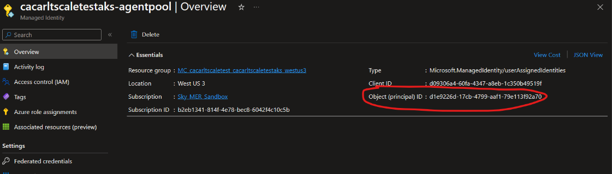
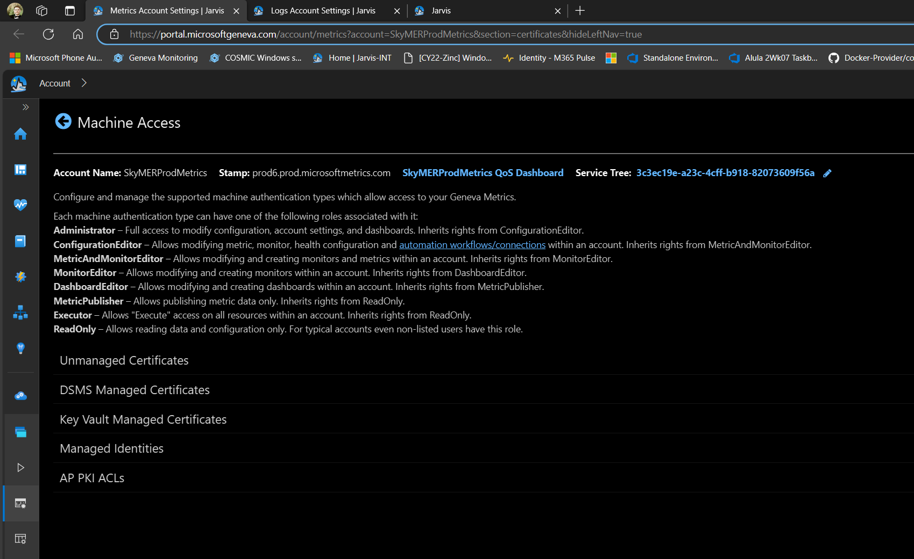
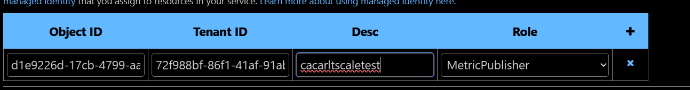
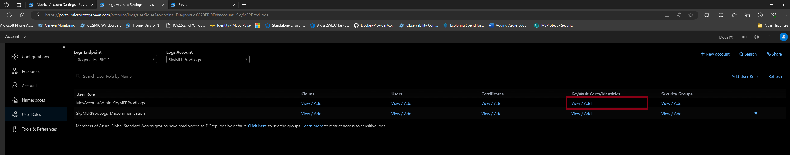
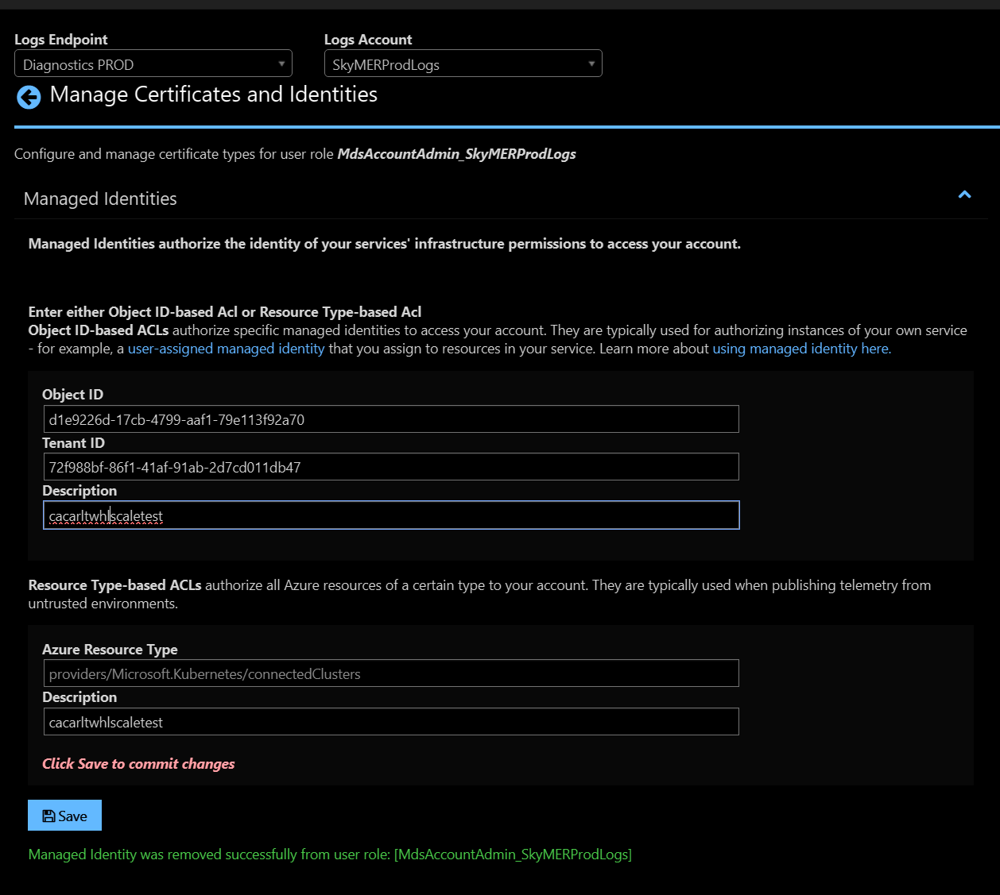

# Windows Host Logs Scale Test

## Prerequisites
- Access to an Azure Subscription
- A Dignostic PROD Geneva Account where you have permissions to edit Geneva Log Configurations
- [Azure CLI](https://learn.microsoft.com/en-us/cli/azure/install-azure-cli)
- Latest sky-dev branch
<br>

## 1. Deploy Scale Test Infrastructure 
The first thing we need to do is setup the infrastructure for our scale test. We will do this via .`\Docker-Provider\test\whl-scale-tests\deploy-infra.ps1`. This script will create a new resource group (Ex. [alias]scaletest). Within that resource group you will find an AKS Cluster, an Azure Contianer Registry and a Key Vault. Your cluster will have four nodepool one for each scale component (Crash Dumps, Text Logs, ETW, Event Logs), by default, configured with the most recent stable kuberenetes version and each nodepool having one node each. 

### Using deploy-infra.ps1
```powershell
.\deploy-infra.ps1 `
    -SubscriptionId "<your-azure-subscription>" `
    -Location "<preferred-azure-region>" `
    -AKSAutoUpgradeChannel "<preferred-cluster-configuration>"
    -AKSVersion "<preferred-aks-version>" `
    -AKSWindowsNodeCount "<preferred-aks-windows-node-count>"
```

Here are some brief notes on the parameters:

- **SubscriptionId** - The Azure Subscription ID you want to use for WHL Scale Testing.
    
- **Location** - Your preferred Azure region for deploying resources.

- **WindowsVMSize** - Default VM size is Standard_D2s_v3. Feel free to increase the size but do not go any lower than this.
    
- **AKSAutoUpgradeChannel** - **[Optional]** Choose between "none","node-image",  "patch", "rapid", "stable". By default we have it set to "none".

- **AKSVersion** - **[Optional]** We default to the version COSMIC is using as of writing this document. 

- **AKSWindowsNodeCount** - **[Optional]** Sets the number of nodes for each Windows Nodepool. By default it is set to one node per Windows nodepool.

Example:
```powershell
.\deploy-infra.ps1 `
    -SubscriptionId "b2eb1341-814f-4e78-bec8-6042f4c10c5b" `
    -Location "westus3" `
```

<br>

## 2. Prepare Geneva XML Configuration

> [!NOTE]
>
> If you know you already have a Geneva Account with each of these already configured go ahead and take note of their config versions because will need it for the next section. You will still need to setup your AKS Cluster Object ID for both Geneva Metrics and Geneva Logs

In setting up the Windos Host Log Scale Test Suite you will need to make sure that you have four configurations that focus on each log type. 

To automatically configure the XML for your Geneva Account we will use `.\Docker-Provider\test\whl-scale-tests\prepare-geneva-xml.ps1.` This script will take the xml files in `.\Docker-Provider\test\whl-scale-tests\geneva-config-files` and configure each with your Geneva Account parameters.

### Using prepare-geneva-xml.ps1
```powershell
.\prepare-geneva-xml.ps1 `
    -GenevaAccountName "<your-geneva-account-name>" `
    -GenevaLogAccountNamespace "<your-geneva-log-account-namespace>" `
    -GenevaMetricAccountName "<your-geneva-metric-account-name>" `
    -AKSClusterMSIObjectId "<your-aks-cluster-msi-object-id>"
```
Here are some brief notes on the parameters:

- **GenevaAccountName** - Set this to the name of the Geneva Account you wish to use for scale testing WHL.
    
- **GenevaLogAccountNamespace** - Set this to the Geneva Logs Account Namespace you wish to use for scale testing WHL.
    
- **GenevaMetricAccountName** - Set this to the Geneva Metrics Account you wish to use for scale testing WHL.
    
- **AKSClusterMSIObjectId** - Set this to the MSI assigned to your AKS cluster. You can find this by going to the Azure Portal -> search for your MC_[resource_group]\_[cluster_name]_[region] -> find the [cluster_name]-nodepool -> Get the Object ID.



Example:
```powershell
.\prepare-geneva-xml.ps1 `
    -GenevaAccountName "SkyMERProdLogs" `
    -GenevaLogAccountNamespace "SkyAlulaDevLogs" `
    -GenevaMetricAccountName "SkyMERProdMetrics" `
    -AKSClusterMSIObjectId "d1e9226d-17cb-4799-aaf1-79e113f92a70"
```
<br>

Once you are done with the script it will open three tab for you in the following order: Geneva Metrics Machine Accesss, Geneva Logs User Roles and a page where you can upload your newly created XML files.

### Assign AKS Cluster Object ID to Geneva Metrics

1. Go to the newly opened Web Browser Window and select the first new tab:


2. Select "Managed Identities"

3. Setup a new row with your AKS Cluster Object ID, your Subscription's Tenant ID, describe the cluster attach to this item and provide the "MetricPublisher" Role. It should look similar to this

    

4. Click save towards the top of the page. 
<br>

### Assign AKS Cluster Object ID to Geneva Logs

1. Go next tab:

2. Go to User Role "MdsAccountAdmin_<your_geneva_logs_account>" -> "KeyVault Certs/Identities" and Click "View/Add"


3. Select "Managed Identities"

4. Setup a new entry with your AKS Cluster Object ID, your Subscription's Tenant ID, leave Resource ID blank, and your cluster name for the description. It should look similar to this
    

4. Click save toward the bottom of the form.
<br>

Now use the last tab to upload each XML file under `.\Docker-Provider\test\whl-scale-tests\geneva-config-files\`

## 3. Deploy Scale Test Suite 
<br>

## 4. Taking Measurements of each component
<br>

## 5. How to clean up scale test infra
